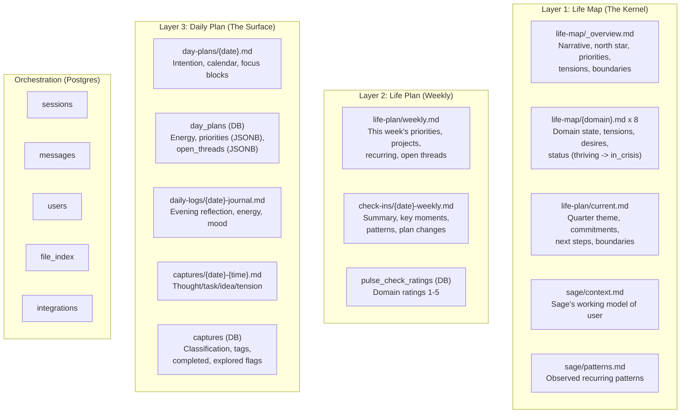

# MeOS Data Architecture

> Canonical reference for the three-layer data model, file paths, write permissions, and data flows.
> Last updated: 2026-02-22

---

## The Three-Layer Model

MeOS artifacts operate in three layers with distinct update cadences:

| Layer | Name | Cadence | Purpose | Primary Storage |
|-------|------|---------|---------|-----------------|
| **1** | Life Map (The Kernel) | Quarterly | Identity, values, domain states, long-term aspirations. The "constitution." | Supabase Storage (markdown) |
| **2** | Life Plan (Weekly) | Weekly | Active priorities, projects, recurring commitments, open threads. The "operating plan." | Supabase Storage (markdown) + Postgres |
| **3** | Daily Plan (The Surface) | Daily | Today's intention, tasks, mood, captures. Ephemeral. | Supabase Storage (markdown) + Postgres |

**Core principle:** User-facing content lives in **Supabase Storage as markdown files**. Postgres handles **orchestration-only concerns** (sessions, auth, indexes, interactive state). If Postgres were wiped but Storage survived, no user content would be lost.

---

## Architecture Diagram



---

## File Path Map

All user files live in Supabase Storage bucket `user-files` under `users/{user_id}/`.

### Layer 1 — Life Map

| File | Type ID | Frontmatter Schema | Description |
|------|---------|-------------------|-------------|
| `life-map/_overview.md` | `overview` | `OverviewFileFrontmatterSchema` | Narrative summary, north star, priorities, tensions, boundaries |
| `life-map/{domain}.md` (x8) | `domain` | `DomainFileFrontmatterSchema` | Per-domain state: current state, tensions, desires, status/score |
| `life-plan/current.md` | `life-plan` | `LifePlanFileFrontmatterSchema` | Quarter theme, commitment headings (###), next steps, boundaries |
| `sage/context.md` | `sage-context` | `SageContextFrontmatterSchema` | Sage's working model of the user |
| `sage/patterns.md` | `sage-patterns` | `PatternsFrontmatterSchema` | Observed recurring patterns |
| `sage/session-insights.md` | `session-insights` | None | Ephemeral: overwritten each life_mapping session |

**Domains (8 total):** Career / Work, Relationships, Health / Body, Finances, Learning / Growth, Creative Pursuits, Play / Fun / Adventure, Meaning / Purpose

**Domain status enum:** `thriving | stable | needs_attention | in_crisis`

### Layer 2 — Life Plan (Weekly)

| File | Type ID | Frontmatter Schema | Description |
|------|---------|-------------------|-------------|
| `life-plan/weekly.md` | `weekly-plan` | `WeeklyPlanFrontmatterSchema` | This week's priorities, projects, threads. Overwritten each weekly check-in |
| `check-ins/{date}-weekly.md` | `check-in` | `CheckInFileFrontmatterSchema` | Weekly check-in summary. Append-only (one per session) |

### Layer 3 — Daily Plan

| File | Type ID | Frontmatter Schema | Description |
|------|---------|-------------------|-------------|
| `day-plans/{date}.md` | `day-plan` | `DayPlanFrontmatterSchema` | Morning intention, calendar snapshot, focus blocks |
| `daily-logs/{date}-journal.md` | `daily-log` | `DailyLogFrontmatterSchema` | Evening reflection: energy, mood, domains touched |
| `captures/{date}-{HHmmss}.md` | `capture` | `CaptureFrontmatterSchema` | Quick capture: thought/task/idea/tension |

---

## Postgres Tables

### Active Tables

| Table | Purpose | Layer |
|-------|---------|-------|
| `users` | Profile, timezone, onboarding state, `next_checkin_at` | Orchestration |
| `sessions` | Conversation lifecycle: type, status, summary, themes, metadata | Orchestration |
| `messages` | Full conversation transcripts (append-only) | Orchestration |
| `file_index` | Cached frontmatter JSONB for fast metadata queries | Orchestration |
| `day_plans` | Interactive daily state: energy, priorities (JSONB), open_threads (JSONB), evening_reflection | Layer 3 |
| `captures` | Queryable capture rows (supplements markdown for UI filtering) | Layer 3 |
| `pulse_check_ratings` | Domain ratings 1-5 with baseline flag | Layer 2 |
| `integrations` | Google Calendar OAuth tokens | Orchestration |
| `scheduled_notifications` | Push notification queue | Orchestration |
| `reflection_prompts` | AI-generated reflection prompts for home screen | Orchestration |
| `push_subscriptions` | PWA push endpoints with timezone | Orchestration |

### Deprecated / Unused

| Table | Status | Notes |
|-------|--------|-------|
| `life_maps` | **Deprecated** | Replaced by markdown files. Safe to drop |
| `life_map_domains` | **Deprecated** | Replaced by markdown files. Safe to drop |
| `patterns` | **Unused** | `sage/patterns.md` serves this purpose |

---

## Session Types & Write Permissions

### Session Types

| Type | Status | Description |
|------|--------|-------------|
| `life_mapping` | Implemented | Deep life exploration and mapping |
| `weekly_checkin` | Implemented | Weekly reflection and forward planning |
| `open_day` | Implemented | Morning briefing and daily intention |
| `close_day` | Implemented | Evening reflection and journal |
| `quick_capture` | Implemented | Quick thought capture (async classification) |
| `ad_hoc` | Implemented | General conversation with Sage |
| `ad_hoc_explore` | Implemented | Domain-focused exploration |
| `monthly_review` | DB enum only | Not implemented |
| `quarterly_review` | DB enum only | Not implemented |

### Write Permission Matrix

```
                        life-map/  life-plan/  check-ins/  sage/   daily-logs/  day-plans/  captures/
                        ---------  ----------  ----------  -----   -----------  ----------  ---------
life_mapping              W          W                       W
weekly_checkin            W*         W           W           W
ad_hoc                                                      W
ad_hoc_explore            W**                                W
close_day                                                   ctx      W                       W
open_day                                                    ctx                   W
quick_capture                                                                                 W

W   = full write access
W*  = status/score updates only (prompt-guarded)
W** = requires user confirmation (prompt-guarded)
ctx = sage/context.md only
```

**Security model:** Deny-by-default. Unknown session types are rejected. Infrastructure-level enforcement in `SESSION_WRITE_PERMISSIONS` (constants.ts). Prompt-level guards are defense-in-depth, not the primary control.

---

## Context Injection Matrix

What each session type reads for Sage's context window.

### Base Context (All Session Types)

| Source | Description |
|--------|-------------|
| Today's date (timezone-aware) | `getLocalDateString(timezone)` |
| `sage/context.md` | Sage's working model |
| `life-map/_overview.md` | Life map overview |
| `life-plan/current.md` | Quarterly commitments (abbreviated for `open_day` when weekly.md exists) |
| Last 3 `check-ins/*.md` | Recent check-in summaries |
| Flagged domain files | Domains with `needs_attention` or `in_crisis` status |
| `sage/patterns.md` | Active patterns |
| `pulse_check_ratings` (DB) | Baseline domain ratings |

### Session-Specific Context

| Source | open_day | close_day | weekly_checkin | ad_hoc_explore |
|--------|:--------:|:---------:|:--------------:|:--------------:|
| `life-plan/weekly.md` | Primary | | Last week's (for comparison) | |
| Calendar events (live) | Yes | | | |
| Yesterday's `day-plans/*.md` | Yes | | | |
| Yesterday's `daily-logs/*.md` | Yes | Yes | | |
| Yesterday's `captures/*.md` | Yes (max 10) | | | |
| Yesterday's `day_plans` (DB) | Yes (carry-forward) | | | |
| Today's `day-plans/*.md` | | Yes | | |
| Today's `captures/*.md` | | Yes (max 10) | | |
| Daily journals since last check-in | | | Yes | |
| `day_plans` (DB) for the week | | | Yes (Week in Numbers) | |
| Specific domain file | | | | Yes |

---

## FILE_UPDATE Block System

Sage emits structured blocks in its responses. The system parses and routes them.

### Flow

```
Sage output → parser.ts → file-write-handler.ts → UserFileSystem → Supabase Storage
                                    ↓
                            Permission check (SESSION_WRITE_PERMISSIONS)
                                    ↓
                            Path resolution (resolveFileUpdatePath)
                                    ↓
                            Typed write method (e.g., writeDomain, writeWeeklyPlan)
                                    ↓
                            Frontmatter auto-generation + file_index update
```

### Block Types

| Block | Purpose | Write target |
|-------|---------|-------------|
| `[FILE_UPDATE type="domain" name="Career / Work"]` | Update a domain file | `life-map/{domain}.md` |
| `[FILE_UPDATE type="overview"]` | Update life map overview | `life-map/_overview.md` |
| `[FILE_UPDATE type="life-plan"]` | Update quarterly plan | `life-plan/current.md` |
| `[FILE_UPDATE type="weekly-plan"]` | Write weekly plan | `life-plan/weekly.md` |
| `[FILE_UPDATE type="check-in"]` | Write check-in summary | `check-ins/{date}-weekly.md` |
| `[FILE_UPDATE type="daily-log"]` | Write evening journal | `daily-logs/{date}-journal.md` |
| `[FILE_UPDATE type="day-plan"]` | Write morning plan | `day-plans/{date}.md` |
| `[FILE_UPDATE type="capture"]` | Write capture | `captures/{date}-{time}.md` |
| `[FILE_UPDATE type="sage-context"]` | Update Sage's model | `sage/context.md` |
| `[FILE_UPDATE type="sage-patterns"]` | Update patterns | `sage/patterns.md` |
| `[DAY_PLAN_DATA]` | JSON payload for Postgres | `day_plans` table (JSONB) |
| `[INTENTION_CARD]` | UI rendering only | (not persisted) |
| `[SUGGESTED_REPLIES]` | UI rendering only | (not persisted) |
| `[REFLECTION_PROMPT]` | UI rendering only | (not persisted) |

### Frontmatter

**Sage writes markdown body only.** The system auto-generates YAML frontmatter for every file type. Each `generate*Frontmatter()` function in `frontmatter.ts` takes existing frontmatter + overrides and produces the final YAML.

System-controlled fields: `last_updated`, `version`, `schema_version`, `created_at`.

---

## Data Flows

### Daily Cycle

```
Morning (Open Day)
  reads: weekly.md, yesterday's day-plans/*.md, yesterday's day_plans (DB),
         yesterday's captures, calendar events, base context
  writes: day-plans/{today}.md, day_plans row (DB), sage/context.md

Mid-day (Captures)
  writes: captures/{date}-{time}.md + captures row (DB)

Evening (Close Day)
  reads: today's day-plans/*.md, today's captures, yesterday's journal, base context
  writes: daily-logs/{today}-journal.md, sage/context.md
  side-effect: marks today's captures as folded_into_journal
```

### Weekly Cycle

```
Sunday (Weekly Reflection)
  reads: base context, daily journals since last check-in,
         day_plans (DB) for the week (Week in Numbers),
         last week's weekly.md (for comparison)
  writes: check-ins/{date}-weekly.md, life-plan/weekly.md,
          life-plan/current.md (commitment status updates),
          life-map/{domain}.md (status/score only), sage/context.md

Monday Morning (Open Day)
  reads: life-plan/weekly.md (this week's priorities) as primary anchor
         life-plan/current.md commitment headings (quarterly awareness)
```

### Priority Carry-Forward

```
User sets 3 priorities in Open Day → stored in day_plans.priorities (JSONB)
User completes 1 via toggle → atomic toggle_priority_completed() RPC
User skips Close Day → no journal written
Next morning's Open Day:
  1. Reads day_plans row for yesterday
  2. Filters to uncompleted priorities
  3. Injects as "CARRY FORWARD" section
  4. Sage surfaces them as options (not obligations)
```

---

## Key File References

| File | Purpose |
|------|---------|
| `lib/markdown/constants.ts` | `FILE_TYPES`, `SESSION_WRITE_PERMISSIONS`, `ALLOWED_PATH_PREFIXES` |
| `lib/markdown/user-file-system.ts` | Core file I/O service: read/write methods per type |
| `lib/markdown/file-write-handler.ts` | Routes `[FILE_UPDATE]` blocks to typed write methods |
| `lib/markdown/frontmatter.ts` | Auto-generates YAML frontmatter per file type |
| `lib/markdown/extract.ts` | Markdown section extraction helpers |
| `types/markdown-files.ts` | Zod schemas for all frontmatter types |
| `lib/ai/parser.ts` | Parses Sage output for structured blocks |
| `lib/ai/context.ts` | `fetchAndInjectFileContext()` — builds session context |
| `lib/ai/prompts.ts` | System prompts per session type |
| `lib/supabase/day-plan-queries.ts` | Day plan DB queries (`getDayPlan`, `getOrCreateTodayDayPlan`) |
| `lib/dates.ts` | Timezone-aware date utilities (`getLocalDateString`, `getYesterdayDateString`, etc.) |
| `lib/get-user-timezone.ts` | Three-tier timezone resolution (cookie -> DB -> UTC fallback) |

---

## Architectural Invariants

1. **Commitment heading stability.** `###` headings in `life-plan/current.md` are identity keys across sessions. Never rename them — `extractCommitments()` parser and React keys rely on heading text.

2. **Session-scoped write permissions.** Each session type has a whitelist of writable paths. The `isWritePermitted()` check runs before every file write. Unknown session types are denied.

3. **Frontmatter ownership.** Sage writes markdown body only. The system generates and owns all YAML frontmatter. Never instruct Sage to write YAML.

4. **Timezone threading.** All server-side date computation goes through `lib/dates.ts`. Timezone is resolved at the API route entry point and explicitly threaded through the call chain. Never use `new Date().toISOString().split('T')[0]`.

5. **Capture sanitization.** User-submitted text is stripped of `[FILE_UPDATE]`, `[DOMAIN_SUMMARY]`, and other block tags before injection into Sage's context. Prevents prompt injection via capture content.

6. **Rate limiting.** Maximum 10 `[FILE_UPDATE]` blocks per message. 20 API requests per user per minute.

7. **File path security.** Three-layer validation: path traversal check (`..`), strict regex (`/^[a-z0-9\-_]+(?:\/[a-z0-9\-_]+){0,2}\.md$/`), and prefix whitelist.

---

## Vocabulary Mapping (Data Layer -> UI)

The `LifeMap` TypeScript type uses legacy field names. The UI displays coaching vocabulary. Mapping happens at the presentation layer — do NOT rename the type fields.

| Type field | UI label | Where mapped |
|---|---|---|
| `primary_compounding_engine` | "Your north star" | `life-map/page.tsx`, `home/page.tsx` |
| `anti_goals` | "Boundaries" | `life-map/page.tsx`, `home/page.tsx` |
| `key_tensions` | "Tensions to watch" | `life-map/page.tsx` |
