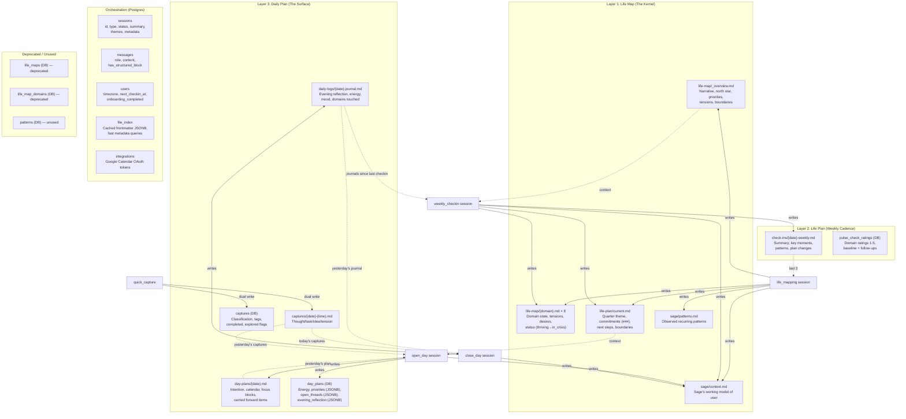

# MeOS Data Architecture Audit

> Generated: 2026-02-22
> Scope: Full codebase audit mapping existing artifacts to the three-layer model (Life Map / Life Plan / Daily Plan)

---

## Architecture Diagram



---

## 1. Complete Artifact Inventory

### Postgres Tables

| # | Table | Purpose | Created By | Read By | Updated By | Layer |
|---|-------|---------|------------|---------|------------|-------|
| 1 | `users` | User profile, timezone, onboarding state, next_checkin_at | Auth registration | Home screen, session creation, all queries | Onboarding, profile updates, session completion | Orchestration |
| 2 | `sessions` | Conversation lifecycle (type, status, summary, themes) | Session initiation (any type) | Chat UI, home screen, history page | Session completion, metadata updates | Orchestration |
| 3 | `messages` | Full conversation transcripts | Each user/assistant turn | Chat UI, session review | Append-only | Orchestration |
| 4 | `pulse_check_ratings` | Domain ratings (1-5) with baseline flag | Onboarding pulse check, weekly re-rate | Context injection, radar chart, pattern analysis | Append-only (new rows per rating event) | Layer 2 |
| 5 | `file_index` | Cached frontmatter for fast metadata queries | UserFileSystem on every write | Domain status queries, sidebar, realtime subscriptions | Every file write (invalidate + rewrite) | Orchestration |
| 6 | `day_plans` | Interactive daily state (energy, priorities, threads, reflection) | `getOrCreateTodayDayPlan()` on morning open | Day Plan UI, home screen | Morning completion, priority toggles, evening reflection | Layer 3 |
| 7 | `captures` | Queryable capture rows (supplements markdown for filtering) | Quick capture API, morning/evening sessions | Day Plan UI, capture history | Classification updates, completed/explored flags | Layer 3 |
| 8 | `integrations` | Google Calendar OAuth tokens | OAuth callback | Calendar event fetch, token refresh | Token refresh | Orchestration |
| 9 | `scheduled_notifications` | Push notification queue (day_1, day_3, checkin_reminder, midday_nudge) | Background jobs, re-engagement service | Notification delivery | sent_at on delivery | Orchestration |
| 10 | `reflection_prompts` | AI-generated reflection prompts for home screen | Content generation API post-session | Reflection prompt display | used_at on display | Orchestration |
| 11 | `push_subscriptions` | PWA push endpoints with timezone | PWA registration | Notification delivery | Registration updates | Orchestration |
| 12 | `life_maps` | **DEPRECATED** — Legacy relational life map | Legacy code | Legacy code paths only | N/A | Deprecated |
| 13 | `life_map_domains` | **DEPRECATED** — Legacy relational domain data | Legacy code | Legacy code paths only | N/A | Deprecated |
| 14 | `patterns` | **UNUSED** — Designed for pattern detection | Nothing (future feature) | Nothing | Nothing | Unused |

### Markdown Files (Supabase Storage: `user-files` bucket)

| # | File Path Pattern | Type ID | Frontmatter Schema | Created By | Read By | Updated By | Layer |
|---|-------------------|---------|-------------------|------------|---------|------------|-------|
| 1 | `life-map/_overview.md` | `overview` | `OverviewFileFrontmatterSchema` | life_mapping session | Context injection (all sessions), Life Map page | life_mapping, weekly_checkin | Layer 1 |
| 2 | `life-map/{domain}.md` × 8 | `domain` | `DomainFileFrontmatterSchema` | life_mapping session | Context injection (flagged domains), Life Map page | life_mapping, weekly_checkin, ad_hoc_explore | Layer 1 |
| 3 | `life-plan/current.md` | `life-plan` | `LifePlanFileFrontmatterSchema` | life_mapping session | Context injection (all sessions), Life Map page, Chat (pinned commitments) | life_mapping, weekly_checkin | Layer 1/2 |
| 4 | `sage/context.md` | `sage-context` | `SageContextFrontmatterSchema` | Any session (first write) | Context injection (all sessions) | Every session type (except quick_capture) | Cross-cutting |
| 5 | `sage/patterns.md` | `sage-patterns` | `PatternsFrontmatterSchema` | life_mapping session | Context injection (all sessions) | life_mapping, weekly_checkin, ad_hoc | Cross-cutting |
| 6 | `sage/session-insights.md` | `session-insights` | None | life_mapping session | Subsumed into overview during synthesis | Overwritten each life_mapping session | Cross-cutting |
| 7 | `check-ins/{date}-weekly.md` | `check-in` | `CheckInFileFrontmatterSchema` | weekly_checkin session | Context injection (last 3), History page | Append-only (one per session) | Layer 2 |
| 8 | `day-plans/{date}.md` | `day-plan` | `DayPlanFrontmatterSchema` | open_day session | Context injection (yesterday's plan for open_day, today's plan for close_day) | open_day session only | Layer 3 |
| 9 | `daily-logs/{date}-journal.md` | `daily-log` | `DailyLogFrontmatterSchema` | close_day session | Context injection (yesterday's journal, weekly journals since last checkin), Home page | close_day session only | Layer 3 |
| 10 | `captures/{date}-{HHmmss}.md` | `capture` | `CaptureFrontmatterSchema` | Quick capture API | Context injection (yesterday's for open_day, today's for close_day), Day Plan UI | Classification (async), folded_into_journal flag | Layer 3 |

---

## 2. Mapping to the Three-Layer Model

### Layer 1: Life Map (The Kernel)

**Expected cadence:** Monthly or quarterly. Stable, weighty. Daily conversations should NOT mutate.

| Artifact | Correct Layer? | Cadence Correct? | Notes |
|----------|---------------|-------------------|-------|
| `life-map/_overview.md` | **Yes** | **Mostly** — written by life_mapping (correct) but also writable by weekly_checkin | weekly_checkin having write access is a concern — the overview could drift from its "constitutional" nature if updated weekly |
| `life-map/{domain}.md` | **Yes** | **No** — writable by weekly_checkin for status updates | Status updates (thriving→needs_attention) during weekly check-ins are reasonable, but deeper content edits are not guarded against in the prompt |
| `life-plan/current.md` | **Hybrid Layer 1/2** | **No** — written weekly via check-in AND during life_mapping | This file serves dual purposes: quarterly commitments (Layer 1) AND weekly status tracking (Layer 2). The three-layer model says the weekly reflection should produce a separate weekly artifact |

**Gaps:**
- No monthly or quarterly review prompts or flows exist (session types `monthly_review` and `quarterly_review` are in the DB enum but have zero implementation)
- No formal "Life Map update proposal" flow — the user's spec says "formal reflection sessions propose updates; user confirms" but currently Sage directly writes updates during life_mapping without explicit user confirmation of each change

**Working well:**
- Commitment heading stability (### headings as identity keys across sessions)
- Session-scoped write permissions prevent ad_hoc sessions from mutating Life Map
- Vocabulary mapping at presentation layer (legacy field names preserved, coaching labels in UI)

### Layer 2: Life Plan (The Missing Middle)

**Expected cadence:** Weekly. Weekly reflection is primary write event.

| Artifact | Correct Layer? | Cadence Correct? | Notes |
|----------|---------------|-------------------|-------|
| `life-plan/current.md` | **Partially** | **Conflated with Layer 1** | Contains both quarterly commitments (Layer 1 content) and weekly status/next steps (Layer 2 content) in one file |
| `check-ins/{date}-weekly.md` | **Yes** | **Yes** — created per weekly check-in | Correct: append-only session summaries |
| `pulse_check_ratings` | **Yes** | **Yes** — baseline + periodic re-rates | Correct placement |

**Gaps:**
- **No separate weekly plan artifact** — The three-layer model says Layer 2 should hold "active priorities (top 3-5), active projects, recurring commitments, open threads, weekly goals." Currently `life-plan/current.md` holds quarterly commitments and `day_plans.open_threads` holds daily threads, but there is no weekly-scoped planning artifact
- **Open threads are daily-scoped, not weekly-scoped** — `open_threads` lives in `day_plans` (JSONB column), which is ephemeral per day. There's no mechanism to promote a daily thread to a weekly priority
- **No weekly goals distinct from quarterly commitments** — The weekly check-in updates commitment status but doesn't produce a "this week's top 3 focus areas" artifact
- **Daily journals feed into weekly check-in (good)** but daily plan priorities/threads do NOT — the weekly check-in reads `daily-logs/*.md` since last check-in but not `day_plans` table data or `day-plans/*.md` files

**Working well:**
- Weekly check-in reads daily journals for narrative context (avoids cold "how was your week?" opener)
- Commitment heading stability preserves continuity across check-ins
- Pulse check ratings provide quantitative trend data

### Layer 3: Daily Plan (The Surface)

**Expected cadence:** Created each morning, enriched by evening. Ephemeral — lives for one day.

| Artifact | Correct Layer? | Cadence Correct? | Notes |
|----------|---------------|-------------------|-------|
| `day-plans/{date}.md` | **Yes** | **Yes** — one per day, created by open_day | Correct |
| `day_plans` (DB) | **Yes** | **Yes** — interactive state per day | Correct: atomic operations for priority toggles |
| `daily-logs/{date}-journal.md` | **Yes** | **Yes** — one per day, created by close_day | Correct |
| `captures/*.md` + `captures` (DB) | **Yes** | **Yes** — ephemeral, multiple per day | Correct: dual-write for queryability |

**Gaps:**
- **Calendar events not persisted** — events are fetched live from Google Calendar API and injected into context, but not stored as part of the day plan artifact. If the user disconnects calendar, historical day plans lose event context
- **No explicit carry-forward for uncompleted priorities** — if user skips Close Day, tomorrow's open_day reads yesterday's captures from markdown but does NOT read `day_plans.priorities` JSONB to surface uncompleted priorities. The carry-forward mechanism exists only for intentions (via `day-plans/{yesterday}.md` frontmatter) and captures (via `captures/{yesterday}-*.md`), not for the structured priority list
- **Dual storage drift risk** — captures exist in both markdown (for Sage context) and Postgres (for UI queryability). If one write succeeds and the other fails, they can diverge

**Working well:**
- Morning/evening session pairing with clear write scopes
- Stale session expiry prevents zombie morning sessions
- Quick capture with async AI classification
- Capture folding into journal (close_day marks captures as `folded_into_journal`)
- Streak tracking for consistency motivation
- Timezone-aware date computation across all flows

---

## 3. Data Flow Audit

### Q: When Sage gives a morning brief, where does it pull priorities from?

**Source:** Context injection in `fetchAndInjectFileContext()` for `open_day` sessions reads:
- `life-plan/current.md` (quarterly commitments and next steps)
- `day-plans/{yesterday}.md` (yesterday's intention + carried items)
- `captures/{yesterday}-*.md` (yesterday's unprocessed captures, max 10)
- Calendar events (live fetch from Google Calendar API)
- `sage/context.md` (Sage's working memory)

**Assessment:** Mostly correct, but **priorities come from quarterly commitments, not weekly goals** (since no weekly goal artifact exists). The morning brief references broad life-plan commitments rather than a focused "this week's top 3" list. This means the morning brief may feel disconnected from what the user actually planned to focus on this week.

### Q: When a user marks a priority complete in morning session, where does it write?

**Source:** `toggle_priority_completed()` atomic PL/pgSQL function updates `day_plans.priorities` JSONB.

**Assessment:** Correct — writes to the daily-scoped `day_plans` table. However, this completion is never propagated upward. The weekly check-in does not read `day_plans.priorities` to summarize what got done during the week.

### Q: When a user captures a thought via Quick Capture, where does it go?

**Source:** Dual-write:
1. Markdown: `captures/{date}-{HHmmss}.md` (for Sage context injection)
2. Postgres: `captures` table (for Day Plan UI queryability)
3. Async: AI classification updates both stores

**Does it surface in next morning brief?** Yes — `open_day` context injection reads `captures/{yesterday}-*.md` (max 10, sanitized for prompt injection).

**Assessment:** Working correctly.

### Q: If a user skips Close Day, what happens?

**Source:** No explicit skip-handling logic. The following occurs:
1. Today's captures remain with `folded_into_journal: false`
2. No `daily-logs/{today}-journal.md` is created
3. Tomorrow's `open_day` reads yesterday's captures (surfacing them)
4. Tomorrow's `open_day` reads yesterday's day plan (but carries only `intention`, not `priorities`)
5. Stale `open_day` sessions are expired when `close_day` starts

**Assessment:** Partial carry-forward. Captures surface, but **uncompleted priorities from `day_plans.priorities` JSONB do not carry forward**. If the user had 3 priorities and completed 1, the remaining 2 are invisible to tomorrow's morning brief (it doesn't read `day_plans` table).

### Q: Is there a weekly reflection flow?

**Source:** Yes — `weekly_checkin` session type with full prompt, context injection, and write permissions.

**What it reads:** Base context + all `daily-logs/*.md` since last check-in + pulse baseline.

**What it writes:** `check-ins/{date}-weekly.md` + updated `life-plan/current.md` (commitment statuses) + optionally updated `life-map/{domain}.md` (if domain status changed).

**Assessment:** Functional but missing weekly-scoped planning output. It reads daily journals (good) but not daily plans or daily priorities (gap). It updates quarterly commitments but doesn't produce a weekly focus list.

### Q: Are daily conversations accidentally mutating the Life Map?

**Source:** Session write permissions:
- `open_day`: can write `day-plans/` and `sage/context.md` only — **cannot** touch Life Map
- `close_day`: can write `daily-logs/`, `sage/context.md`, `captures/` — **cannot** touch Life Map
- `quick_capture`: can write `captures/` only — **cannot** touch Life Map
- `ad_hoc`: can write `sage/` only — **cannot** touch Life Map

**Assessment:** Correct — daily sessions are properly isolated from Life Map writes. The concern is with `weekly_checkin` which CAN write to `life-map/` (domain status changes). This is a weekly cadence, not daily, so it's reasonable, but the prompt doesn't explicitly limit the weekly check-in to status-only updates vs. deeper content rewrites.

---

## 4. Prompt Architecture Audit

| Session Type | Prompt Location | Context Sources | Write Permissions | Layer Discipline | Issues |
|---|---|---|---|---|---|
| `life_mapping` | `lib/ai/prompts.ts` L50-280 | 9 sources (full base context) | `life-map/`, `life-plan/current.md`, `sage/` | Layer 1 only — correct | None — well-scoped |
| `weekly_checkin` | `lib/ai/prompts.ts` L364-440 | Full base + daily journals since last check-in | `check-ins/`, `life-plan/current.md`, `life-map/`, `sage/` | Layers 1+2 — can update both Life Map and Life Plan | **No guard against deep Life Map edits** during weekly check-in. Prompt says it can update domains "if status changed" but doesn't explicitly prohibit rewriting domain content |
| `open_day` | `skills/open-day.md` | Full base + calendar + yesterday's plan/journal/captures | `day-plans/`, `sage/context.md` | Layer 3 only — correct | **Doesn't read `day_plans` table priorities** — only reads markdown day plan. If priorities were set via `[DAY_PLAN_DATA]` JSON and stored in JSONB, the next day's open_day only sees the markdown narrative, not the structured priority list |
| `close_day` | `skills/close-day.md` + `lib/ai/prompts.ts` L282-362 | Full base + today's plan/captures + yesterday's journal | `daily-logs/`, `sage/context.md`, `captures/` | Layer 3 only — correct | None — well-scoped |
| `ad_hoc` | `lib/ai/prompts.ts` L443-511 | Full base (+ optional domain) | `sage/` (or `sage/` + `life-map/` for explore variant) | Sage-only by default — correct | `ad_hoc_explore` can write to `life-map/` which lets a casual conversation update the "kernel" |
| `quick_capture` | `app/api/capture/route.ts` (no interactive prompt) | N/A (async classification only) | `captures/` | Layer 3 only — correct | None |

---

## 5. Gap Analysis & Prioritized Issues

### P0 — Critical Architectural Gaps

**P0-1: No monthly/quarterly review implementation**
- Session types `monthly_review` and `quarterly_review` exist in the DB enum but have zero prompt logic, zero context injection, and zero write paths defined
- The three-layer model says Life Map updates should happen through "formal reflection sessions" — these ARE those sessions, and they don't exist
- **Impact:** Life Map has no formal update mechanism with user confirmation. Currently updated as a side effect of life_mapping sessions
- **Recommendation:** Implement at least `quarterly_review` as a dedicated session type with explicit Life Map change proposals that the user approves

**P0-2: No weekly planning artifact (Layer 2 gap)**
- `life-plan/current.md` conflates quarterly commitments (Layer 1) with weekly status tracking (Layer 2)
- There is no "this week's top 3 focus areas" output from weekly check-in
- Morning briefs pull from quarterly commitments, not weekly priorities
- **Impact:** The planning cascade (Life Map → Life Plan → Daily Plan) is broken at the Life Plan → Daily Plan link. Morning briefs reference broad quarterly commitments instead of specific weekly priorities
- **Recommendation:** Either (a) add a weekly plan section to `life-plan/current.md` that weekly_checkin populates and open_day reads, or (b) create a new `life-plan/weekly.md` artifact

**P0-3: Daily priorities don't carry forward**
- `day_plans.priorities` (JSONB) stores the day's priorities, but tomorrow's `open_day` context injection does NOT read this table
- If user completes 1 of 3 priorities and skips close_day, the remaining 2 are invisible tomorrow
- `open_day` only reads `day-plans/{yesterday}.md` (markdown narrative) and `captures/{yesterday}-*.md`
- **Impact:** Users lose track of uncompleted priorities. The carry-forward promise is partially broken
- **Recommendation:** Add `day_plans` table read to `open_day` context injection — specifically inject uncompleted priorities and unresolved open_threads from yesterday

### P1 — Significant Gaps

**P1-1: Weekly check-in doesn't read daily plan data**
- `weekly_checkin` context injection reads `daily-logs/*.md` since last check-in (good) but ignores:
  - `day-plans/*.md` files (morning intentions, focus blocks)
  - `day_plans.priorities` (what user prioritized each day)
  - `day_plans.open_threads` (unresolved threads)
- **Impact:** Weekly reflection has narrative data (journals) but not operational data (what was planned vs. what happened). Can't close the loop on daily priorities
- **Recommendation:** Inject a summary of daily plan data (intentions + priority completion rates + unresolved threads) into weekly check-in context

**P1-2: `ad_hoc_explore` can mutate Life Map via casual conversation**
- `ad_hoc_explore` write permissions include `life-map/`, allowing domain file updates
- There's no gate or user confirmation — Sage can update a domain file during a casual "let's talk about career" session
- **Impact:** Violates the principle that Life Map should only update through formal reflection sessions
- **Recommendation:** Either (a) remove `life-map/` from `ad_hoc_explore` write permissions (Sage can still note observations in `sage/context.md`), or (b) add explicit user confirmation before Life Map writes in ad_hoc sessions

**P1-3: Weekly check-in prompt doesn't guard against deep Life Map edits**
- The prompt instructs Sage to update domains "if status changed" but doesn't explicitly prohibit rewriting domain content (current state, tensions, desires)
- **Impact:** A weekly check-in could inadvertently rewrite deep Life Map content that should require a formal quarterly review
- **Recommendation:** Add explicit prompt instruction: "During weekly check-ins, only update domain `status` and `score` fields. Do not rewrite domain content sections. Content rewrites require a life_mapping or quarterly_review session."

**P1-4: Calendar events not persisted in day plan**
- Events are fetched live from Google Calendar API and injected into open_day context
- The resulting `day-plans/{date}.md` may include a `## Calendar` section (written by Sage), but this is unstructured prose
- Historical day plans lose calendar context if integration is disconnected
- **Impact:** Weekly/monthly reflections can't reference what meetings happened on which days
- **Recommendation:** Persist a structured calendar snapshot in `day_plans.briefing_data` (JSONB column already exists for this purpose but may not be populated)

**P1-5: Dual-write capture drift risk**
- Captures exist in both markdown (`captures/*.md`) and Postgres (`captures` table)
- If one write succeeds and the other fails, data diverges silently
- Classification updates touch both stores independently
- **Impact:** Day Plan UI (reads Postgres) and Sage context injection (reads markdown) could show different data
- **Recommendation:** Make the Postgres write the source of truth for queryable state; treat markdown as the Sage-readable artifact. Add a reconciliation check or make writes transactional

### P2 — Minor Issues / Tech Debt

**P2-1: Deprecated relational tables still in schema**
- `life_maps` and `life_map_domains` tables exist but are unused (data moved to markdown)
- **Recommendation:** Drop in a future migration (low urgency, no runtime impact)

**P2-2: `patterns` table designed but unused**
- Schema exists with fields for `recurring_theme`, `sentiment_trend`, `consistency`, `avoidance`
- No code writes to it; `sage/patterns.md` serves this purpose instead
- **Recommendation:** Either implement pattern detection (post-MVP) or drop the table

**P2-3: `briefing_data` JSONB column on `day_plans` may be underutilized**
- Column exists but research didn't confirm it's being populated during open_day
- **Recommendation:** Verify if `briefing_data` is populated; if not, use it to store calendar snapshot + carry-forward data for historical reference

**P2-4: No aggregation of daily data for weekly view**
- Weekly check-in reads individual daily journals but doesn't compute aggregates (e.g., average energy this week, priorities completed vs. planned, patterns across days)
- **Recommendation:** Add a lightweight daily-data summarizer that runs before weekly check-in to produce a "week at a glance" injection

**P2-5: Session type enum drift between TypeScript and Postgres**
- `types/chat.ts` defines: `life_mapping | weekly_checkin | ad_hoc | close_day | open_day | quick_capture`
- `types/database.ts` defines: `life_mapping | weekly_checkin | monthly_review | quarterly_review`
- DB constraint includes all of: `life_mapping | weekly_checkin | monthly_review | quarterly_review | ad_hoc | close_day | open_day | quick_capture`
- **Recommendation:** Align TypeScript types to include all DB values; mark unimplemented ones with comments

**P2-6: `reflection_prompts` table stores per-session prompts but unclear display**
- Post-session re-engagement generates reflection prompts stored in DB
- Not clear if these are displayed prominently on the home screen or used in subsequent context injection
- **Recommendation:** Audit the home screen to confirm reflection prompts surface; consider injecting them into the next morning brief

---

## 6. Session Write Permissions Matrix

```
                        life-map/  life-plan/  check-ins/  sage/  daily-logs/  day-plans/  captures/
                        ─────────  ──────────  ──────────  ─────  ───────────  ──────────  ─────────
life_mapping              ✅          ✅                      ✅
weekly_checkin             ✅          ✅          ✅          ✅
ad_hoc                                                       ✅
ad_hoc_explore             ✅                                 ✅
close_day                                                    ctx*    ✅                       ✅
open_day                                                     ctx*                 ✅
quick_capture                                                                                 ✅

ctx* = sage/context.md only (not sage/patterns.md)
```

---

## 7. Context Injection Matrix (What Each Session Reads)

| Context Source | life_mapping | weekly_checkin | open_day | close_day | ad_hoc |
|---|:---:|:---:|:---:|:---:|:---:|
| Today's date | ✅ | ✅ | ✅ | ✅ | ✅ |
| Pulse check baseline (DB) | ✅ | ✅ | ✅ | ✅ | ✅ |
| `sage/context.md` | ✅ | ✅ | ✅ | ✅ | ✅ |
| `life-map/_overview.md` | ✅ | ✅ | ✅ | ✅ | ✅ |
| `life-plan/current.md` | ✅ | ✅ | ✅ | ✅ | ✅ |
| Last 3 `check-ins/*.md` | ✅ | ✅ | ✅ | ✅ | ✅ |
| Flagged domain files | ✅ | ✅ | ✅ | ✅ | ✅ |
| `sage/patterns.md` | ✅ | ✅ | ✅ | ✅ | ✅ |
| Calendar events (live) | | | ✅ | | |
| Yesterday's `day-plans/*.md` | | | ✅ | | |
| Yesterday's `daily-logs/*.md` | | | ✅ | ✅ | |
| Yesterday's `captures/*.md` | | | ✅ | | |
| Today's `day-plans/*.md` | | | | ✅ | |
| Today's `captures/*.md` | | | | ✅ | |
| Daily journals since last check-in | | ✅ | | | |
| Specific domain file (explore) | | | | | ✅* |
| `day_plans` table (DB priorities) | | | **MISSING** | | |
| `day_plans` table (DB open_threads) | | **MISSING** | **MISSING** | | |

---

## 8. Data Flow Summary: Downward (Planning) vs. Upward (Learning)

### Downward (Planning) — Current State

```
Life Map (Layer 1)
  └─ life-map/_overview.md ──► injected into ALL sessions (correct)
  └─ life-map/{domain}.md ──► injected when flagged (correct)

Life Plan (Layer 1/2 hybrid)
  └─ life-plan/current.md ──► injected into ALL sessions (correct)
                           ──► open_day reads for morning brief (correct, but quarterly-scoped)
      ⚠️ NO weekly-scoped priorities flow down to daily plan

Daily Plan (Layer 3)
  └─ day-plans/{yesterday}.md ──► open_day reads for carry-forward (partially correct)
  └─ captures/{yesterday}-*.md ──► open_day reads for morning context (correct)
      ⚠️ day_plans.priorities (DB) NOT read by open_day
      ⚠️ day_plans.open_threads (DB) NOT read by open_day
```

### Upward (Learning) — Current State

```
Daily Plan (Layer 3)
  └─ daily-logs/*.md ──► weekly_checkin reads all since last check-in (correct)
  └─ captures/*.md ──► open_day reads yesterday's (correct)
      ⚠️ day_plans.priorities NOT read by weekly_checkin
      ⚠️ day_plans.open_threads NOT read by weekly_checkin

Weekly (Layer 2)
  └─ check-ins/*.md ──► injected into ALL sessions (last 3) (correct)
  └─ life-plan/current.md ──► updated by weekly_checkin (correct)
  └─ pulse_check_ratings ──► baseline + follow-ups (correct)
      ⚠️ NO weekly plan artifact produced for downstream consumption

Life Map (Layer 1)
  └─ life-map/{domain}.md ──► updated by weekly_checkin (domain status only, mostly correct)
  └─ life-map/_overview.md ──► updated by weekly_checkin (⚠️ should this be quarterly only?)
      ⚠️ NO formal quarterly review flow to propose + confirm Life Map changes
```

---

## 9. Recommended Next Steps

### Phase 1: Fix the broken links (P0s)

1. **Add `day_plans` DB read to `open_day` context injection** — Read yesterday's uncompleted priorities and unresolved open_threads from the `day_plans` table. Inject as structured "CARRY FORWARD" section in morning brief context. This fixes the biggest daily data flow gap.

2. **Add weekly focus output to `weekly_checkin`** — After the check-in conversation, have Sage emit a `## This Week's Focus` section in `life-plan/current.md` (or a new section within the check-in summary). The morning brief should read this to anchor daily intentions.

3. **Add `day_plans` + `day-plans/*.md` read to `weekly_checkin` context injection** — So the weekly reflection has operational data (priorities, completion rates, energy trends) alongside narrative data (journals).

### Phase 2: Tighten layer boundaries (P1s)

4. **Restrict weekly_checkin Life Map writes** — Add prompt guard: "Only update domain `status` and `score`. Do not rewrite domain content."

5. **Restrict or remove `ad_hoc_explore` Life Map write permission** — Casual conversations shouldn't mutate the kernel without explicit user confirmation.

6. **Persist calendar snapshot in `day_plans.briefing_data`** — So historical day plans have full context even after calendar disconnect.

### Phase 3: Build the missing ceremonies (P0-1)

7. **Implement `quarterly_review` session type** — This is the proper gate for Life Map changes. Should read everything, propose changes, and require user confirmation before writing.

### Phase 4: Clean up tech debt (P2s)

8. Drop deprecated `life_maps` and `life_map_domains` tables
9. Align TypeScript session type enums with DB
10. Audit `briefing_data` population
11. Add daily-data aggregation for weekly check-in

---

## 10. What's Working Well (Preserve These)

1. **Markdown-native architecture** — Flexible, human-readable, LLM-friendly. The file-based approach enables rich context injection without complex joins
2. **Session-scoped write permissions** — Prevents prompt injection and enforces layer boundaries at the infrastructure level
3. **Commitment heading stability** — `###` headings as identity keys across sessions is a clever, simple solution for continuity tracking
4. **Dual-write captures** — Markdown for AI context + Postgres for UI queryability is pragmatic
5. **Timezone-aware date computation** — Properly centralized after the R5a fixes
6. **Stale session expiry** — Prevents ghost morning sessions from confusing evening flow
7. **Frontmatter auto-generation** — System controls metadata consistency; Sage writes content only
8. **File index for fast metadata queries** — Avoids downloading full files for status checks
9. **Context injection security** — XML wrapping, capture sanitization, block tag stripping
10. **Carry-forward for captures** — Yesterday's unprocessed thoughts surface in morning brief
