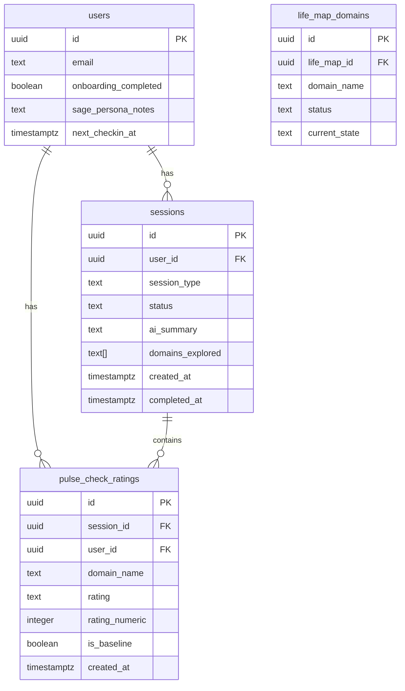

# Post-Playtest Fixes — Round 1

## Overview

First end-to-end playtest of MeOS MVP revealed 7 issues across trust (P0), experience quality (P1), and polish (P2). This plan implements all fixes in priority order, grouping related changes to minimize context-switching.

**Source spec:** `Docs/generated/feedback/20260213_R1.md`

## Key Architecture Decisions

These decisions resolve ambiguities in the feedback spec:

1. **Pulse check ratings**: 5-point scale (thriving / good / okay / struggling / in_crisis) — different from the 4-value domain status enum. Stored in new `pulse_check_ratings` DB table linked to sessions. On submit, also seed `life_map_domains` with an initial status mapping (thriving→thriving, good→stable, okay→stable, struggling→needs_attention, in_crisis→in_crisis).

2. **Chat state**: Computed dynamically server-side (not stored). Avoids stale state. Helper function queries `users.onboarding_completed`, active sessions, last completed session date, and derives the state enum. Passed as prop to `ChatView`.

3. **Session creation timing**: Session created on chat page load (before pulse check renders). Pulse check ratings saved to session on submit. If user abandons before submit, session stays `active` and is cleaned up by the existing 24h stale logic.

4. **Multi-block parsing**: Fix parser to handle N blocks AND add system prompt instruction to emit one per message. Belt and suspenders — the prompt instruction prevents the common case, the parser fix handles edge cases.

5. **Chat input during pulse check**: Disable text/voice input until ratings submitted. Show placeholder: "Rate your life areas above to begin."

6. **Next check-in date**: Set to 7 days from session completion. Stored on `users` table as `next_checkin_at`. Updated after both life mapping completion and weekly check-in completion.

## Implementation Phases

### Phase 1: System Prompt Quick Wins + Parser Fix

Low-risk changes, no UI work. Can be tested immediately with existing chat flow.

---

#### 1.1 System Prompt Updates

**Files:**
- `lib/ai/prompts.ts`

**Changes:**
- Add instruction: "Emit each `[DOMAIN_SUMMARY]` as its own message. Never combine two domain summaries in one response."
- Add instruction: "When listing priorities, do NOT include numbering (no '1)', '2)', etc.). The app handles display numbering."
- Replace `EXPLICITLY NOT DOING NOW` label with `ANTI-GOALS` in synthesis output format
- Add instruction: "After each domain card, only offer unexplored domains as next options. Sort by pulse check rating if available (struggling first)."
- Add instruction: "For domains rated 'thriving' or 'good' in the pulse check, offer a quick confirmation: 'You rated [domain] as [rating] — want to spend time here or is that a quick confirm?'"
- Add instruction: "Always include the full life map context in every conversation."

**Acceptance criteria:**
- [x] All 6 prompt additions present in `prompts.ts`
- [x] Existing prompt structure preserved (additions are additive)
- [x] Anti-goals label change in both life mapping and synthesis output format specs

---

#### 1.2 Domain Card Parser — Multi-Block Support

**Files:**
- `lib/ai/parser.ts`
- `lib/ai/parser.test.ts`

**Changes:**
- Refactor `parseMessage()` to return `ParsedMessage` with an array of segments instead of single `textBefore/block/textAfter`
- Each segment is either `{ type: 'text', content: string }` or `{ type: 'block', blockType: string, data: DomainSummary | Synthesis | SessionSummary }`
- Use global regex or iterative parsing to find ALL block occurrences
- Update `parseStreamingChunk()` to track multiple pending blocks

**Data type change:**
```typescript
// Before
interface ParsedMessage {
  textBefore: string;
  block: ParsedBlock | null;
  textAfter: string;
}

// After
interface ParsedSegment =
  | { type: 'text'; content: string }
  | { type: 'block'; blockType: BlockType; data: DomainSummary | Synthesis | SessionSummary }

interface ParsedMessage {
  segments: ParsedSegment[];
}
```

**Tests to add:**
- [x]Single block (regression — existing behavior)
- [x]Two domain summaries in one message with text between
- [x]Three domain summaries back-to-back
- [x]Mixed block types (domain + synthesis — should not happen per prompt, but handle gracefully)
- [x]Malformed second block (first renders, second falls back to text)
- [x]No blocks (pure text message)

**Downstream updates:**
- `components/chat/message-bubble.tsx` — render array of segments instead of single block
- `components/chat/chat-view.tsx` — extract ALL domain names from multi-block messages when updating `domainsExplored`

**Critical: `domainsExplored` tracking for multi-block messages (Gap #2)**

The current code at `chat-view.tsx:262-276` only extracts the domain from `parsed.block.data.domain` (singular). After this refactor, the structured block handler must loop through ALL segments of type `block` and:
1. Extract every domain name from every `domain_summary` block
2. Add all of them to `domainsExplored` in a single state update
3. Call `updateDomainsExplored()` once with the full set
4. Call `upsertDomain()` for each domain summary block

```typescript
// After refactor — handle all blocks in a message
const domainBlocks = parsed.segments.filter(
  (s): s is BlockSegment => s.type === 'block' && s.blockType === 'domain_summary'
)
if (domainBlocks.length > 0) {
  const newDomains = new Set(domainsExplored)
  for (const block of domainBlocks) {
    newDomains.add(block.data.domain)
  }
  setDomainsExplored(newDomains)

  try {
    const lifeMap = await getOrCreateLifeMap(supabase, userId)
    for (const block of domainBlocks) {
      await upsertDomain(supabase, lifeMap.id, block.data)
    }
    await updateDomainsExplored(supabase, sessionId, [...newDomains])
  } catch {
    console.error('Failed to persist domains to life map')
  }
}
```

Without this, `mapping_in_progress` state detection (Phase 3.1) can't know which domains have been explored, and quick-reply filtering breaks for multi-block responses.

**Acceptance criteria:**
- [x] Parser handles 1, 2, 3+ blocks per message
- [x] MessageBubble renders text-card-text-card-text correctly
- [x] All existing parser tests pass
- [x] New multi-block tests pass
- [x] `domainsExplored` updated for ALL domains in a multi-block message
- [x] `sessions.domains_explored` DB column updated with all domain names
- [x] Each domain summary persisted to `life_map_domains` via `upsertDomain()`

---

### Phase 2: Pulse Check Component (P0-1)

The biggest new feature. New DB table, new interactive component, modified chat initialization.

---

#### 2.1 Database Migration — Pulse Check Ratings + User State Fields

**Files:**
- `supabase/migrations/002_pulse_check.sql` (new)

**Schema:**
```sql
-- Pulse check ratings per session
CREATE TABLE pulse_check_ratings (
  id UUID DEFAULT gen_random_uuid() PRIMARY KEY,
  session_id UUID NOT NULL REFERENCES sessions(id) ON DELETE CASCADE,
  user_id UUID NOT NULL REFERENCES users(id) ON DELETE CASCADE,
  domain_name TEXT NOT NULL,
  rating TEXT NOT NULL CHECK (rating IN ('thriving', 'good', 'okay', 'struggling', 'in_crisis')),
  rating_numeric INTEGER NOT NULL CHECK (rating_numeric BETWEEN 1 AND 5),
  is_baseline BOOLEAN DEFAULT false,
  created_at TIMESTAMPTZ DEFAULT NOW()
);

-- RLS
ALTER TABLE pulse_check_ratings ENABLE ROW LEVEL SECURITY;
CREATE POLICY "Users can manage own ratings"
  ON pulse_check_ratings FOR ALL
  USING (auth.uid() = user_id);

-- Index for quick lookups
CREATE INDEX idx_pulse_ratings_session ON pulse_check_ratings(session_id);
CREATE INDEX idx_pulse_ratings_user ON pulse_check_ratings(user_id);

-- Add next_checkin_at to users table
ALTER TABLE users ADD COLUMN next_checkin_at TIMESTAMPTZ;
```

**Acceptance criteria:**
- [x] Migration runs cleanly on Supabase
- [x] RLS policy prevents cross-user access
- [x] TypeScript types regenerated with `npx supabase gen types`

---

#### 2.2 Pulse Check Data Layer

**Files:**
- `lib/supabase/pulse-check.ts` (new)
- `types/pulse-check.ts` (new)

**Functions:**
```typescript
// Save all ratings from a pulse check submission
savePulseCheckRatings(sessionId: string, ratings: PulseCheckRating[], isBaseline: boolean): Promise<void>

// Get pulse check ratings for a session
getPulseCheckRatings(sessionId: string): Promise<PulseCheckRating[]>

// Get most recent baseline ratings for a user
getBaselineRatings(userId: string): Promise<PulseCheckRating[] | null>
```

**Types:**
```typescript
interface PulseCheckRating {
  domain: string;        // e.g., "Career / Work"
  domainKey: string;     // e.g., "career_work"
  rating: 'thriving' | 'good' | 'okay' | 'struggling' | 'in_crisis';
  ratingNumeric: number; // 5, 4, 3, 2, 1
}

interface PulseCheckResult {
  ratings: PulseCheckRating[];
  sessionId: string;
  isBaseline: boolean;
}
```

**Acceptance criteria:**
- [x] Save and retrieve ratings correctly
- [x] Baseline query returns most recent baseline, or null for new users

---

#### 2.3 Pulse Check UI Component

**Files:**
- `components/chat/pulse-check-card.tsx` (new)

**Component:** `PulseCheckCard`

**Props:**
```typescript
interface PulseCheckCardProps {
  onSubmit: (ratings: PulseCheckRating[]) => void;
  isSubmitting: boolean;
}
```

**Behavior:**
- Full-width card with warm background (reference domain card styling — `bg-amber-50/80` border, warm palette)
- Header: "Life Pulse Check" in the app's heading font
- 8 domain rows, each with domain label + 5 tappable rating pills
- Rating pills: Thriving (green), Good (teal), Okay (warm yellow), Struggling (soft orange), In Crisis (muted red)
- Selected state: filled background. Unselected: outlined/muted
- "Done" button: warm amber CTA, disabled until >= 4 domains rated
- Minimum 4 of 8 to proceed (counter shown: "4 of 8 rated")
- Touch targets >= 44px
- Smooth selection animation (scale + color transition)

**Mobile layout (primary):**
- Each domain row: domain name on top line, 5 rating pills below (full width, evenly spaced)
- Vertically stacked for easy thumb reach
- Scroll if needed (component shouldn't exceed ~70vh)

**Accessibility:**
- Each domain row is a radiogroup with ARIA label
- Rating pills are radio buttons with visible labels
- Keyboard: Tab between domains, Arrow keys between ratings
- Submit button announces when it becomes active

**Error & loading states (Gap #6):**

The pulse check submission involves DB writes (save ratings + seed life_map_domains) and then an LLM call (Sage pattern read). These can fail independently.

- **"Done" button states:** idle → submitting (spinner + "Saving...") → success (hidden, card fades) OR error
- **DB write failure:** Show inline error below the Done button: "Couldn't save your ratings. Tap to try again." Keep all selections intact so the user doesn't have to re-rate.
- **Sage response delay (>5s):** The pulse check card should fade/collapse immediately after successful DB write. The chat input enables and the typing indicator shows while waiting for Sage. Don't keep the pulse check card visible during the LLM response — that makes the wait feel longer.
- **Sage response failure:** Handled by existing chat error/retry logic. Pulse check data is already saved. On retry, ratings are re-sent as system context.

```typescript
interface PulseCheckCardProps {
  onSubmit: (ratings: PulseCheckRating[]) => Promise<void>;  // async — caller handles DB + LLM
  isSubmitting: boolean;
  submitError: string | null;
  onRetry: () => void;
}
```

**Acceptance criteria:**
- [x] Renders 8 domains with 5 rating options each
- [x] Selection state is visually clear (filled vs outlined)
- [x] "Done" disabled until 4+ domains rated
- [x] "Done" shows spinner during submission
- [x] DB failure shows inline retry error, preserves selections
- [x] Card collapses after successful DB write (doesn't wait for LLM)
- [x] Calls onSubmit with array of ratings
- [x] Matches MeOS warm design system (not cold/clinical)
- [x] Touch targets >= 44px on mobile

---

#### 2.4 Chat Flow Integration — Pulse Check

**Files:**
- `components/chat/chat-view.tsx`
- `lib/ai/prompts.ts`
- `lib/ai/context.ts`

**Changes to ChatView:**

1. **New state:** `showPulseCheck: boolean` — true for new_user sessions before ratings submitted
2. **New state:** `pulseCheckRatings: PulseCheckRating[] | null` — stored after submission
3. **Modified init flow:**
   - If new life_mapping session (no existing messages): set `showPulseCheck = true`
   - Render shorter Sage greeting message (from spec)
   - Render `PulseCheckCard` immediately after greeting (no user input required)
   - Disable chat input while pulse check is visible
4. **On pulse check submit:**
   - Save ratings to `pulse_check_ratings` table (mark as baseline)
   - Seed `life_map_domains` with initial status from ratings
   - Format ratings as structured context for Claude
   - Send as first "system" context injection (not as user message — use system prompt addition)
   - Sage responds with pattern read (per spec's system prompt addition)
   - Hide pulse check card, enable chat input
5. **System prompt context injection:**
   - Add pulse check ratings to context builder in `lib/ai/context.ts`
   - Include ratings when building system prompt for all subsequent messages in this session

**Shorter Sage greeting (replaces current opening):**
```
Hey — I'm Sage. I'm going to help you build a map of where you are in life right now.

Before we talk, I want to get a quick pulse. Rate each of these areas — don't overthink it, just your gut right now.
```

**System prompt addition after pulse check:**
```
The user just completed a life pulse check. Here are their self-ratings:
[formatted ratings]

Your job now:
1. Briefly reflect back the overall pattern you see (1-2 sentences). Note any contrasts.
2. Propose starting with the domain that seems most pressing (lowest rated), but give the user choice.
3. Ask a specific opening question — NOT "tell me about X" but something like "You rated X as 'struggling' — what's the main source of tension there?"

Do NOT list all 8 domains back. Keep it conversational.
```

**Acceptance criteria:**
- [x] New users see greeting → pulse check card → Sage pattern read response
- [x] Chat input disabled during pulse check
- [x] Ratings persisted to DB on submit
- [x] Life map domains seeded with initial status
- [x] Sage's first response references the ratings naturally
- [x] Existing returning-user flow unchanged

---

#### 2.5 Quick-Reply Buttons — Pulse Check Sorting

**Files:**
- `components/chat/quick-reply-buttons.tsx`
- `components/chat/chat-view.tsx`

**Changes:**
- Pass `pulseCheckRatings` to `QuickReplyButtons` component
- Sort remaining (unexplored) domains by rating: struggling → in_crisis → okay → good → thriving
- Already-explored domains filtered out (existing behavior — verify it works)

**Acceptance criteria:**
- [x]Domains sorted by pulse check rating (lowest first)
- [x]Explored domains filtered out
- [x]"Wrap up" button still present

---

### Phase 2.6: Life Map Context Injection — Full Memory for Every Conversation (Gap #1)

This is the single most important change for preventing Sage amnesia. Currently `buildConversationContext()` in `lib/ai/context.ts` has a hard fork: life_mapping sessions get a static prompt with zero user context, while weekly check-ins get full context injection. After the initial mapping is done and the user returns, Sage must know everything about them in every conversation type.

---

#### 2.6a Context Serialization — What Sage Knows

**Files:**
- `lib/ai/context.ts`

**Problem:** `buildConversationContext('life_mapping', userId)` returns `getLifeMappingPrompt()` — a static string. No life map data, no prior sessions, no pulse check. This means a returning user in `mapping_in_progress` state gets a Sage that has no memory.

**Solution:** Build a `serializeLifeMapContext()` function that produces a structured text block from DB data, then inject it into ALL conversation types.

**Data shape — exactly what gets injected:**

```typescript
function serializeLifeMapContext(
  lifeMap: LifeMap & { domains: LifeMapDomain[] },
  pulseCheckBaseline: PulseCheckRating[] | null,
  recentSessionSummaries: string[],
  activePatterns: Pattern[],
  lastCommitment: string
): string
```

**Output format (injected into system prompt as a `CONTEXT` section):**

```
=== USER'S LIFE MAP ===

PULSE CHECK BASELINE (from [date]):
- Career / Work: struggling (2/5)
- Health / Body: in_crisis (1/5)
- Relationships: good (4/5)
[... all rated domains]

EXPLORED DOMAINS:
---
CAREER / WORK (Status: needs_attention)
Current state: Freelancing but inconsistent income...
What's working: Creative freedom, flexible schedule
What's not working: No steady pipeline, pricing too low
Key tension: Wants stability but fears corporate structure
Stated intention: Build a retainer client base in Q1
---
HEALTH / BODY (Status: in_crisis)
[... same format for each explored domain]
---

UNEXPLORED DOMAINS: Creative Pursuits, Play / Fun / Adventure

SYNTHESIS (from [date]):
Narrative: [full narrative paragraph]
Primary Compounding Engine: [value]
Quarterly Priorities: [list]
Key Tensions: [list]
Anti-Goals: [list]

RECENT SESSION HISTORY:
- [date]: [ai_summary — 2-3 sentences]
- [date]: [ai_summary]
[... last 3-5 sessions]

ACTIVE PATTERNS:
- [pattern description]
[... active patterns]

LAST STATED COMMITMENT: [commitment text]
=== END LIFE MAP ===
```

**Token budget:** This block will be ~500-1500 tokens depending on how many domains are explored. For an 8-domain fully mapped user with 5 session summaries, estimate ~1200 tokens. This is well within Claude's context budget and far cheaper than injecting raw transcripts. Add a comment documenting this estimate so future devs don't panic about prompt size.

**Integration points:**
1. `buildConversationContext()` calls `serializeLifeMapContext()` for ALL session types when user has a life map
2. For `life_mapping` sessions: base prompt + life map context (if returning user with partial/complete map)
3. For `weekly_checkin` sessions: base prompt + life map context (existing behavior, now using shared serializer)
4. For new users with no life map: base prompt only (existing behavior)

**Refactored `buildConversationContext()`:**
```typescript
export async function buildConversationContext(
  sessionType: SessionType,
  userId: string
): Promise<string> {
  const basePrompt = sessionType === 'life_mapping'
    ? getLifeMappingPrompt()
    : getWeeklyCheckinPrompt()

  // Fetch life map context (returns empty string if no life map exists)
  const lifeMapContext = await fetchAndSerializeLifeMapContext(userId)

  if (!lifeMapContext) {
    return basePrompt  // New user, no context to inject
  }

  return `${basePrompt}\n\n${lifeMapContext}`
}
```

**Acceptance criteria:**
- [x] `serializeLifeMapContext()` produces a structured, readable text block
- [x] Life map context injected for life_mapping sessions (not just weekly check-in)
- [x] Life map context injected for weekly check-in sessions (preserves existing behavior)
- [x] Pulse check baseline included in context (with date)
- [x] Unexplored domains listed so Sage knows what's left
- [x] Token estimate documented in code comment (~500-1500 tokens)
- [x] New user with no life map gets base prompt only (no crash, no empty context block)
- [x] Weekly check-in context includes pulse check baseline for longitudinal comparison (Gap #5)

---

#### 2.6b Weekly Check-In — Pulse Check Longitudinal Context (Gap #5)

**Files:**
- `lib/ai/context.ts`
- `lib/ai/prompts.ts`

**Problem:** The weekly check-in prompt currently gets domain statuses but has no concept of where the user *started*. Sage can't say "Your career went from struggling to good over 6 weeks" because the baseline pulse check ratings aren't in the check-in context.

**Solution:** `serializeLifeMapContext()` (from 2.6a) already includes the pulse check baseline. This sub-task ensures:

1. The weekly check-in system prompt tells Sage to reference changes from baseline: "Compare current domain statuses to the user's initial pulse check ratings. Note improvements and areas that haven't changed."
2. If a second pulse check is ever taken (future: at check-in time), include both baseline and latest ratings for comparison.

**System prompt addition (in `getWeeklyCheckinPrompt()`):**
```
The user's initial pulse check baseline is included in the context above. When discussing domains, reference how things have shifted since their initial self-assessment. For example: "When we first talked, you rated career as 'struggling' — it sounds like things have moved to a better place."
```

**Acceptance criteria:**
- [x] Pulse check baseline present in weekly check-in system prompt context
- [x] Sage prompt instructs referencing changes from baseline
- [x] No crash if no pulse check exists (older users who mapped before pulse check feature)

---

### Phase 3: Chat Context Persistence (P0-2)

State-aware chat entry so returning users never see a cold start.

---

#### 3.1 Session State Detection

**Files:**
- `lib/supabase/session-state.ts` (new)

**Function:**
```typescript
type SessionState =
  | 'new_user'
  | 'mapping_in_progress'
  | 'mapping_complete'
  | 'checkin_due'
  | 'checkin_overdue'
  | 'mid_conversation';

async function detectSessionState(userId: string): Promise<{
  state: SessionState;
  activeSession?: Session;
  lastCompletedSession?: Session;
  nextCheckinAt?: Date;
  unexploredDomains?: string[];
}>
```

**Logic:**
1. Check `users.onboarding_completed` — if false → `new_user`
2. Check for active session (status='active') — if exists:
   - If session has messages → `mid_conversation`
   - If session type is life_mapping and some domains explored → `mapping_in_progress`
3. If no active session and onboarding complete:
   - Check `users.next_checkin_at` vs now:
     - Past by >24h → `checkin_overdue`
     - Past or within next 24h → `checkin_due`
     - Otherwise → `mapping_complete`

**Query strategy:** Single query with joins to minimize DB round-trips. Fetch user + latest active session + latest completed session in one call.

**Acceptance criteria:**
- [x]All 6 states detected correctly
- [x]Returns active session data when relevant
- [x]Returns unexplored domains for mapping_in_progress
- [x]Performance: <200ms on Supabase

---

#### 3.2 State-Aware Chat Page

**Files:**
- `app/(main)/chat/page.tsx`
- `components/chat/chat-view.tsx`

**Changes to `chat/page.tsx` (server component):**
- Call `detectSessionState()` server-side
- Pass `sessionState`, `activeSession`, `nextCheckinAt` as props to `ChatView`

**Changes to `ChatView`:**
- Accept `sessionState` prop
- Modify initialization logic based on state:

| State | Opening Message | Quick Replies | Behavior |
|-------|----------------|---------------|----------|
| `new_user` | Sage greeting + pulse check | None (pulse check card instead) | P0-1 flow |
| `mapping_in_progress` | "Welcome back, [name]. Last time we mapped [domains]. Want to keep going?" | Remaining domains + "Just want to talk" + "Wrap up" | Load existing session + messages |
| `mapping_complete` | "Hey [name]. Next check-in in [X] days. Anything on your mind?" | "Start check-in early" + "Something's on my mind" + "Update my life map" | New session if user engages |
| `checkin_due` | "Hey [name] — it's check-in time. Ready to look at how this week went?" | "Let's do it" + "Not right now" | Create weekly_checkin session on "Let's do it" |
| `checkin_overdue` | "Hey [name] — we missed our check-in. No pressure. Want to catch up now?" | "Check in now" + "Skip this week" | Same as checkin_due |
| `mid_conversation` | Load messages + "Hey — we were in the middle of things. Pick up or start fresh?" | "Continue" + "Start fresh" | Resume or abandon active session |

- **Conversation history loading:** For all post-mapping states, load recent messages and display them. New Sage messages append below.
- **System prompt context:** Always include current life map data, pulse check baseline, session history summary. (Handled by Phase 2.6 — `buildConversationContext()` now injects life map context for all session types.)
- **"Start fresh" in mid_conversation:** Mark current session as `abandoned`, create new session.

**"Update my life map" behavior (Gap #4):**

When a `mapping_complete` user taps "Update my life map", the flow is:
1. Create a new `life_mapping` session (NOT re-run pulse check — they already have baseline ratings)
2. Sage opening: "Let's update your map. What's changed since we last talked? Or pick a domain to revisit."
3. Quick-reply buttons: All 8 domains (sorted by pulse check rating, lowest first)
4. System prompt includes full life map context (Phase 2.6), so Sage knows what was said before
5. Domain exploration works the same as initial mapping — new domain summaries overwrite old ones via `upsertDomain()`
6. No synthesis forced at the end — user can update 1 domain and stop, or do a full re-mapping

This is distinct from "Start check-in early" (which creates a `weekly_checkin` session) and from "Something's on my mind" (which creates a free-form conversation — for MVP, also a `life_mapping` session but without the structured domain flow).

**`onboarding_completed` lifecycle (Gap #3):**

The existing code (`chat-view.tsx:287-290`) already sets `onboarding_completed = true` when a `life_map_synthesis` block is received. This behavior MUST be preserved during the Phase 3 refactor. Specifically:
- `onboarding_completed` is flipped in the structured block handler, not in `completeSession()`
- It gates the `new_user` → `mapping_in_progress` → `mapping_complete` state transitions in `detectSessionState()`
- If the synthesis persistence fails (catch block at line 296), `onboarding_completed` stays false — this is a risk. Consider: set `onboarding_completed` BEFORE the synthesis persistence, or add a retry mechanism. For MVP, the existing behavior is acceptable since synthesis persistence is reliable.

**Acceptance criteria:**
- [x]Each state renders correct opening message
- [x]Each state shows appropriate quick-reply buttons
- [x]Conversation history loads for returning users
- [x]System prompt includes full life map context (via Phase 2.6)
- [x]No cold-start opening for returning users
- [x]"Start fresh" properly abandons and creates new session
- [x]"Update my life map" creates new life_mapping session with full context, no re-pulse-check
- [x]`onboarding_completed` set to true on synthesis (existing behavior preserved)
- [x]`onboarding_completed` correctly gates state detection (new_user vs mapping_complete)

---

#### 3.3 Next Check-In Date Management

**Files:**
- `lib/supabase/sessions.ts`
- `components/chat/chat-view.tsx`

**Changes:**
- After `completeSession()` for life_mapping: set `users.next_checkin_at = NOW() + 7 days`
- After `completeSession()` for weekly_checkin: set `users.next_checkin_at = NOW() + 7 days`
- Home screen uses `next_checkin_at` for countdown display (replace current calculation)

**Acceptance criteria:**
- [x]Check-in date set after both session types complete
- [x]Home screen countdown uses DB value
- [x]Null handling for users who haven't completed any sessions

---

### Phase 4: Home Screen Enhancement (P1-1)

---

#### 4.1 Dynamic Sage Line

**Files:**
- `app/(main)/home/page.tsx`
- `lib/supabase/home-data.ts`

**Template bank:**
```typescript
function getSageLine(context: HomeContext): string {
  const { daysSinceMapping, daysSinceCheckin, topPriority, compoundingEngine, nextCheckinAt } = context;

  // Check-in imminent
  if (nextCheckinAt && isWithin24Hours(nextCheckinAt))
    return "Check-in's tomorrow. Take a minute to notice how the week felt.";

  // Post check-in (within 1 day)
  if (daysSinceCheckin !== null && daysSinceCheckin <= 1)
    return "Good check-in. Here's what's carrying forward.";

  // Day 1 after mapping
  if (daysSinceMapping <= 1)
    return "You mapped your life yesterday. Today's the first day of doing something about it.";

  // First week
  if (daysSinceMapping <= 7 && compoundingEngine)
    return `Day ${daysSinceMapping} of focusing on ${compoundingEngine}. How's momentum?`;

  // Week 2
  if (daysSinceMapping <= 14)
    return "Two weeks in. Are things tracking, or has reality intervened?";

  // Generic with priority
  if (topPriority)
    return `Your focus: ${topPriority}. One thing today?`;

  // Fallback
  return "I'm here whenever you want to talk.";
}
```

**Display:** Below "Good morning, [name]" greeting, styled as a subtle warm card with small Sage icon (leaf or similar). Italic text, slightly smaller than heading.

**Acceptance criteria:**
- [x]Sage line displays contextually based on user state
- [x]Visually distinct from other home screen elements
- [x]Warm, not clinical

---

#### 4.2 Compounding Engine Card

**Files:**
- `app/(main)/home/page.tsx`
- `components/ui/compounding-engine-card.tsx` (new)

**Behavior:**
- Display `primary_compounding_engine` from current life map
- Prominent card between Sage line and check-in timer
- Display only (not tappable for MVP)
- Hidden if no compounding engine set yet

**Styling:** Warm gradient background (amber-50 → cream), slightly larger text, border accent. Should feel like the "north star" card — most important element after the greeting.

**Home screen layout (top to bottom):**
1. "Good morning, [name]"
2. Sage dynamic line
3. Compounding Engine card
4. Next check-in timer + "Start early" button
5. Current priorities (top 3)
6. "Talk to Sage" button

**Acceptance criteria:**
- [x]Compounding engine card renders when data exists
- [x]Hidden gracefully when no data
- [x]Layout order matches spec
- [x]Warm, prominent styling

---

### Phase 5: Polish (P2-1 through P2-4)

---

#### 5.1 Priority Numbering Fix (P2-1)

**Files:**
- `app/(main)/home/page.tsx` OR system prompt

**Fix:** Strip leading "1) ", "2) " patterns from priority text before rendering in the numbered `<ol>`. Use regex: `/^\d+[\)\.]\s*/`

System prompt addition (belt and suspenders): "When listing priorities, do NOT include numbering." (Already added in Phase 1.)

**Acceptance criteria:**
- [x]Priorities display as "1. Build MVP demo" not "1. 1) Build MVP demo"

---

#### 5.2 Quick-Reply Button Filtering (P2-2)

**Already partially implemented** in existing `quick-reply-buttons.tsx`. Verify:
- [x]Explored domains are filtered out after domain card renders
- [x]Quick replies only appear after assistant messages containing domain cards
- [x]Sorting by pulse check rating works (added in Phase 2)

If filtering is already working, this is just verification. If not, fix the `domainsExplored` state update to trigger re-render of quick-reply buttons.

---

#### 5.3 Anti-Goals Label Rename (P2-3)

**Files:**
- `lib/ai/prompts.ts` (already updated in Phase 1)
- `components/chat/synthesis-card.tsx` — update any hardcoded "EXPLICITLY NOT DOING NOW" labels
- `components/life-map/synthesis-section.tsx` — same

**Acceptance criteria:**
- [x]"Anti-Goals" label in synthesis card
- [x]"Anti-Goals" label in life map synthesis section
- [x]System prompt uses "ANTI-GOALS" (Phase 1)

---

#### 5.4 Synthesis Card Collapsible Narrative (P2-4)

**Files:**
- `components/chat/synthesis-card.tsx`
- `components/life-map/synthesis-section.tsx`

**Changes:**
- In chat (inline): Show first 3 lines of narrative, "Read more" toggle to expand
- In Life Map view (standalone): Show full narrative by default (no collapse)
- Add `isInline` prop to control behavior
- Smooth expand/collapse animation (max-height transition)

**Acceptance criteria:**
- [x]Narrative collapsed by default in chat view
- [x]"Read more" / "Show less" toggle works
- [x]Full narrative shown in Life Map view
- [x]Smooth animation on expand/collapse

---

### Phase 6: Pulse Check in Life Map View (P0-1 Step 5)

---

#### 6.1 Baseline Ratings Display

**Files:**
- `app/(main)/life-map/page.tsx`
- `components/life-map/domain-detail-card.tsx`

**Changes:**
- Fetch baseline pulse check ratings alongside life map data
- Each domain card shows a small color dot + "Initial pulse: [rating]" with date
- After domain exploration, the domain card's explored status/summary takes visual precedence
- Baseline rating preserved as subtle secondary indicator

**Acceptance criteria:**
- [x]Color dot matches rating (green/teal/yellow/orange/red)
- [x]"Initial pulse" label with date shown
- [x]Explored domain data takes visual precedence
- [x]Unexplored domains show only pulse check baseline

---

## Files Affected Summary

| Phase | New Files | Modified Files |
|-------|-----------|----------------|
| 1 | — | `lib/ai/prompts.ts`, `lib/ai/parser.ts`, `lib/ai/parser.test.ts`, `components/chat/message-bubble.tsx`, `components/chat/chat-view.tsx` |
| 2 (2.1-2.5) | `supabase/migrations/002_pulse_check.sql`, `lib/supabase/pulse-check.ts`, `types/pulse-check.ts`, `components/chat/pulse-check-card.tsx` | `components/chat/chat-view.tsx`, `lib/ai/prompts.ts`, `lib/ai/context.ts`, `components/chat/quick-reply-buttons.tsx` |
| 2.6 | — | `lib/ai/context.ts` (major refactor), `lib/ai/prompts.ts` |
| 3 | `lib/supabase/session-state.ts` | `app/(main)/chat/page.tsx`, `components/chat/chat-view.tsx`, `lib/supabase/sessions.ts` |
| 4 | `components/ui/compounding-engine-card.tsx` | `app/(main)/home/page.tsx`, `lib/supabase/home-data.ts` |
| 5 | — | `app/(main)/home/page.tsx`, `components/chat/synthesis-card.tsx`, `components/life-map/synthesis-section.tsx` |
| 6 | — | `app/(main)/life-map/page.tsx`, `components/life-map/domain-detail-card.tsx` |

## Dependencies & Risks

**Dependencies:**
- Phase 2 (2.1-2.5 Pulse Check) depends on Phase 1 (system prompt + parser)
- Phase 2.6 (Life Map Context) depends on Phase 2.2 (pulse check data layer — needs `getBaselineRatings()`)
- Phase 3 (Chat State) depends on Phase 2.6 (every chat entry needs full context injection)
- Phase 3.2 ("Update my life map" behavior) depends on Phase 2.6 (returning mapping sessions need full life map in system prompt)
- Phases 4-6 are independent of each other, can be parallelized

**Risks:**
- **Parser refactor (1.2):** Changing `ParsedMessage` shape affects all downstream renderers. Must update `MessageBubble` AND the domain tracking loop in `chat-view.tsx` in the same PR to avoid breakage.
- **Context injection size (2.6):** A fully-mapped user with 8 domains + synthesis + 5 session summaries will inject ~1200 tokens. Monitor this — if it grows beyond ~2000 tokens, consider summarizing older session summaries.
- **Pulse check component (2.3):** Most complex new UI. Mobile layout for 8 domains x 5 ratings needs careful design iteration. Error states (DB write failure) must not lose user's selections.
- **State detection (3.1):** Multiple DB queries on every chat page load. Must optimize into minimal queries. Depends on `sessions.domains_explored` being reliably populated (Phase 1.2 fix).
- **onboarding_completed (3.2):** Currently set inside a try/catch that silently fails. If synthesis persistence fails, user stays in `new_user` state forever. Acceptable for MVP but flag for monitoring.
- **System prompt changes:** May affect Sage's behavior in unexpected ways. Test each prompt addition in isolation.

## Success Metrics

- No cold-start opening for returning users (P0-2 fixed)
- Pulse check completion rate > 80% of new users (P0-1 working)
- All domain cards render correctly including multi-block messages (P0-3 fixed)
- Home screen feels alive with Sage presence (P1-1)
- No double-numbering, stale quick-replies, or clinical labels (P2s fixed)

## ERD — New/Modified Tables



## References

- **Feedback spec:** `Docs/generated/feedback/20260213_R1.md`
- **Product spec:** `Docs/MVP_PRD.md`
- **UX design:** `Docs/UX_design.md`
- **Design system:** `.claude/skills/meos-design/SKILL.md`
- **Existing parser:** `lib/ai/parser.ts`
- **System prompts:** `lib/ai/prompts.ts`
- **Chat view:** `components/chat/chat-view.tsx`
- **Home screen:** `app/(main)/home/page.tsx`
