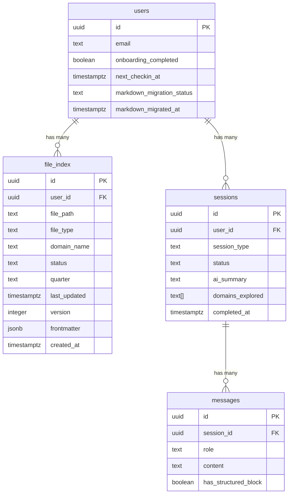

# feat: Markdown-Native Data Architecture

## Enhancement Summary

**Deepened on:** 2026-02-14
**Sections enhanced:** All 5 phases + cross-cutting concerns
**Review agents used:** architecture-strategist, security-sentinel, performance-oracle, data-integrity-guardian, code-simplicity-reviewer, data-migration-expert, best-practices-researcher

### Key Improvements

1. **Phase reordering** — Run migration (Phase 4) *before* switching read/write paths (Phases 2-3), preventing empty-file reads for existing users
2. **Security hardening** — Path traversal protection (`AND name NOT LIKE '%..%'` in RLS), prompt injection mitigation for `[FILE_UPDATE]` blocks, `file_index` restricted to SELECT-only from client
3. **~40% scope reduction for MVP** — Cut `file_index` table (just read ~15 files directly), cut `sage/patterns.md`, cut `life-plan/archive/`, cut `version`/`schema_version` fields, cut verification script, cut deferred-user polling
4. **Async file writes** — Fire Storage writes in background from chat-view (saves 200-800ms blocked input per message)
5. **Unmapped column discovery** — Migration must handle `desires`, `failure_modes`, `identity_statements`, `sage_persona_notes` columns or verify empty
6. **Semantic FILE_UPDATE identifiers** — Use `type="domain" name="Career / Work"` instead of raw file paths in Sage output, decoupling Sage from file structure
7. **Promise.allSettled()** for all parallel file reads — graceful partial failure instead of all-or-nothing

### Critical Findings (Must Address Before Implementation)

- **CRITICAL: Phase ordering** — Deploying file-reading code before migration runs = empty reads for all existing users. Migration MUST run first.
- **CRITICAL: RLS path traversal** — All 4 storage policies need `AND name NOT LIKE '%..%'` to prevent `users/../../admin/` attacks
- **CRITICAL: Prompt injection** — Sage-generated `[FILE_UPDATE]` paths are untrusted input. Add session-scoped write permission map + strip YAML delimiters from body content.
- **HIGH: Unmapped columns** — `life_map_domains` has `desires[]`, `failure_modes[]`, `identity_statements[]` that the migration script doesn't map. Run `SELECT COUNT(*) FROM life_map_domains WHERE desires IS NOT NULL` before shipping.

---

## Overview

Migrate MeOS from relational-only data storage to a markdown-native architecture where `.md` files in Supabase Storage are the canonical source of truth for all user-facing data. Supabase Postgres shifts from "source of truth" to "orchestration and index layer."

This covers the full Phase 1 + Phase 2 scope: storage infrastructure, file format schemas, `UserFileSystem` service, data migration, Sage context injection rewrite, parser update, and file-first for new features (life plan, check-in summaries).

**Brainstorm:** `Docs/brainstorms/2026-02-14-markdown-data-architecture-brainstorm.md`
**Design docs:** `Docs/feedback/20260214_Data_architecture_as_markdown_proposal.md`, `Docs/plans/2026-02-14-narrative-home-approachability-design.md`

---

## Problem Statement

The current relational data model creates three tensions:

1. **Serialization overhead** — `buildConversationContext()` runs 5+ DB queries, joins tables, and serializes rows into a text block for Sage's system prompt. This translation layer is fragile and drifts from the canonical structure.
2. **No composability** — interop with OpenClaw, Obsidian, or any file-based agent requires building API adapters. The data format should BE the interface contract.
3. **No real portability** — "export your data" is an engineering project, not a trivial file copy.

---

## Proposed Solution

**Markdown files as canonical source of truth, hosted in Supabase Storage, with Postgres as orchestration/index.**

Every meaningful piece of user data exists as a `.md` file with YAML frontmatter. Sage reads files as context and writes files as output. The relational DB handles auth, notifications, session orchestration, and a rich file index.

### Architecture Split (by altitude)

| Layer | Storage | Data | Update Cadence |
|-------|---------|------|----------------|
| **Identity** | `life-map/_overview.md` + domain files | Narrative, north star, priorities, tensions | Quarterly |
| **Action** | `life-plan/current.md` | Quarter theme, commitments, next steps, boundaries | Weekly |
| **Operational** | Supabase Postgres tables | Auth, sessions, notifications, file index, task queues | Real-time |

---

## Technical Approach

### Architecture

```
User's Storage Bucket (/users/{user_id}/)
├── life-map/
│   ├── _overview.md          ← Identity layer
│   ├── career.md             ← Domain files (8 total)
│   ├── relationships.md
│   ├── health.md
│   ├── finances.md
│   ├── learning.md
│   ├── creative-pursuits.md
│   ├── play.md
│   └── meaning.md
├── life-plan/
│   ├── current.md            ← Action layer
│   └── archive/
│       └── 2026-q1.md
├── check-ins/
│   ├── 2026-02-14-weekly.md  ← Check-in summaries with plan diffs
│   └── ...
└── sage/
    ├── context.md            ← Sage's working model
    └── patterns.md           ← Observed patterns

Supabase Postgres (orchestration)
├── users                     ← Auth, next_checkin_at, preferences
├── sessions                  ← Session lifecycle, status, type, timestamps
├── messages                  ← Conversation transcripts (for chat replay)
├── file_index                ← Rich index of all user files (NEW)
├── push_subscriptions        ← Push notification endpoints
└── pulse_check_ratings       ← Pulse check scores (stays relational)
```

### Data Flow: Conversation

```
1. User opens chat
   ├── detectSessionState() → DB queries (sessions, users) [unchanged]
   └── buildConversationContext() → reads 4-6 .md files from Storage [NEW]

2. System assembles Sage context
   ├── Read sage/context.md
   ├── Read life-map/_overview.md
   ├── Read life-plan/current.md
   ├── Read last 2-3 check-ins/*.md
   └── Read relevant life-map/{domain}.md files

3. Sage responds with [FILE_UPDATE] blocks
   ├── Parser extracts path + markdown body
   ├── System generates YAML frontmatter (timestamps, version)
   ├── System writes file to Storage (upsert)
   ├── System updates file_index table (async)
   └── Chat renders content as card (optimistic)

4. Session ends
   ├── Sage produces check-in summary [FILE_UPDATE]
   ├── System writes check-in file
   ├── DB: session.status = 'completed'
   └── DB: users.next_checkin_at = +7 days
```

### New Dependencies

```bash
npm install gray-matter    # YAML frontmatter parsing + writing
# zod already in project for validation
```

---

### Implementation Phases

#### Phase 1: Infrastructure & Foundation

Build the storage layer, file format types, and UserFileSystem service. No reads/writes change yet — this is pure foundation.

##### Task 1.1: Supabase Storage Bucket + RLS

**New file:** `supabase/migrations/003_storage_bucket.sql`

```sql
-- Create private storage bucket for user markdown files
INSERT INTO storage.buckets (id, name, public, file_size_limit, allowed_mime_types)
VALUES ('user-files', 'user-files', false, 1048576, ARRAY['text/markdown', 'text/plain']);

-- RLS: Users can only access their own folder
CREATE POLICY "users_own_folder_select" ON storage.objects
  FOR SELECT TO authenticated
  USING (
    bucket_id = 'user-files'
    AND (storage.foldername(name))[1] = 'users'
    AND (storage.foldername(name))[2] = (auth.jwt()->>'sub')
  );

CREATE POLICY "users_own_folder_insert" ON storage.objects
  FOR INSERT TO authenticated
  WITH CHECK (
    bucket_id = 'user-files'
    AND (storage.foldername(name))[1] = 'users'
    AND (storage.foldername(name))[2] = (auth.jwt()->>'sub')
  );

CREATE POLICY "users_own_folder_update" ON storage.objects
  FOR UPDATE TO authenticated
  USING (
    bucket_id = 'user-files'
    AND (storage.foldername(name))[1] = 'users'
    AND (storage.foldername(name))[2] = (auth.jwt()->>'sub')
  )
  WITH CHECK (
    bucket_id = 'user-files'
    AND (storage.foldername(name))[1] = 'users'
    AND (storage.foldername(name))[2] = (auth.jwt()->>'sub')
  );

CREATE POLICY "users_own_folder_delete" ON storage.objects
  FOR DELETE TO authenticated
  USING (
    bucket_id = 'user-files'
    AND (storage.foldername(name))[1] = 'users'
    AND (storage.foldername(name))[2] = (auth.jwt()->>'sub')
  );
```

**Verify:** Bucket appears in Supabase dashboard. RLS policies block cross-user access.

##### Task 1.2: File Index Table

**New file:** `supabase/migrations/004_file_index.sql`

```sql
CREATE TABLE file_index (
  id UUID PRIMARY KEY DEFAULT gen_random_uuid(),
  user_id UUID NOT NULL REFERENCES users(id) ON DELETE CASCADE,
  file_path TEXT NOT NULL,           -- e.g., "life-map/career.md"
  file_type TEXT NOT NULL,           -- e.g., "domain", "life-plan", "check-in", "sage-context"
  domain_name TEXT,                  -- for domain files only
  status TEXT,                       -- extracted from frontmatter
  quarter TEXT,                      -- for life-plan files, e.g., "2026-Q1"
  last_updated TIMESTAMPTZ NOT NULL DEFAULT NOW(),
  version INTEGER NOT NULL DEFAULT 1,
  frontmatter JSONB,                -- full frontmatter as JSON for flexible queries
  created_at TIMESTAMPTZ NOT NULL DEFAULT NOW(),
  UNIQUE(user_id, file_path)
);

-- Indexes for common queries
CREATE INDEX idx_file_index_user ON file_index(user_id);
CREATE INDEX idx_file_index_type ON file_index(user_id, file_type);
CREATE INDEX idx_file_index_domain ON file_index(user_id, domain_name) WHERE domain_name IS NOT NULL;
CREATE INDEX idx_file_index_updated ON file_index(user_id, last_updated DESC);

-- RLS
ALTER TABLE file_index ENABLE ROW LEVEL SECURITY;

CREATE POLICY "users_own_index" ON file_index
  FOR ALL TO authenticated
  USING (user_id = auth.uid())
  WITH CHECK (user_id = auth.uid());
```

##### Task 1.3: File Format Types + Zod Schemas

**New file:** `types/markdown-files.ts`

Define TypeScript types and Zod schemas for all file types:

- `DomainFileFrontmatter` — domain, status, score, last_updated, updated_by, version, schema_version
- `OverviewFileFrontmatter` — type, user_id, last_updated, domains_mapped, version, schema_version
- `LifePlanFileFrontmatter` — type, quarter, quarter_theme, north_star_domain, status, created_at, last_updated, version, schema_version
- `CheckInFileFrontmatter` — type, date, duration_minutes, domains_discussed[], mood, pulse_scores{}, version, schema_version
- `SageContextFrontmatter` — user_name, member_since, total_sessions, last_session, life_map_completion
- `PatternsFrontmatter` — last_updated, active_count, version

Each schema uses Zod for validation with sensible defaults. Export both the Zod schema and the inferred TypeScript type.

**New file:** `lib/markdown/constants.ts`

```typescript
// Allowed file path prefixes (security whitelist)
export const ALLOWED_PATH_PREFIXES = [
  'life-map/',
  'life-plan/',
  'check-ins/',
  'sage/',
] as const

// Domain name to filename mapping
export const DOMAIN_FILE_MAP: Record<string, string> = {
  'Career / Work': 'career',
  'Relationships': 'relationships',
  'Health / Body': 'health',
  'Finances': 'finances',
  'Learning / Growth': 'learning',
  'Creative Pursuits': 'creative-pursuits',
  'Play / Fun / Adventure': 'play',
  'Meaning / Purpose': 'meaning',
}

export const STORAGE_BUCKET = 'user-files'
```

##### Task 1.4: UserFileSystem Service

**New file:** `lib/markdown/user-file-system.ts`

Core service for reading/writing markdown files to Supabase Storage. All file operations go through this layer.

**Methods:**

```typescript
class UserFileSystem {
  constructor(supabase: SupabaseClient, userId: string)

  // Core operations
  async readFile(path: string): Promise<{ frontmatter: Record<string, unknown>; content: string } | null>
  async writeFile(path: string, frontmatter: Record<string, unknown>, content: string): Promise<void>
  async fileExists(path: string): Promise<boolean>
  async listFiles(prefix: string): Promise<string[]>
  async deleteFile(path: string): Promise<void>

  // Validated operations (parse + validate frontmatter with Zod)
  async readDomain(domainFilename: string): Promise<{ frontmatter: DomainFileFrontmatter; content: string } | null>
  async readOverview(): Promise<{ frontmatter: OverviewFileFrontmatter; content: string } | null>
  async readLifePlan(): Promise<{ frontmatter: LifePlanFileFrontmatter; content: string } | null>
  async readSageContext(): Promise<{ frontmatter: SageContextFrontmatter; content: string } | null>
  async readCheckIn(filename: string): Promise<{ frontmatter: CheckInFileFrontmatter; content: string } | null>
  async listCheckIns(limit?: number): Promise<string[]>

  // Write operations (auto-generate/update frontmatter)
  async writeDomain(domainFilename: string, content: string, statusOverrides?: Partial<DomainFileFrontmatter>): Promise<void>
  async writeOverview(content: string, overrides?: Partial<OverviewFileFrontmatter>): Promise<void>
  async writeLifePlan(content: string, overrides?: Partial<LifePlanFileFrontmatter>): Promise<void>
  async writeCheckIn(date: string, content: string, metadata: Partial<CheckInFileFrontmatter>): Promise<void>
  async writeSageContext(content: string): Promise<void>

  // Index operations
  async updateFileIndex(path: string, frontmatter: Record<string, unknown>): Promise<void>
  async rebuildIndex(): Promise<void>
}
```

**Key behaviors:**
- `readFile()` uses gray-matter to parse frontmatter + body
- `writeFile()` uses gray-matter.stringify() to combine frontmatter + body
- All writes auto-increment `version`, set `last_updated` to now
- All writes update `file_index` table after successful storage write
- File path validation: reject paths not starting with `ALLOWED_PATH_PREFIXES`
- Sanitization: strip `..`, normalize separators
- Retry logic: 2 retries with 1s/3s backoff on storage write failure
- Graceful read failures: return `null` (not throw) when file doesn't exist

##### Task 1.5: Frontmatter Generator

**New file:** `lib/markdown/frontmatter.ts`

Utility for generating/updating YAML frontmatter when the system writes files:

```typescript
function generateDomainFrontmatter(existing: Partial<DomainFileFrontmatter> | null, updates: Partial<DomainFileFrontmatter>): DomainFileFrontmatter
function generateOverviewFrontmatter(existing: Partial<OverviewFileFrontmatter> | null, updates: Partial<OverviewFileFrontmatter>): OverviewFileFrontmatter
function generateLifePlanFrontmatter(existing: Partial<LifePlanFileFrontmatter> | null, updates: Partial<LifePlanFileFrontmatter>): LifePlanFileFrontmatter
function generateCheckInFrontmatter(metadata: Partial<CheckInFileFrontmatter>): CheckInFileFrontmatter
```

Rules:
- `version` increments from existing (or starts at 1)
- `last_updated` always set to `new Date().toISOString()`
- `updated_by` set to `'sage'` for conversation writes, `'system'` for migration
- `schema_version` always `1`
- Zod validation on output

---

#### Phase 1: Research Insights

**Architecture (from architecture-strategist):**
- Consider a two-layer split: thin `StorageClient` (raw bytes) + typed `UserFileSystem` on top. Keeps Storage SDK coupling in one place.
- `file_index` should be treated as eventually-consistent. Never trust it for data correctness — only for discovery/filtering. Always read files for truth.
- Define a `SAFE_PATH_REGEX` (e.g., `^[a-z0-9\-_/]+\.md$`) in addition to prefix whitelist for defense-in-depth.

**Security (from security-sentinel):**
- **CRITICAL:** Add `AND name NOT LIKE '%..%'` to ALL 4 RLS policies to prevent path traversal (`users/../../admin/`).
- **HIGH:** `file_index` should be `FOR SELECT` only from client. All writes should come from service role (server-side). Change the RLS policy from `FOR ALL` to `FOR SELECT`.
- **MEDIUM:** Verify gray-matter doesn't execute embedded JS in YAML (it has a `engines` option — ensure it's disabled).

**Simplicity (from code-simplicity-reviewer):**
- **Cut `file_index` table for MVP.** With <10 users and ~15 files per user, just read files directly. `listFiles()` + frontmatter parsing is fast enough. Add the index when you have 100+ users.
- Simplify `UserFileSystem` to 3 core methods: `readFile(path)`, `writeFile(path, frontmatter, content)`, `listFiles(prefix)`. The typed convenience methods (`readDomain`, `readOverview`, etc.) can be standalone functions that call these 3.
- Cut `version` and `schema_version` fields from frontmatter — YAGNI for MVP. `last_updated` is sufficient.
- Cut `sage/patterns.md` — patterns can stay in the relational `patterns` table for now.
- Cut `life-plan/archive/` — quarterly archival is future scope.

**Performance (from performance-oracle):**
- Verify Vercel functions and Supabase Storage are co-located in the same AWS region (`us-east-1`). Cross-region adds 50-100ms per request.
- Expect 20-100ms per file read from same-region Supabase Storage. 5 parallel reads = ~100ms wall clock.
- Remove redundant `idx_file_index_user` index — it's a prefix of `idx_file_index_type` and `idx_file_index_domain`.
- gray-matter parsing overhead is negligible (<1ms per file).

---

#### Phase 2: Parser + Prompt Transition

Update Sage's output format and the parser to work with `[FILE_UPDATE]` blocks.

##### Task 2.1: New Parser for [FILE_UPDATE] Blocks

**Modify:** `lib/ai/parser.ts`

Add new block type: `FILE_UPDATE`. The parser extracts `path` attribute and markdown body.

```typescript
// New parsed segment type
type FileUpdateData = {
  path: string      // e.g., "life-map/career.md"
  content: string   // markdown body (no frontmatter)
}

// Add to ParsedSegment union:
| { type: 'block'; blockType: 'file_update'; data: FileUpdateData }
```

**Parsing logic:**
1. Detect `[FILE_UPDATE path="..."]` opening tag — extract `path` via regex
2. Find matching `[/FILE_UPDATE]` closing tag
3. Extract body between tags as raw markdown string
4. Validate path against `ALLOWED_PATH_PREFIXES` whitelist
5. If path invalid: log warning, treat block as plain text (graceful degradation)

**Backward compatibility (dual parser):**
- Keep detection for `[DOMAIN_SUMMARY]`, `[LIFE_MAP_SYNTHESIS]`, `[SESSION_SUMMARY]` blocks
- When old block detected: convert to `file_update` segment internally
  - `[DOMAIN_SUMMARY]` with `Domain: Career / Work` → path `life-map/career.md`, content converted to markdown sections
  - `[LIFE_MAP_SYNTHESIS]` → generates TWO file updates: `life-map/_overview.md` + `life-plan/current.md`
  - `[SESSION_SUMMARY]` → path `check-ins/{date}-{type}.md`, content converted to markdown
- Log deprecation warning when old format detected

**Streaming parser update:** `parseStreamingChunk()` must handle `[FILE_UPDATE` partial detection.

##### Task 2.2: File Write Handler

**New file:** `lib/markdown/file-write-handler.ts`

Connects parsed `[FILE_UPDATE]` blocks to UserFileSystem writes:

```typescript
async function handleFileUpdate(
  ufs: UserFileSystem,
  update: FileUpdateData,
  sessionId: string
): Promise<{ success: boolean; error?: string }>
```

**Logic:**
1. Validate `update.path` against whitelist
2. Read existing file (for frontmatter merge)
3. Determine file type from path prefix
4. Generate appropriate frontmatter using `frontmatter.ts`
5. Extract status/metadata from markdown body if possible (e.g., `**Status:** in_progress`)
6. Write file via `ufs.writeFile()`
7. If write fails: retry 2x with 1s/3s backoff
8. Return result

##### Task 2.3: Update System Prompts

**Modify:** `lib/ai/prompts.ts`

Update both life mapping and weekly check-in prompts:

1. **Remove** old block format instructions (`[DOMAIN_SUMMARY]`, `[LIFE_MAP_SYNTHESIS]`, `[SESSION_SUMMARY]`)
2. **Add** new `[FILE_UPDATE]` block format with examples
3. **Explain** the file structure to Sage: what files exist, what each one is for
4. **Instruct** Sage to produce full markdown body (not partial), without YAML frontmatter
5. **Provide** examples for each file type Sage may update

Key prompt additions:
- Sage knows the user's file tree
- Sage knows it should produce `[FILE_UPDATE path="life-map/career.md"]` blocks
- Sage knows NOT to include frontmatter (system handles it)
- Sage knows the markdown section structure for each file type
- For synthesis: Sage produces separate updates for `_overview.md` and `current.md`
- For check-ins: Sage produces a check-in file that includes plan diffs section

##### Task 2.4: Update Chat View to Handle File Writes

**Modify:** `components/chat/chat-view.tsx`

Currently, after parsing structured blocks, chat-view calls `upsertDomain()`, `updateLifeMapSynthesis()`, etc.

Replace with:
1. Parse message for `file_update` blocks
2. For each file update block:
   - Call `handleFileUpdate()` to write to Storage
   - Render content as a card in chat (optimistic — show immediately)
   - Show subtle "Saved" indicator on success, error badge on failure
3. **Remove** direct calls to `upsertDomain()`, `updateLifeMapSynthesis()`
4. Keep `saveMessage()` — messages table still stores transcripts
5. Keep session lifecycle calls (`completeSession()`, etc.)

**Card rendering:** The card component receives the markdown body from the `[FILE_UPDATE]` block and renders it. Domain cards show the domain name + key fields. Life plan cards show commitments. Check-in cards show summary.

---

#### Phase 2: Research Insights

**Architecture (from architecture-strategist):**
- **Use semantic identifiers in `[FILE_UPDATE]` blocks**, not raw file paths. Instead of `[FILE_UPDATE path="life-map/career.md"]`, use `[FILE_UPDATE type="domain" name="Career / Work"]`. The system resolves `name` → file path using `DOMAIN_FILE_MAP`. Benefits: Sage doesn't need to know the file tree, typos are caught at resolution, file structure can change without prompt changes.
- Keep the parser pure — don't put domain-to-path resolution inside the parser. Parser outputs `{ type: "domain", name: "Career / Work" }`, a separate resolver maps to `life-map/career.md`.
- For `[LIFE_MAP_SYNTHESIS]` backward compat: don't try to convert to `file_update` inside the parser. Instead, keep the old parser path for display rendering, and have `chat-view.tsx` call a separate converter that produces file writes. Simpler, less fragile.

**Security (from security-sentinel):**
- **CRITICAL: Prompt injection via `[FILE_UPDATE]`** — Sage's output is untrusted input. A crafted conversation could make Sage output `[FILE_UPDATE path="sage/context.md"]` with malicious content that alters future context injection. Mitigations:
  1. **Session-scoped write permission map**: For `life_mapping` sessions, allow writes to `life-map/*`, `life-plan/current.md`, `sage/*`. For `weekly_checkin`, allow writes to `check-ins/*`, `life-plan/current.md`, domain files. Reject all other paths.
  2. **Strip YAML delimiters**: Ensure Sage's body content can't inject `---` to create fake frontmatter.
  3. **Rate-limit blocks**: Max 15 `[FILE_UPDATE]` blocks per message (a synthesis produces ~10-12).
- **MEDIUM:** The existing `pulseCheckContext` in `buildConversationContext()` injects raw user ratings into the system prompt — this is a pre-existing injection risk unrelated to this plan but worth noting.

**Simplicity (from code-simplicity-reviewer):**
- Cut the full dual-parser backward-compat conversion. Instead: keep old parser for rendering old-format blocks as cards (they still look fine). Add the new `[FILE_UPDATE]` parser alongside. Don't convert between formats — just support both in parallel. Simpler code.

---

#### Phase 3: Context Injection Rewrite

Replace DB-based context assembly with file reads.

##### Task 3.1: Rewrite buildConversationContext()

**Modify:** `lib/ai/context.ts`

Replace `fetchAndSerializeLifeMapContext()` with `fetchAndInjectFileContext()`:

```typescript
async function fetchAndInjectFileContext(
  ufs: UserFileSystem
): Promise<string | null>
```

**Logic:**
1. Read `sage/context.md` — inject full body (communication preferences, user model)
2. Read `life-map/_overview.md` — inject body with metadata header: `=== LIFE MAP (8 domains mapped) ===`
3. Read `life-plan/current.md` — inject body with header: `=== LIFE PLAN (Q1 2026, active) ===`
4. List + read last 3 `check-ins/*.md` files (sorted by filename desc) — inject bodies with date headers
5. Read domain files for domains with `needs_attention` or `in_crisis` status (from file index query) — inject bodies

**Frontmatter handling:** Strip raw YAML. Convert useful metadata to readable inline headers:
```
=== CAREER (needs attention, 3/5, updated Feb 14) ===
# Career
## Current State
...
```

**Token budget:** Cap total injected context at ~3000 tokens. Priority order if truncating:
1. sage/context.md (always full)
2. life-map/_overview.md (always full)
3. life-plan/current.md (always full)
4. Last 2-3 check-in files (truncate to summary section if too long)
5. Domain files (only for flagged domains, truncate if needed)

**Graceful degradation:** If any file read fails, skip that file and continue. Log the error. Include `[Note: {filename} unavailable]` in context so Sage is aware.

##### Task 3.2: Rewrite Home Data Assembly

**Modify:** `lib/supabase/home-data.ts`

Replace `getHomeData()` to read from files + DB:

```typescript
export async function getHomeData(
  supabase: SupabaseClient,
  userId: string
): Promise<HomeData>
```

**New implementation:**
1. Create `UserFileSystem` instance
2. **Parallel reads:**
   - `ufs.readSageContext()` → user_name from frontmatter
   - `ufs.readOverview()` → north star section (with "because" clause), priorities
   - `ufs.readLifePlan()` → commitments, next steps, boundaries, quarter theme
   - DB query: `users.next_checkin_at`, `users.onboarding_completed`
   - DB query: last completed session `completed_at`
3. **Assemble HomeData:**
   - `greeting` — time-based greeting
   - `firstName` — from sage/context.md frontmatter `user_name` (fallback: parse from email)
   - `onboardingCompleted` — from DB
   - `nextCheckinDate` — from DB
   - `checkinOverdue` — computed from nextCheckinDate
   - `northStar` — extracted from overview markdown (## Your North Star section)
   - `activeCommitments` — extracted from life plan markdown (## Active Commitments section)
   - `boundaries` — extracted from life plan markdown (## Boundaries section)
   - `quarterTheme` — from life plan frontmatter
   - `sageLine` — dynamic line using commitment names + timing
   - `compoundingEngine` — deprecated field, mapped from north star
   - `daysSinceMapping` — from overview `last_updated`
4. **Graceful degradation:** If any file missing, return null for that section. Home screen hides missing sections.

**New helper:** `extractMarkdownSection(body: string, heading: string): string | null` — extracts content under a `##` heading from markdown body.

---

#### Phase 3: Research Insights

**Architecture (from architecture-strategist):**
- `extractMarkdownSection()` (heading-based extraction) is fragile. If Sage varies heading text (`## Your North Star` vs `## North Star` vs `## The North Star`), extraction breaks. For MVP: accept the fragility with exact heading match. Longer term: move machine-readable fields (north star label, commitment names) to frontmatter and use markdown body only for narrative content.
- Add an end-to-end integration test: Sage output → parser → file write → context injection. This tests the full loop and catches format drift.

**Performance (from performance-oracle):**
- **Use `Promise.allSettled()` for parallel file reads**, not `Promise.all()`. If one file is missing/errored, the others still resolve. Pattern:
  ```typescript
  const results = await Promise.allSettled([
    ufs.readFile('sage/context.md'),
    ufs.readFile('life-map/_overview.md'),
    ufs.readFile('life-plan/current.md'),
  ])
  // Extract fulfilled values, skip rejected
  ```
- Add simple `Promise.race()` timeout for individual reads (5s). No AbortController needed — just let the slower promise resolve in the background.
- Use React `cache()` for request-level dedup if the same file is read in multiple server components within one request.
- **P1:** Add a per-request file cache (60s TTL) in UserFileSystem. Multiple components (home, nav, chat) may read the same files within a request.

**Simplicity (from code-simplicity-reviewer):**
- Defer `check-ins/*.md` reads in context injection. For MVP, the AI summary is still in `sessions.ai_summary`. Reading check-in files adds complexity without new data.
- Defer `sage/context.md` creation and reading. For MVP, keep user profile data in the `users` table and build context from there. Migrate to sage/context.md when there's actually distinct data to put there.

---

#### Phase 4: Data Migration

Migrate existing relational data to markdown files. Clean cutover — no dual-write period.

##### Task 4.1: Migration Script

**New file:** `scripts/migrate-to-markdown.ts`

Executable script (not a Supabase migration — runs as a Node.js script with service role key):

```typescript
async function migrateUser(userId: string): Promise<MigrationResult>
```

**Per-user migration steps:**
1. Check for active session — if found, add to `deferred_users` list and skip
2. Read all data from relational tables
3. Generate files:
   - `life-map/_overview.md` from `life_maps` row
     - `narrative_summary` → ## Narrative Summary section
     - `primary_compounding_engine` → ## Your North Star (add "because" placeholder for migrated users)
     - `quarterly_priorities[]` → ## This Quarter's Focus (numbered list)
     - `key_tensions[]` → ## Tensions to Watch
     - `anti_goals[]` → ## Boundaries
   - `life-map/{domain}.md` for each `life_map_domains` row
     - `current_state` → ## Current State
     - `whats_working[]` → ## What's Working (bullet list)
     - `whats_not_working[]` → ## What's Not Working (bullet list)
     - `tensions[]` → ## Key Tension
     - `stated_intentions[]` → ## Stated Intention
     - Frontmatter: status, score from pulse check baseline
   - `sage/context.md` from user profile + patterns
     - `user_name` from email parsing
     - `member_since` from user created_at
     - `total_sessions` from session count
     - `life_map_completion` from domain count
     - Active patterns → ## Communication Notes + ## Active Tensions
   - `sage/patterns.md` from patterns table
   - `check-ins/*.md` from completed sessions with ai_summary
     - filename: `{completed_at date}-{session_type}.md`
     - Include: summary text, key_themes, commitments_made, sentiment, energy_level
     - Include: pulse check ratings if available for that session
   - `life-plan/current.md` generated from synthesis data
     - `primary_compounding_engine` → quarter theme
     - `quarterly_priorities[]` → active commitments (with placeholder "Why it matters")
     - Empty "Things to Protect" and "Boundaries" sections
     - Minimum: quarter theme + 1 commitment
4. Write all files to Storage via UserFileSystem
5. Populate `file_index` table
6. Verify: read files back, check frontmatter, compare key fields
7. Mark user as migrated (add `migration_status` column to users table)

**Error handling:**
- Migration is idempotent — checks if files exist before writing, uses `upsert: true`
- If file write fails for a user: log error, continue to next user, add to retry list
- Deferred users (active sessions): re-check every 5 minutes, migrate when session completes
- Verification step: read-back comparison catches data loss

##### Task 4.2: Add Migration Status Column

**New file:** `supabase/migrations/005_migration_status.sql`

```sql
ALTER TABLE users ADD COLUMN markdown_migration_status TEXT
  CHECK (markdown_migration_status IN ('pending', 'migrated', 'failed', 'deferred'))
  DEFAULT 'pending';

ALTER TABLE users ADD COLUMN markdown_migrated_at TIMESTAMPTZ;
```

##### Task 4.3: Verification Script

**New file:** `scripts/verify-migration.ts`

Reads markdown files and compares against relational data:
- Domain count matches
- Narrative summary present
- Check-in count matches completed sessions
- Life plan exists
- Sage context has correct user_name
- Reports discrepancies per user

---

#### Phase 4: Research Insights

**CRITICAL: Phase Ordering (from data-integrity-guardian):**
- **Migration MUST run before code cutover.** If file-reading code deploys before migration, `readFile()` returns null for every existing user → home screen shows nothing, context injection is empty, Sage loses all memory. The recommended phase execution order is: **1 → 4 → 2 → 3 → 5** (infrastructure → migrate data → switch parser → switch reads → cleanup).
- Alternative: add a per-user feature flag (`markdown_migration_status = 'migrated'`) and dual-path reads. But this contradicts the "no dual-write" decision. Better: migrate all users, verify, then deploy code changes.

**Data Integrity (from data-migration-expert + data-integrity-guardian):**
- **Unmapped columns — must verify before migration:**
  - `life_map_domains.desires[]` — not mapped in migration script. Run: `SELECT COUNT(*) FROM life_map_domains WHERE desires IS NOT NULL AND array_length(desires, 1) > 0`
  - `life_map_domains.failure_modes[]` — not mapped. Same check.
  - `life_map_domains.identity_statements[]` — not mapped. Same check.
  - `users.sage_persona_notes` — not mapped. Check if populated.
  - If any of these are populated: add mapping to the migration (e.g., `desires[]` → `## Desires` section in domain markdown).
- **Domain join path:** `life_map_domains` has no `user_id` column — it joins through `life_map_id`. Migration must: `SELECT d.* FROM life_map_domains d JOIN life_maps lm ON d.life_map_id = lm.id WHERE lm.user_id = $1`. Document this join path in the migration script.
- **`anti_goals` location:** Copy to BOTH `life-map/_overview.md` (## Boundaries section) AND `life-plan/current.md` (## Boundaries section). They serve different purposes in each file but start with the same data.
- **Idempotency guard:** Check `migration_status` column first, not just upsert. If status is `'migrated'`, skip unless `--force` flag passed. Prevents re-migration overwriting Sage-updated files.
- **Pre-migration verification queries (run these BEFORE migrating):**
  ```sql
  -- Unmapped columns with data
  SELECT 'desires' AS col, COUNT(*) FROM life_map_domains WHERE desires IS NOT NULL AND array_length(desires, 1) > 0
  UNION ALL SELECT 'failure_modes', COUNT(*) FROM life_map_domains WHERE failure_modes IS NOT NULL AND array_length(failure_modes, 1) > 0
  UNION ALL SELECT 'identity_statements', COUNT(*) FROM life_map_domains WHERE identity_statements IS NOT NULL AND array_length(identity_statements, 1) > 0;

  -- Domain names that don't match DOMAIN_FILE_MAP
  SELECT DISTINCT domain_name FROM life_map_domains WHERE domain_name NOT IN ('Career / Work', 'Relationships', 'Health / Body', 'Finances', 'Learning / Growth', 'Creative Pursuits', 'Play / Fun / Adventure', 'Meaning / Purpose');
  ```

**Security (from security-sentinel):**
- **HIGH:** Migration script uses service role key. Mitigations: validate all user IDs are UUIDs before use, add `--dry-run` mode that logs intended writes without executing, add `--user` flag for single-user testing.

**Simplicity (from code-simplicity-reviewer):**
- **Cut verification script** for MVP (<10 users). Verify manually by reading files in Supabase dashboard.
- **Cut migration_status column** for MVP. With <10 users, run migration once, verify manually, done.
- **Cut deferred-user polling.** If a user has an active session during migration, just wait and run the script again later.

**Performance (from performance-oracle):**
- **Parallelize migration writes.** Current plan writes files sequentially per user. Instead: generate all files in memory, then `Promise.allSettled()` to write all 12-15 files per user in parallel. Reduces per-user migration from ~5s to ~1s.
- **Batch file_index inserts.** Instead of one INSERT per file, batch all files per user into a single multi-row INSERT. For 1000 users: ~80 minutes sequential → ~5 minutes parallel.

---

#### Phase 5: Code Cutover + Cleanup

Switch all read/write paths to the new file-based system.

##### Task 5.1: Switch Write Paths

All structured block handling in `chat-view.tsx` now writes to Storage via `handleFileUpdate()`.

**Remove** direct calls to:
- `upsertDomain()` (life-map.ts)
- `updateLifeMapSynthesis()` (life-map.ts)
- `updateSessionSummary()` (sessions.ts) — replaced by check-in file write

**Keep** calls to:
- `saveMessage()` — messages table still stores transcripts
- `completeSession()` — session lifecycle stays in DB
- `savePulseCheckRatings()` — pulse check stays relational
- `updateDomainsExplored()` — session orchestration stays in DB

##### Task 5.2: Switch Read Paths

**Replace in `context.ts`:**
- `fetchAndSerializeLifeMapContext()` → `fetchAndInjectFileContext()`

**Replace in `home-data.ts`:**
- All `life_maps` queries → file reads via UserFileSystem
- Keep `users` and `sessions` queries for orchestration data

**Replace in `life-map/page.tsx`:**
- `getCurrentLifeMap()` → `ufs.readOverview()` + `ufs.listFiles('life-map/')` + read each domain file

**Replace in `history/page.tsx`:**
- Session list → read from `file_index` table (type='check-in', ordered by date)
- Session detail → read check-in .md file

##### Task 5.3: Update CLAUDE.md

Document the new architecture so all future development uses the markdown-native approach:

- Update "Critical Architecture Decisions" section
- Add "Markdown File System" section describing file structure, UserFileSystem service, and file types
- Update "Structured Output Parsing" to describe `[FILE_UPDATE]` block format
- Note that relational content tables are deprecated (read-only backup)

---

#### Phase 5: Research Insights

**Architecture (from architecture-strategist):**
- Hidden coupling: `handlePulseCheckSubmit()` in the chat flow currently writes to `pulse_check_ratings` table. After migration, pulse scores should ALSO update the corresponding domain file's frontmatter (`score` field). Add this to the write handler.
- Deploy Phase 5 as a hard gate: all users must be migrated (`markdown_migration_status = 'migrated'`) before the code deploys. Add a startup check or feature flag.

**Performance (from performance-oracle):**
- **P0: Async file writes in chat-view.** Currently, after parsing a Sage response, chat-view blocks on DB writes before showing the next message. File writes (especially multiple domain updates during synthesis) will be slower than DB writes. Fire file writes asynchronously — show the card optimistically, write in the background.
  ```typescript
  // Don't await — fire and forget with error logging
  handleFileUpdate(ufs, update, sessionId).catch(err =>
    console.error('File write failed:', err)
  )
  ```
- Keep `updateSessionSummary()` as a temporary backup write during the transition period. Messages table + session summary = recovery path if file writes fail.

**Data Integrity (from data-integrity-guardian):**
- Build a recovery script (`scripts/recover-from-messages.ts`) that can regenerate markdown files from the `messages` table. This is the ultimate safety net — if files get corrupted, you can re-derive them from chat transcripts. Build this BEFORE removing relational backup tables.
- If `file_index` is kept: make the index update synchronous (not async) to avoid read-after-write inconsistency. Add a weekly repair cron that rebuilds the index from files.

---

## Recommended Phase Execution Order

Based on the critical finding about phase ordering, the recommended execution sequence is:

```
Phase 1: Infrastructure & Foundation
  └── Build Storage bucket, types, UserFileSystem
       ↓
Phase 4: Data Migration (MOVED UP)
  └── Migrate all existing users to markdown files
  └── Verify all files are readable
       ↓
Phase 2: Parser + Prompt Transition
  └── Add [FILE_UPDATE] parser, update prompts
       ↓
Phase 3: Context Injection Rewrite
  └── Switch reads from DB to files
       ↓
Phase 5: Code Cutover + Cleanup
  └── Switch writes, remove old code paths
```

**Rationale:** Phase 4 (migration) must complete before Phase 2-3 deploy. Otherwise, `readFile()` returns null for every existing user because their files don't exist yet.

---

## MVP Scope Reduction (Recommended)

Based on the simplicity review, the following items can be **cut from MVP** to reduce scope by ~40%:

| Cut | Rationale | When to Add |
|-----|-----------|-------------|
| `file_index` table | <10 users, ~15 files each. `listFiles()` + parse is fast enough. | 100+ users |
| `sage/patterns.md` | Patterns stay in relational `patterns` table | When patterns need composability |
| `life-plan/archive/` | Quarterly archival is future scope | When quarterly reset ships |
| `version` / `schema_version` frontmatter | `last_updated` is sufficient for MVP | When file versioning ships |
| `verify-migration.ts` script | Verify manually with <10 users | 100+ users |
| `migration_status` column | Run once, verify, done | 100+ users |
| Deferred-user polling | Wait and re-run script manually | 100+ users |
| `sage/context.md` reads | Keep user profile in DB for now | When Sage context diverges from user profile |
| `check-ins/*.md` reads in context | `sessions.ai_summary` still works | When check-in files have richer data |

**Keep (not cut):** Storage bucket, RLS policies, UserFileSystem (3 core methods), all domain file reads/writes, `life-plan/current.md`, `_overview.md`, `[FILE_UPDATE]` parser, prompt updates, context injection from files, migration script.

---

## Acceptance Criteria

### Functional Requirements

- [ ] Supabase Storage bucket `user-files` exists with per-user RLS policies
- [ ] `file_index` table created with rich indexing (path, type, domain, status, quarter)
- [ ] `UserFileSystem` service reads/writes markdown files with YAML frontmatter
- [ ] All file operations validate paths against whitelist (security)
- [ ] gray-matter parses frontmatter, Zod validates types
- [ ] Parser handles `[FILE_UPDATE path="..."]` blocks
- [ ] Parser backward-compatible with old `[DOMAIN_SUMMARY]`, `[LIFE_MAP_SYNTHESIS]`, `[SESSION_SUMMARY]` blocks
- [ ] System prompts instruct Sage to use `[FILE_UPDATE]` format with examples
- [ ] Sage context injection reads from files, not DB queries
- [ ] Home screen reads from files (overview, life plan, sage context) + DB (orchestration)
- [ ] Life Map page reads domain files from Storage
- [ ] Chat writes `[FILE_UPDATE]` blocks to Storage via UserFileSystem
- [ ] Check-in files include plan diffs (what changed in life plan)
- [ ] Life plan always created at synthesis (minimum: quarter theme + 1 commitment)
- [ ] Migration script converts all existing user data to markdown files
- [ ] Migration handles: incomplete data, missing fields, no synthesis yet
- [ ] Migration skips users with active sessions (deferred migration)
- [ ] Migration is idempotent — safe to re-run
- [ ] Old relational content tables are read-only backup after migration

### Non-Functional Requirements

- [ ] File read latency < 1s for individual files (Supabase Storage SLA)
- [ ] Context assembly reads 4-6 files in < 2s total (parallel reads)
- [ ] Token budget for injected context stays under 3000 tokens
- [ ] No `any` types — all frontmatter parsed through Zod schemas
- [ ] File write retry: 2 retries with 1s/3s backoff
- [ ] Graceful degradation: missing files return null, not throw
- [ ] File path sanitization prevents directory traversal attacks

### Quality Gates

- [ ] All existing parser tests pass (backward compatibility)
- [ ] New parser tests cover `[FILE_UPDATE]` block parsing
- [ ] UserFileSystem unit tests: read, write, list, delete, validation, retry
- [ ] Migration script tested against dev data (all users migrate successfully)
- [ ] Verification script reports zero discrepancies
- [ ] Home screen renders correctly with partial file data (some files missing)
- [ ] Context injection produces valid Sage responses (manual test with conversation)

---

## Success Metrics

1. **Context assembly queries:** 5+ DB queries → 0 DB queries (replaced by file reads)
2. **Data portability:** User file tree is self-contained, downloadable, human-readable
3. **Migration completeness:** 100% of users migrated with zero data loss
4. **Sage output quality:** Sage produces valid `[FILE_UPDATE]` blocks consistently after prompt update

---

## Dependencies & Prerequisites

- Supabase Storage enabled on the project (check `supabase/config.toml`)
- `gray-matter` npm package
- Service role key available for migration script (not committed to repo)
- Existing parser tests in `lib/ai/parser.test.ts` passing before changes

---

## Risk Analysis & Mitigation

| Risk | Impact | Likelihood | Mitigation |
|------|--------|------------|------------|
| Storage write failures during conversations | High — user loses synthesis data | Low | Retry logic + data preserved in messages table + async writes |
| Sage produces malformed `[FILE_UPDATE]` blocks | Medium — domain card fails to render | Medium | Graceful fallback to plain text + keep old parser alongside |
| Migration corrupts/loses data | Critical — user trust destroyed | Low | Idempotent migration + relational backup + pre-migration column audit |
| Token budget overflow with large files | Medium — Sage context degraded | Low | Cap at 3000 tokens, priority-based truncation |
| File path injection attack | Critical — security vulnerability | Low | Whitelist + SAFE_PATH_REGEX + path traversal check in RLS |
| **Prompt injection via FILE_UPDATE** | **Critical — context poisoning** | Medium | Session-scoped write permissions + strip YAML delimiters + rate limit blocks |
| **Phase ordering — empty reads** | **Critical — broken for all users** | High (if not addressed) | Migrate data (Phase 4) before deploying read changes (Phases 2-3) |
| **Unmapped columns in migration** | High — silent data loss | Medium | Pre-migration queries to audit `desires`, `failure_modes`, `identity_statements` |
| Concurrent writes from multi-device | Low — rare edge case | Low | Last-write-wins + data in messages table as safety net |
| Performance regression on home screen | Medium — slower load | Low | Parallel reads via Promise.allSettled() + same-region deployment |
| Heading-based extraction fragility | Medium — data not shown | Medium | Exact heading match for MVP + plan to move key fields to frontmatter |

---

## Error Handling Matrix

| Scenario | Behavior | User Impact |
|----------|----------|-------------|
| File read returns 404 | Return null, skip section | Section hidden from UI |
| File read times out | Return null after 5s, log error | Section hidden, logged |
| File write fails (all retries) | Log error, show error badge on card | Card shows "Save failed" — data in chat transcript |
| YAML frontmatter parse error | Log warning, return body without frontmatter | Data displayed, metadata may be stale |
| Zod validation fails | Log warning, use raw parsed data | Data displayed with possible type issues |
| File path validation fails | Reject write, log security warning | Block shown as plain text |
| Migration: incomplete source data | Generate minimal file with placeholder content | File exists but may need Sage refinement |
| Migration: active session | Defer user, retry after session completes | No impact — user unaware |
| Storage bucket unreachable | All reads return null, writes retry | App shows "unable to load" state |

---

## File Reference

### New Files

| File | Purpose |
|------|---------|
| `supabase/migrations/003_storage_bucket.sql` | Storage bucket + RLS policies |
| `supabase/migrations/004_file_index.sql` | Rich file index table |
| `supabase/migrations/005_migration_status.sql` | Migration tracking column |
| `types/markdown-files.ts` | File format types + Zod schemas |
| `lib/markdown/constants.ts` | Path whitelist, domain mapping, bucket name |
| `lib/markdown/user-file-system.ts` | Core file read/write service |
| `lib/markdown/frontmatter.ts` | Frontmatter generation/update utilities |
| `lib/markdown/file-write-handler.ts` | Connects parser output to file writes |
| `scripts/migrate-to-markdown.ts` | One-time migration script |
| `scripts/verify-migration.ts` | Post-migration verification |

### Modified Files

| File | Changes |
|------|---------|
| `lib/ai/parser.ts` | Add `[FILE_UPDATE]` block parsing, keep backward compat |
| `lib/ai/prompts.ts` | Update block format instructions for Sage |
| `lib/ai/context.ts` | Replace DB queries with file reads |
| `lib/supabase/home-data.ts` | Replace life map queries with file reads |
| `components/chat/chat-view.tsx` | Replace DB writes with file writes via handler |
| `app/(main)/life-map/page.tsx` | Read from files instead of DB |
| `types/chat.ts` | Add FileUpdateData type to ParsedSegment union |
| `CLAUDE.md` | Document new architecture |

### Unchanged Files (orchestration stays in DB)

| File | Reason |
|------|--------|
| `lib/supabase/sessions.ts` | Session lifecycle is orchestration |
| `lib/supabase/session-state.ts` | State detection uses session/user tables |
| `lib/supabase/pulse-check.ts` | Pulse scores stay relational |
| `lib/supabase/client.ts` | Supabase client unchanged |
| `lib/supabase/server.ts` | Supabase server client unchanged |
| `lib/supabase/middleware.ts` | Auth middleware unchanged |
| `app/api/chat/route.ts` | Streaming route mostly unchanged (context.ts handles reads) |

---

## ERD: File Index Table



Note: `life_maps`, `life_map_domains`, and `patterns` tables remain but become read-only backup after migration.

---

## Documentation Plan

After implementation, update:

1. **CLAUDE.md** — New "Markdown File System" section, updated architecture decisions
2. **Docs/generated/architecture-reference.md** — Generate updated architecture doc from new codebase
3. **README** — Add note about markdown-native data architecture if one exists

---

## References

### Internal

- Brainstorm: `Docs/brainstorms/2026-02-14-markdown-data-architecture-brainstorm.md`
- Data architecture proposal: `Docs/feedback/20260214_Data_architecture_as_markdown_proposal.md`
- Narrative home design: `Docs/plans/2026-02-14-narrative-home-approachability-design.md`
- Current parser: `lib/ai/parser.ts`
- Current context assembly: `lib/ai/context.ts`
- Current life map operations: `lib/supabase/life-map.ts`

### External

- [Supabase Storage RLS Policies](https://supabase.com/docs/guides/storage/security/access-control)
- [Supabase Storage Helper Functions](https://supabase.com/docs/guides/storage/schema/helper-functions)
- [gray-matter (YAML frontmatter parser)](https://github.com/jonschlinkert/gray-matter)
- [Zod (TypeScript schema validation)](https://zod.dev)

### Best Practices (from research)

- **Parallel file reads:** Use `Promise.allSettled()` instead of `Promise.all()` — partial failure is expected when files may not exist
- **Timeout pattern:** Simple `Promise.race([readFile(path), sleep(5000).then(() => null)])` — no AbortController needed
- **Request-level caching:** Use React `cache()` for dedup when multiple server components read the same file in one request
- **Frontmatter parsing:** gray-matter is the standard — <1ms per file, well-tested, handles edge cases
- **Zod validation:** Parse frontmatter with `.safeParse()` (not `.parse()`) to get error details without throwing
- **Storage latency budget:** Same-region Supabase Storage reads: 20-100ms per file. 5 parallel reads: ~100ms total wall clock
