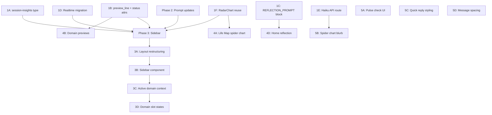

# R3 Playtest Fixes

## Overview

Six categories of fixes from R3 playtest, shipping before Wave 1 external testing:

1. **P0: Session length cap** — Sage proposes 2-3 domains, soft wrap-up default
2. **P0: Defer prescriptions** — Exploration mode bookmarks; synthesis mode prescribes
3. **P1: Desktop artifact sidebar** — Live domain slots + spider chart + insights during life-mapping
4. **P1: Home screen refinements** — Sage-generated reflection prompt, boundaries grounding
5. **P1: Life Map view refinements** — Spider chart anchor, preview lines, status overrides
6. **P1: UX polish** — Pulse check UI, spider chart blurb, quick replies, message spacing

All serve the core retention question: **Do users who complete life mapping come back for a weekly check-in?**

---

## Phase 1: Data Pipeline Foundation

These changes unblock the sidebar (Phase 3) and view refinements (Phase 4). Ship as one commit.

### 1A. Add `session-insights` FILE_UPDATE type

**`lib/markdown/constants.ts`:**
- Add `SESSION_INSIGHTS: 'session-insights'` to `FILE_TYPES` object (after line 42)
- No new write permission entry needed — `sage/session-insights.md` already falls under the `sage/` prefix in `life_mapping` and `weekly_checkin` permissions

**`lib/ai/parser.ts`:**
- The `VALID_FILE_TYPES` set (line 14) auto-derives from `FILE_TYPES` — no change needed after constants update
- The `parseFileUpdateBlock()` function validates against this set — `session-insights` will pass automatically

**`lib/markdown/file-write-handler.ts` — `resolveFileUpdatePath()`:**
- Add case for `FILE_TYPES.SESSION_INSIGHTS` → returns `'sage/session-insights.md'`
- This is a singleton file (overwritten each time, not date-stamped) — keeps it simple

**`lib/markdown/file-write-handler.ts` — `handleFileUpdate()`:**
- Add case that calls `ufs.writeRaw('sage/session-insights.md', content)` or a new `ufs.writeSessionInsights()` method
- Session insights don't need frontmatter — they're ephemeral (overwritten each session, subsumed by overview during synthesis)

**`lib/markdown/user-file-system.ts`:**
- If no generic `writeRaw` exists, add a `writeSessionInsights(content: string)` method following the pattern of `writeSageContext()`
- Must call `updateFileIndex()` with `file_type: 'session-insights'` so Realtime subscription picks it up

### 1B. Add `preview_line` and `status` attributes to FILE_UPDATE tags

The key insight: Sage writes markdown body only, system generates frontmatter. But `preview_line` and `status` are Sage's editorial decisions. Solution: add optional attributes to the `[FILE_UPDATE]` tag itself.

**Current tag format:**
```
[FILE_UPDATE type="domain" name="Career / Work"]
```

**New tag format:**
```
[FILE_UPDATE type="domain" name="Career / Work" preview_line="Security vs. freedom tension driving all major decisions" status="needs_attention"]
```

**`lib/ai/parser.ts` — `parseFileUpdateBlock()`:**
- Update the regex to capture optional `preview_line="..."` and `status="..."` attributes
- Add these to the returned `FileUpdateData` type
- Validation: `status` must be one of `thriving|stable|needs_attention|in_crisis` if present

**`types/chat.ts` — `FileUpdateData`:**
- Add optional `preview_line?: string` and `status?: DomainStatus` fields

**`types/markdown-files.ts` — `DomainFileFrontmatterSchema`:**
- Add `preview_line: z.string().optional()` (after `score`)

**`lib/markdown/frontmatter.ts` — `generateDomainFrontmatter()`:**
- Accept optional `preview_line` and `status` override params
- When present, use them instead of defaults

**`lib/markdown/file-write-handler.ts` — domain handling in `handleFileUpdate()`:**
- Pass `update.preview_line` and `update.status` through to the `writeDomain()` / frontmatter generator

### 1C. Add `[REFLECTION_PROMPT]` block type

Follow the `[PULSE_CHECK]` pattern — a marker block that triggers a specific system action.

**`lib/ai/parser.ts`:**
- Add `[REFLECTION_PROMPT]...[/REFLECTION_PROMPT]` to the block detection regex
- Parse content as plain text (the reflection question itself)
- Return as a new segment type `reflection_prompt` with `content: string`

**`types/chat.ts`:**
- Add `reflection_prompt` to the `ParsedSegment` union type

**`components/chat/chat-view.tsx`:**
- After streaming completes, check parsed segments for `reflection_prompt` type
- When found, make an API call to store in `reflection_prompts` table:
  ```typescript
  await supabase.from('reflection_prompts').upsert({
    user_id: userId,
    session_id: sessionId,
    prompt_text: reflectionBlock.content,
    type: 'sage_generated',
    created_at: new Date().toISOString(),
  })
  ```
- The block is NOT rendered in chat — it's a silent data extraction (like sage-context/sage-patterns FILE_UPDATEs)

### 1D. Enable Supabase Realtime on `file_index`

**New migration** (`supabase/migrations/XXX_enable_file_index_realtime.sql`):
```sql
-- Enable realtime for file_index table
ALTER PUBLICATION supabase_realtime ADD TABLE file_index;

-- Ensure replica identity is set for realtime to track changes
ALTER TABLE file_index REPLICA IDENTITY FULL;
```

**Verify RLS:** The existing `file_index` RLS policies scope SELECT to `auth.uid() = user_id`. Supabase Realtime respects RLS — users will only receive events for their own files. No changes needed.

### 1E. Create lightweight Haiku API route

**`app/api/generate-blurb/route.ts`:**
- POST endpoint accepting `{ ratings: Record<string, number>, domains: string[] }`
- Calls Claude Haiku (claude-haiku-4-5-20251001) with a simple one-shot prompt:
  ```
  Given these life domain ratings (1=in crisis, 5=thriving):
  {formatted ratings}
  Generate a 1-2 sentence observation about what stands out. Be specific about contrasts, patterns, or areas of strength. Warm tone, no advice.
  ```
- Returns `{ blurb: string }`
- Fallback: if API call fails, return a template-generated blurb (identify highest/lowest domains, note contrasts)
- No session management, no SSE streaming, no auth token needed beyond standard Supabase auth check

### 1F. Make RadarChart reusable

**Move** `components/onboarding/radar-chart.tsx` → `components/ui/radar-chart.tsx`
- Update the import in `components/onboarding/summary-screen.tsx`

**Add props:**
- `size?: number` (default 320) — controls SVG width/height
- `exploredDomains?: string[]` — domains that have been fully explored (sidebar needs this to show "mapped vs. rated only" distinction)
- Colors remain hardcoded to the warm palette — no need for color props

**For explored vs. rated-only distinction:**
- Data points for explored domains: full opacity, larger dot
- Data points for rated-only domains: 50% opacity, smaller dot
- Polygon fill stays uniform (it represents the overall shape)

---

## Phase 2: Prompt Updates (P0s)

Pure prompt changes in `lib/ai/prompts.ts`. No infrastructure changes. Can be tested immediately via playtest.

### 2A. Session length cap — `getLifeMappingPrompt()`

Insert a `SESSION STRUCTURE` block at the beginning of the session flow section (before the current "1. OPENING" step):

```
SESSION STRUCTURE FOR FIRST LIFE MAPPING:

You are NOT exploring all 8 domains today. Based on the pulse check data,
identify the 2-3 domains that look most interesting to explore first — lowest
rated, sharpest contrasts, or connected tensions.

1. OPENING: Acknowledge the pulse check data. Propose 2-3 priority domains.
   Say something like: "Based on your snapshot, I want to dig into [Domain A]
   and [Domain B] first — that's where the real tension seems to live.
   We'll explore the rest over the next few sessions. Sound good?"

   Wait for the user to confirm or adjust the selection.

2. EXPLORE PRIORITY DOMAINS: Deep exploration as currently designed.
   Generate a [FILE_UPDATE type="domain"] card after each.

3. AFTER 2-3 DOMAINS: Default toward wrapping up. Say something like:
   "We've covered a lot of ground. Want to keep going, or is this a good
   place to synthesize what we've found?"

   If the user wants to continue, explore more domains. No hard cap.

4. SYNTHESIS: Generate synthesis based on explored domains only. Reference
   unexplored domains as "areas to dig into next time."

5. BRIDGE: "Next time we talk, I'd love to explore [remaining priority
   domains]. In the meantime, here's what I'd suggest focusing on..."
```

**Also update quick-reply behavior after 3+ domains:**
- In `components/chat/quick-reply-buttons.tsx`, add logic: when `domainsExplored.length >= 3`, style the "Wrap up" button as primary and domain buttons as secondary
- No functional change — just visual emphasis on wrapping up

### 2B. Defer prescriptions — `getLifeMappingPrompt()`

Insert `EXPLORATION MODE` and `SYNTHESIS MODE` constraints:

```
EXPLORATION MODE (active during all domain exploration):
- Your job is to understand, reflect, connect, and synthesize
- You may BOOKMARK potential actions: "that sounds like something worth
  building a habit around — we'll come back to this after we see the
  full picture"
- Do NOT propose specific commitments, check-ins, schedules, or routines
- Do NOT ask "what day of the week works for you?" or similar questions
- Do NOT lock in action items — exploration is about understanding
- You earn the right to prescribe by first demonstrating you understand
  the full picture

SYNTHESIS MODE (active only after user agrees to wrap up):
- NOW propose 2-3 concrete next steps informed by the FULL conversation
- Each recommendation MUST reference cross-domain connections
  (e.g., "Your spending anxiety connects to your runway timeline, which
  connects to the startup decision — so the real first step is...")
- Recommendations should feel earned by the conversation, not generic
- Include these in the [FILE_UPDATE type="life-plan"] block
```

### 2C. Session-insights generation instructions

Add to the prompt after the domain exploration section:

```
CROSS-CUTTING INSIGHTS (after 2nd domain explored):
After generating the 2nd and each subsequent domain card, also generate:
[FILE_UPDATE type="session-insights" name="cross-cutting"]
# Emerging Patterns

## Connections
- [Specific cross-domain connection 1]
- [Specific cross-domain connection 2]

## Tensions
- [Cross-domain tension 1]

## Open Questions
- [Question that spans multiple domains]
[/FILE_UPDATE]

Update this each time with accumulated insights from all explored domains.
```

### 2D. preview_line, status, and reflection prompt instructions

**Add to domain card generation instructions:**
```
When generating domain [FILE_UPDATE] blocks, include preview_line and status
attributes in the opening tag:

[FILE_UPDATE type="domain" name="Career / Work" preview_line="Security vs.
freedom tension driving all major career decisions" status="needs_attention"]

- preview_line: A single sentence capturing the most salient insight or
  tension for this domain. This is the one-liner preview users see on their
  Life Map. Make it specific and emotionally resonant.
- status: Your honest assessment based on the conversation (not just the
  pulse rating). Use: thriving, stable, needs_attention, or in_crisis.
```

**Add to synthesis instructions:**
```
REFLECTION PROMPT:
During synthesis, generate a [REFLECTION_PROMPT] block containing the single
most provocative, unresolved question from the conversation. This should be
specific to what the user said — not generic advice. It will appear on their
home screen as "Something to sit with."

Example:
[REFLECTION_PROMPT]
You said you'd hurt if she chose friendship over romance. What does that tell
you about what you actually want right now?
[/REFLECTION_PROMPT]
```

**Add boundaries grounding constraint:**
```
BOUNDARIES:
When writing boundaries in the overview synthesis:
- Only include boundaries the user EXPLICITLY stated or clearly implied
- Do NOT infer specific numbers, timelines, or thresholds the user didn't mention
- If you make an inference, prefix it with "~" to indicate approximation
  (e.g., "~6-month runway buffer" vs. "6-month runway buffer")
```

---

## Phase 3: Desktop Artifact Sidebar

### 3A. Chat page layout restructuring

**`app/(main)/chat/page.tsx`:**

Current structure:
```tsx
<div className="fixed inset-0 bottom-16 pb-[env(safe-area-inset-bottom)]">
  <ChatView ... />
</div>
```

New structure:
```tsx
<div className="fixed inset-0 bottom-16 pb-[env(safe-area-inset-bottom)]">
  <div className="h-full grid grid-cols-1 lg:grid-cols-[1fr_320px]">
    <ChatView ... />
    {sessionType === 'life_mapping' && (
      <LifeMapSidebar
        userId={userId}
        sessionId={sessionId}
      />
    )}
  </div>
</div>
```

- The grid wrapper is a simple addition — no changes to ChatView internals
- Sidebar only renders for `life_mapping` sessions
- On mobile (`< lg`), `grid-cols-1` means sidebar is not rendered (no display:none needed, grid just doesn't create the column)
- `LifeMapSidebar` is a client component (needs Realtime subscription)

### 3B. LifeMapSidebar component

**New file: `components/chat/life-map-sidebar.tsx`**

```
Props:
  userId: string
  sessionId: string

State:
  collapsed: boolean (default false, persisted to localStorage)
  fileIndex: FileIndexRow[] (from Realtime subscription)
  insightsContent: string | null (from session-insights file)
  activeDomain: string | null (tracked from quick-reply events)
  pulseRatings: PulseCheckRating[] (fetched once on mount)
```

**Layout (when expanded):**
```
┌─────────────────────────┐
│ [collapse toggle]       │
│                         │
│ ┌─────────────────────┐ │
│ │  Compact RadarChart │ │
│ │  (~200px)           │ │
│ └─────────────────────┘ │
│                         │
│ 2 of 8 explored         │
│ ━━━━━━░░░░░░░░░░░░░░░░ │
│                         │
│ ● Finances ████████████ │  ← explored: status dot + preview_line
│ ● Relationships ██████  │  ← explored
│ ◌ Career ░░░░░░░░░░░░░ │  ← unexplored: pulse dot + "Not explored"
│ ◌ Health ░░░░░░░░░░░░░ │
│ ★ Learning ············ │  ← active: highlighted border, "Exploring..."
│ ◌ Creative ░░░░░░░░░░░ │
│ ◌ Play ░░░░░░░░░░░░░░░ │
│ ◌ Meaning ░░░░░░░░░░░░ │
│                         │
│ ─── Emerging Patterns ──│  ← appears after 2+ domains
│ • Security vs. freedom  │
│   tension across        │
│   finances and career   │
│ • ...                   │
└─────────────────────────┘
```

**Layout (when collapsed):**
```
┌───┐
│ > │  ← expand toggle (thin vertical strip)
└───┘
```

**Data flow:**

1. **On mount:** Fetch pulse ratings from `pulse_check_ratings` table. Fetch current `file_index` rows for this user with `file_type IN ('domain', 'session-insights')`.

2. **Supabase Realtime subscription:**
   ```typescript
   const channel = supabase
     .channel('sidebar-file-index')
     .on(
       'postgres_changes',
       {
         event: '*',
         schema: 'public',
         table: 'file_index',
         filter: `user_id=eq.${userId}`,
       },
       (payload) => {
         // Update local state based on INSERT/UPDATE events
         // For domain files: update corresponding slot
         // For session-insights: fetch and display content
       }
     )
     .subscribe()
   ```

3. **When domain file_index event arrives:** Match `file_path` to domain name via `FILE_TO_DOMAIN_MAP`. Update that slot from "unexplored" to "explored". Read the file to get frontmatter (`preview_line`, `status`).

4. **When session-insights event arrives:** Read `sage/session-insights.md` content and display in the "Emerging Patterns" section.

5. **Active domain tracking:** Listen for a custom event or prop from ChatView. When the user sends "Let's explore Career / Work" via quick replies, set `activeDomain = 'Career / Work'`. Reset when domain card is generated.

**Cleanup:** Unsubscribe from channel on unmount.

### 3C. Active domain communication between ChatView and Sidebar

Since ChatView and Sidebar are siblings in the grid, they need shared state.

**Option: React Context (simplest for Phase 1)**

**New file: `components/chat/sidebar-context.tsx`:**
```typescript
const SidebarContext = createContext<{
  activeDomain: string | null
  setActiveDomain: (domain: string | null) => void
}>({ activeDomain: null, setActiveDomain: () => {} })
```

**Wrap grid in provider** in `page.tsx`. ChatView calls `setActiveDomain` when user sends a domain exploration message. Sidebar reads `activeDomain` to highlight the active slot.

### 3D. Domain slot states

Each of the 8 domain slots has one of 3 visual states:

| State | Visual | Data source |
|-------|--------|-------------|
| **Unexplored** | Muted card, dashed border, domain name, pulse rating dot, "Not explored" | Pulse data only |
| **Active** | Highlighted border (primary/20 glow), "Exploring..." text, subtle pulse animation | `activeDomain` context |
| **Explored** | Status color dot, preview_line text, stated intention one-liner | `file_index` → read domain file frontmatter |

**Transition animation:** When a slot changes from "unexplored" to "explored", use Framer Motion `AnimatePresence` for a satisfying fade-in/scale-up transition.

---

## Phase 4: View Refinements

### 4A. Life Map — Spider chart at top

**`app/(main)/life-map/page.tsx`:**
- Import `RadarChart` from `components/ui/radar-chart.tsx`
- After fetching `baselineRatingsData`, compute the `ratings` prop: `Record<number, number>` mapping index to numeric rating
- Compute `exploredDomains` from the domain files that have content
- Render above `LifeMapTabs`:
  ```tsx
  {baselineRatingsData.length > 0 && (
    <div className="mb-6">
      <RadarChart
        domains={PULSE_DOMAINS.map(d => d.label)}
        ratings={ratingsMap}
        maxRating={5}
        size={280}
        exploredDomains={exploredDomainNames}
      />
    </div>
  )}
  ```

### 4B. Life Map — Domain preview lines

**`components/life-map/domain-detail-card.tsx`:**
- Read `preview_line` from domain data (passed via props from parent)
- In collapsed view, replace the `current_state` line-clamp-1 display:
  ```tsx
  const previewText = domain.preview_line || domain.current_state
  ```
- No other changes — the component already handles status display and trend arrows

**`components/life-map/domain-grid.tsx`:**
- Pass `preview_line` from file frontmatter through to `DomainDetailCard`

### 4C. Life Map — Status override logic

**`components/life-map/domain-grid.tsx` or `domain-detail-card.tsx`:**
- When transforming domain file data, check if frontmatter has an explicit `status` field
- If present and not `'stable'` (the default), use it as the display status
- Otherwise fall back to pulse-derived status (current behavior)
- The `domainFileToDomain()` helper in `life-map/page.tsx` already transforms file data — add `status` override logic there

### 4D. Home screen — Reflection nudge upgrade

**`lib/supabase/home-data.ts`:**
- The existing `getReflectionPrompt()` or equivalent query already fetches from `reflection_prompts` table
- When Phase 1C stores Sage-generated reflection prompts with `type: 'sage_generated'`, they'll be picked up automatically
- **Priority:** If a `sage_generated` prompt exists for the latest session, show it instead of the system-generated one

**`components/home/reflection-nudge-card.tsx`:**
- May need styling adjustment to handle longer, more specific text from Sage
- Ensure text wraps properly and doesn't overflow

### 4E. Home screen — Boundaries grounding

Pure prompt change (already covered in Phase 2D). No code changes beyond the prompt update. The `~` prefix for inferred values is a display convention, not a technical feature.

---

## Phase 5: UX Polish

### 5A. Pulse check rating UI

**`components/chat/pulse-check-card.tsx`:**

1. **Numbers on circles:** Add a small number (1-5) inside each rating button. The existing buttons are `flex-1 min-h-[44px]` — add the number as centered text.

2. **Color gradient before selection:** Unselected buttons get a subtle background tint:
   - Rating 1 (in_crisis): `bg-status-crisis/10`
   - Rating 2 (struggling): `bg-accent-terra/10`
   - Rating 3 (okay): `bg-primary/10`
   - Rating 4 (good): `bg-accent-sage/10`
   - Rating 5 (thriving): `bg-status-thriving/10`
   This provides a visual hint of the rating scale without overwhelming.

3. **Tighter vertical spacing:** Reduce domain row spacing from `space-y-3` to `space-y-2`.

4. **Tap animation:** Add Framer Motion `whileTap={{ scale: 0.95 }}` and `whileHover={{ scale: 1.02 }}` to rating buttons. On selection, animate the fill color transition.

5. **Auto-advance:** Defer per brainstorm decision. Keep manual flow.

### 5B. Spider chart blurb

**`components/onboarding/summary-screen.tsx`:**
- After pulse check data is available, call `/api/generate-blurb` (Phase 1E)
- Show a loading placeholder: "Looking at your ratings..." (light text, no spinner)
- When blurb returns, fade it in replacing the placeholder
- If API call fails, use fallback: identify highest-rated and lowest-rated domains, generate a template observation

### 5C. Quick reply button styling

**`components/chat/quick-reply-buttons.tsx`:**
- Increase border contrast: `border-text-secondary/25` (up from `/15`)
- Add subtle background: `bg-bg-card/50` for more visual weight
- Ensure minimum tap target of 44px height

**`components/chat/chat-view.tsx` — `StateQuickReplies`:**
- Same styling updates for consistency

### 5D. Message spacing

**`components/chat/chat-view.tsx`:**
- Reduce the gap between the last message and quick reply buttons
- Currently quick replies are rendered inside the message scroll area with the same `space-y-4` gap
- Tighten to `mt-2` for quick replies specifically, keeping `space-y-4` for messages

---

## Implementation Phases and Dependencies



**Suggested implementation order:**

1. **Phase 2 (P0 prompt updates)** — Pure prompt changes, testable immediately, zero risk. Ship first.
2. **Phase 1A-1D (data pipeline)** — Foundation for sidebar and view refinements. One commit.
3. **Phase 1E-1F (Haiku route + RadarChart)** — Can be done in parallel with Phase 1A-1D.
4. **Phase 5 (UX polish)** — Independent of everything else. Can be done in parallel.
5. **Phase 3 (sidebar)** — Depends on Phase 1 and 2. Largest effort.
6. **Phase 4 (view refinements)** — Depends on Phase 1B and 1F.

**Parallelizable work:**
- Phases 2, 5 can be done independently of everything
- Phases 1A-1D and 1E-1F can be done in parallel
- Phases 3 and 4 can be done in parallel after Phase 1 completes

---

## Acceptance Criteria

### P0: Session Length
- [ ] Sage opens first life-mapping session by proposing 2-3 priority domains based on pulse data
- [ ] Sage explicitly tells the user they won't cover everything today
- [ ] After 2-3 domains, Sage defaults toward wrapping up (not a hard cap)
- [ ] "Wrap up" button gets primary styling after 3+ domains explored
- [ ] Synthesis references only explored domains; mentions unexplored as future topics
- [ ] Session completes in ~20-30 minutes

### P0: Prescription Timing
- [ ] During domain exploration, Sage does not propose commitments, schedules, or routines
- [ ] Sage may bookmark potential actions with explicit deferral ("we'll come back to this")
- [ ] Synthesis includes 2-3 concrete recommendations referencing cross-domain connections
- [ ] Active Commitments on home screen reflect synthesis recommendations

### P1: Artifact Sidebar
- [ ] Desktop (`lg:` breakpoint): right sidebar visible during life-mapping conversations
- [ ] Sidebar shows compact spider chart with pulse check data
- [ ] 8 domain card slots visible — unexplored shown as muted/empty with pulse rating
- [ ] Active domain highlighted during exploration
- [ ] When domain card generated, corresponding sidebar slot fills in (via Realtime)
- [ ] "Emerging Patterns" section appears after 2+ domains explored
- [ ] Sidebar collapsible via toggle, state persisted to localStorage
- [ ] Sidebar scrolls independently from conversation
- [ ] Progress indicator: "X of 8 domains explored"
- [ ] Sidebar hidden during ad-hoc and weekly check-in conversations
- [ ] No performance degradation on conversation flow
- [ ] Mobile layout completely unaffected

### P1: Home Screen
- [ ] "Something to sit with" card shows Sage-generated specific provocation (not generic prompt)
- [ ] Boundaries are grounded in explicit user statements (no invented numbers)

### P1: Life Map View
- [ ] Spider chart rendered at top of Life Map view
- [ ] Explored domains show `preview_line` instead of truncated current_state
- [ ] Domain status reflects conversation-derived override when available
- [ ] Unexplored domains still show "Explore with Sage" CTA (existing)

### P1: UX Polish
- [ ] Pulse check circles show numbers (1-5)
- [ ] Subtle color gradient hint on unselected rating circles
- [ ] Tighter vertical spacing between pulse check domains
- [ ] Tap animation on pulse check selection
- [ ] Spider chart blurb is specific to actual ratings (not generic)
- [ ] Quick reply buttons have visible border contrast
- [ ] Reduced gap between messages and quick reply buttons

---

## Files Modified (Summary)

| File | Changes |
|------|---------|
| `lib/ai/prompts.ts` | Session structure, exploration/synthesis modes, preview_line/status/insights/reflection instructions, boundaries grounding |
| `lib/ai/parser.ts` | Parse `preview_line` + `status` from FILE_UPDATE attrs, add `[REFLECTION_PROMPT]` block type |
| `lib/markdown/constants.ts` | Add `SESSION_INSIGHTS` to FILE_TYPES |
| `lib/markdown/file-write-handler.ts` | Route `session-insights` to `sage/session-insights.md`, pass `preview_line`/`status` to frontmatter |
| `lib/markdown/user-file-system.ts` | Add `writeSessionInsights()` method |
| `lib/markdown/frontmatter.ts` | Accept `preview_line` and `status` in `generateDomainFrontmatter()` |
| `types/markdown-files.ts` | Add `preview_line` to `DomainFileFrontmatterSchema` |
| `types/chat.ts` | Add `preview_line`, `status` to `FileUpdateData`; add `reflection_prompt` segment type |
| `app/(main)/chat/page.tsx` | CSS Grid wrapper, sidebar rendering, SidebarContext provider |
| `components/chat/chat-view.tsx` | REFLECTION_PROMPT handling, message spacing, active domain signaling |
| `components/chat/life-map-sidebar.tsx` | **New** — full sidebar component |
| `components/chat/sidebar-context.tsx` | **New** — shared state between ChatView and sidebar |
| `components/ui/radar-chart.tsx` | **Moved** from onboarding, add `size` + `exploredDomains` props |
| `components/onboarding/summary-screen.tsx` | Update RadarChart import, add Haiku blurb |
| `components/chat/pulse-check-card.tsx` | Numbers, gradients, tighter spacing, tap animation |
| `components/chat/quick-reply-buttons.tsx` | Border contrast, primary styling for "Wrap up" after 3+ domains |
| `app/(main)/life-map/page.tsx` | Add spider chart at top |
| `components/life-map/domain-detail-card.tsx` | Use `preview_line` for collapsed preview |
| `components/life-map/domain-grid.tsx` | Pass `preview_line` and status override |
| `app/api/generate-blurb/route.ts` | **New** — lightweight Haiku generation endpoint |
| `supabase/migrations/XXX_enable_file_index_realtime.sql` | **New** — enable Realtime on file_index |

---

## Risk Analysis

| Risk | Impact | Mitigation |
|------|--------|------------|
| Sage ignores session structure instructions | Session still goes long | Test with multiple playtests; add programmatic nudge in quick replies after 3 domains |
| Supabase Realtime events are delayed or dropped | Sidebar goes stale | Add manual refresh on sidebar; initial data fetch on mount provides baseline |
| CSS Grid breaks mobile layout | Core UX broken for all users | `grid-cols-1` on mobile means grid has no effect; test thoroughly on mobile viewports |
| `preview_line` parsing from FILE_UPDATE tag is fragile | Preview lines missing or malformed | Fallback to `current_state` line-clamp-1 (current behavior); validate in parser |
| Haiku API call adds latency to onboarding | Slower onboarding flow | Async call with placeholder text; cache result |
| Sidebar adds performance overhead | Chat feels sluggish | Realtime subscription is lightweight; sidebar renders independently from chat |

---

## References

- **Brainstorm:** `Docs/brainstorms/2026-02-17-r3-playtest-fixes-brainstorm.md`
- **Playtest findings:** `Docs/feedback/20260217_R3_playtest.md`
- **Steering:** `Docs/STEERING.md` (Week 1 priorities)
- **Security learnings:** `docs/solutions/security-issues/markdown-storage-security-review-fixes.md` (FILE_UPDATE validation)
- **Animation learnings:** `docs/solutions/performance-issues/breathing-orb-optimization.md` (Framer Motion patterns)
- **Markdown extraction:** `docs/solutions/logic-errors/markdown-section-extraction-heading-boundary.md` (heading boundary gotcha)
