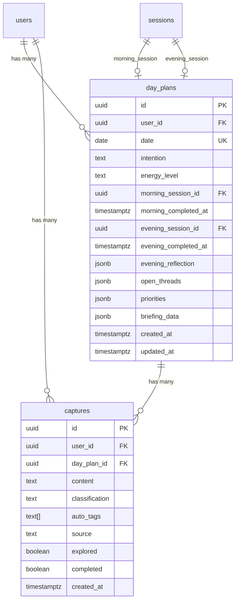

# Day Plan Artifact + Morning Flow Redesign

## Overview

Post-Playtest 4 redesign that fixes three systemic issues: (1) the broken promise loop where "View Day Plan" routes to Life Map, (2) the capture black hole where captures disappear after submission, and (3) the morning session running 13-20 minutes instead of the promised 3.

The solution: build a persistent Day Plan artifact on a new Day tab, redesign the morning conversation as a structured 5-step launch sequence, and promote captures to a queryable database table.

## Problem Statement

Playtest 4 revealed that Sage conversations produce insights and intentions, but the system has no persistent layer to hold them. The home screen doesn't update meaningfully. The day plan doesn't exist as a real artifact. Captures disappear into markdown files with no visibility. The morning session takes 13-20 minutes when the header says "~3 min."

## Architecture Decision: Hybrid Data Layer

**Key decision from brainstorming:** Keep markdown day plan files as the content store (for Sage context, session history) AND add Postgres tables for interactive/operational UI data.

- `day-plans/{date}.md` in Supabase Storage continues to be written by the open_day session via `[FILE_UPDATE]` blocks (unchanged)
- NEW `day_plans` Postgres table stores interactive state: energy level, priorities with checkbox state, open threads with provenance, streak data
- NEW `captures` Postgres table stores captures for queryability (grouped display, completion state, type filtering)
- Existing capture markdown pipeline continues in parallel for backward compat



## Technical Approach

### Implementation Phases

#### Phase 1: Data Layer (Foundation)

Create the Postgres tables, TypeScript types, query helpers, and RLS policies. Everything else depends on this.

**Tasks:**

1. **Create Supabase migration `016_day_plans_and_captures.sql`**
   - `day_plans` table with `UNIQUE(user_id, date)` constraint
   - `captures` table with `day_plan_id` FK (nullable — capture can arrive before morning session)
   - RLS policies: users can only read/write their own rows (deny-by-default per learnings from `Docs/solutions/security-issues/rls-auth-data-leak-fix.md`)
   - Indexes: `day_plans(user_id, date)`, `captures(user_id, day_plan_id)`, `captures(day_plan_id, classification)`

   ```sql
   -- day_plans table
   CREATE TABLE day_plans (
     id UUID PRIMARY KEY DEFAULT gen_random_uuid(),
     user_id UUID NOT NULL REFERENCES users(id) ON DELETE CASCADE,
     date DATE NOT NULL,
     intention TEXT,
     energy_level TEXT CHECK (energy_level IN ('fired_up', 'focused', 'neutral', 'low', 'stressed')),
     morning_session_id UUID REFERENCES sessions(id),
     morning_completed_at TIMESTAMPTZ,
     evening_session_id UUID REFERENCES sessions(id),
     evening_completed_at TIMESTAMPTZ,
     evening_reflection JSONB,
     open_threads JSONB DEFAULT '[]'::jsonb,
     priorities JSONB DEFAULT '[]'::jsonb,
     briefing_data JSONB,
     created_at TIMESTAMPTZ DEFAULT now(),
     updated_at TIMESTAMPTZ DEFAULT now(),
     UNIQUE(user_id, date)
   );

   -- captures table
   CREATE TABLE captures (
     id UUID PRIMARY KEY DEFAULT gen_random_uuid(),
     user_id UUID NOT NULL REFERENCES users(id) ON DELETE CASCADE,
     day_plan_id UUID REFERENCES day_plans(id) ON DELETE SET NULL,
     content TEXT NOT NULL,
     classification TEXT CHECK (classification IN ('thought', 'task', 'idea', 'tension')),
     auto_tags TEXT[] DEFAULT '{}',
     source TEXT DEFAULT 'manual' CHECK (source IN ('manual', 'morning_session', 'conversation')),
     explored BOOLEAN DEFAULT false,
     completed BOOLEAN DEFAULT false,
     created_at TIMESTAMPTZ DEFAULT now()
   );

   -- RLS
   ALTER TABLE day_plans ENABLE ROW LEVEL SECURITY;
   ALTER TABLE captures ENABLE ROW LEVEL SECURITY;

   CREATE POLICY "Users can manage own day plans" ON day_plans
     FOR ALL USING (auth.uid() = user_id) WITH CHECK (auth.uid() = user_id);
   CREATE POLICY "Users can manage own captures" ON captures
     FOR ALL USING (auth.uid() = user_id) WITH CHECK (auth.uid() = user_id);

   -- Indexes
   CREATE INDEX idx_day_plans_user_date ON day_plans(user_id, date);
   CREATE INDEX idx_captures_user_day_plan ON captures(user_id, day_plan_id);
   CREATE INDEX idx_captures_day_plan_classification ON captures(day_plan_id, classification);
   ```

2. **Create TypeScript types** in `types/day-plan.ts`
   - `DayPlan` type matching the table schema
   - `Capture` type matching the table schema
   - `Priority` type: `{ rank: number; text: string; completed: boolean }`
   - `OpenThread` type: `{ text: string; source_session_type: string; source_date: string; provenance_label: string; status: 'open' | 'resolved'; resolved_at: string | null }`
   - `EnergyLevel` union: `'fired_up' | 'focused' | 'neutral' | 'low' | 'stressed'`
   - `CaptureClassification` union: `'thought' | 'task' | 'idea' | 'tension'`

3. **Create query helpers** in `lib/supabase/day-plan-queries.ts`
   - `getOrCreateTodayDayPlan(supabase, userId)` — upserts using `ON CONFLICT(user_id, date)` to handle double morning sessions and lazy creation for pre-session captures
   - `updateDayPlan(supabase, userId, date, updates)` — partial update (priorities, threads, energy, etc.)
   - `getDayPlan(supabase, userId, date)` — fetch single day plan with captures
   - `getStreak(supabase, userId)` — count consecutive days with `morning_completed_at IS NOT NULL`, working backward from today. Returns 0 if today incomplete, 1+ if today (or yesterday if before morning) has a chain.
   - `createCapture(supabase, userId, data)` — insert capture row, auto-link to today's day_plan if it exists
   - `getCapturesForDayPlan(supabase, dayPlanId)` — fetch all captures grouped by classification
   - `toggleCaptureCompleted(supabase, captureId, userId)` — toggle task checkbox
   - `togglePriorityCompleted(supabase, userId, date, rank)` — update priorities JSONB

4. **Run migration** against Supabase and regenerate TypeScript types

**Files to create:**
- `supabase/migrations/016_day_plans_and_captures.sql`
- `types/day-plan.ts`
- `lib/supabase/day-plan-queries.ts`

**Files to modify:**
- None (additive)

**Success criteria:**
- [ ] Tables created with correct constraints and RLS
- [ ] TypeScript types generated and importable
- [ ] `getOrCreateTodayDayPlan` handles upsert correctly
- [ ] `getStreak` returns correct count for consecutive days

---

#### Phase 2: Day Plan View (The Artifact)

Build the Day Plan screen as a scrollable page on the new Day tab. This is the hero deliverable — the persistent, living document that replaces the chat-as-destination pattern.

**Prerequisite:** Phase 1 (tables + types must exist)

**Design tokens** (from spec + Magic Patterns code package):
```
cream: '#FBF8F3'         — page background
cream-dark: '#F3EDE4'    — card backgrounds
warm-gray: '#2D2A26'     — primary text
warm-gray-light: '#A39E97' — secondary text
amber: '#D4A853'         — primary accent
sage: '#8B9E7E'          — ideas accent
terracotta: '#C17B5E'    — tensions accent

intention-size: ~27px, font-weight 900, tracking -0.02em
section-header: 10px uppercase, tracking 0.15em, warm-gray-light
card-radius: 16px (rounded-2xl)
```

**Tasks:**

5. **Build `DayPlanView` container** — `app/(main)/day/page.tsx` + `components/day-plan/day-plan-view.tsx`
   - Server component at page level that fetches today's day plan + captures
   - Client component for interactive elements (checkboxes, capture input)
   - Scroll order: Header → IntentionCard → MorningSnapshotCard → CapturedThoughts → (future: Timeline, SitWith, EveningReflection)
   - Empty state (pre-morning): "Your intention will appear here after your morning session" + "Open the Day" CTA
   - Bottom padding `pb-28` to clear tab bar
   - **Critical**: Use explicit height constraints (not implicit `auto`) to prevent CSS Grid layout issues per `Docs/solutions/ui-bugs/chat-input-pushed-offscreen-css-grid-height.md`

6. **Build `IntentionCard`** — `components/day-plan/intention-card.tsx`
   - Hero element: large bold intention text (~27px, weight 900, tracking -0.02em)
   - Streak badge: "Day N" amber pill (top-left, subtle)
   - Amber flourish: short horizontal line (max-w-[80px], amber/50) + small dot
   - "Day in motion" pill below flourish
   - Card: `rounded-2xl`, `bg-cream-dark/60`, generous padding (`py-10 px-6`)
   - Empty state: placeholder text + "Open the Day" button (amber, prominent)

7. **Build `MorningSnapshotCard`** — `components/day-plan/morning-snapshot-card.tsx`
   - Bundled card with three subsections separated by subtle dividers:
     - **Status line**: Session time + energy indicator (e.g., "Morning session complete - 8:15am / Focused - Slept well")
     - **Priorities**: Numbered list (1-3) with checkboxes. Checked → struck-through, muted. Calls `togglePriorityCompleted` on tap.
     - **Open threads**: Each with provenance line + "explore" link + "resolved" affordance. Amber dot indicators (not colored left borders — distinct from captures).
   - Card: slightly warmer than others (`bg-cream-dark/70`)

8. **Build `CaptureInput`** — `components/day-plan/capture-input.tsx`
   - Inline "Capture a thought..." field at top of captures section
   - Expands on tap into text field + submit button
   - On submit: POST to `/api/capture`, show toast "Captured", optimistically add card to list
   - Uses `useOptimistic` or local state for instant feedback

9. **Build `CapturesList`** — `components/day-plan/captures-list.tsx`
   - Groups captures by classification type with section headers: "TASKS - 2", "THOUGHTS & IDEAS - 3", "TENSIONS - 1"
   - Section headers: 10px uppercase tracking, warm-gray-light
   - Delegates rendering to type-specific card components
   - Empty state: "Thoughts you capture during the day will appear here."

10. **Build capture card components** — `components/day-plan/capture-cards.tsx`
    - **TaskCaptureCard**: warm-gray-light left border + "TASK" tag + checkbox + content + timestamp. Checked → struck-through + muted. Calls `toggleCaptureCompleted`.
    - **ThoughtIdeaCaptureCard**: amber/sage left border + type tag + content + timestamp + "Explore with Sage" link (amber)
    - **TensionCaptureCard** (P1 but building the shell now): terracotta left border + "TENSION" tag + content + timestamp + "Sit with this" link
    - All cards: 3px left border, `rounded-2xl`, type label as small colored tag above content

**Files to create:**
- `app/(main)/day/page.tsx`
- `app/(main)/day/layout.tsx` (minimal — just passes through children)
- `components/day-plan/day-plan-view.tsx`
- `components/day-plan/intention-card.tsx`
- `components/day-plan/morning-snapshot-card.tsx`
- `components/day-plan/capture-input.tsx`
- `components/day-plan/captures-list.tsx`
- `components/day-plan/capture-cards.tsx`

**Files to modify:**
- `tailwind.config.ts` — add design tokens if not already present (cream, cream-dark, warm-gray, warm-gray-light, amber `#D4A853`, sage `#8B9E7E`, terracotta `#C17B5E`)

**Success criteria:**
- [ ] Day Plan page renders at `/day` with all sections in scroll order
- [ ] IntentionCard shows streak badge, intention text, amber flourish
- [ ] Priority checkboxes toggle and persist to database
- [ ] Captures grouped by type with correct color coding
- [ ] Task captures have working checkboxes
- [ ] Empty states render gracefully before morning session

---

#### Phase 3: Navigation + Routing (Tab Bar + Home Screen Fixes)

Replace the Chat tab with Day tab and fix the broken "View Day Plan" routing. These are P0 demo-killer fixes.

**Prerequisite:** Phase 2 (Day Plan page must exist at `/day`)

**Tasks:**

11. **Replace Chat tab with Day tab** in `components/ui/bottom-tab-bar.tsx`
    - Change `leftTabs[1]`: label `'Chat'` → `'Day'`, href `'/chat'` → `'/day'`
    - Update icon: replace chat bubble SVG with sun icon SVG (amber when active)
    - Tab structure becomes: `[Home] [Day] [Orb] [Life Map] [History]`
    - **Critical**: `/chat` route must still work for session launching (orb, deep links). Only the TAB destination changes.
    - The tab bar hide logic (`isActiveSession && pathname.startsWith('/chat')`) still works since chat sessions still use `/chat`.

12. **Fix "View Day Plan" routing** on home screen
    - In `components/home/home-screen.tsx`: Change the hero card CTA from routing to `/life-map` to routing to `/day`
    - The `openDayCompleted && todayIntention` state currently shows "Day Plan Set" with CTA routing to `/life-map` — change to `/day`
    - This is the P0 broken promise fix. One line change, massive trust impact.

13. **Update home screen status bar** (post-morning session state)
    - Add capture count status: "Morning complete - 3 captures"
    - Show intention card summary with "View Day Plan" link to `/day`
    - Ensure "View Day Plan" never routes to `/life-map` in any code path

**Files to modify:**
- `components/ui/bottom-tab-bar.tsx` — tab label, href, icon (lines 33-41)
- `components/home/home-screen.tsx` — hero card CTA routing, status bar
- `components/home/hero-card.tsx` (if separate) — routing fix

**Success criteria:**
- [ ] Bottom nav shows: Home | Day | [Orb] | Life Map | History
- [ ] Day tab routes to `/day` showing the Day Plan artifact
- [ ] "View Day Plan" on home screen routes to `/day`, never `/life-map`
- [ ] Active chat sessions still hide the tab bar correctly
- [ ] Center orb time-aware routing unchanged (morning → open_day, midday → capture, evening → close_day)

---

#### Phase 4: Capture Pipeline (Database + Toast + Real-time)

Upgrade the capture pipeline to write to the new Postgres table alongside existing markdown, show toast confirmation, and display captures on the Day Plan in real time.

**Prerequisite:** Phase 1 (captures table), Phase 2 (CaptureInput + CapturesList exist)

**Tasks:**

14. **Update `/api/capture` route** to dual-write
    - After existing markdown write, also `INSERT INTO captures` with `user_id`, `content`, `source: 'manual'`, and `day_plan_id` (link to today's day plan if exists, null otherwise)
    - Return the new capture's `id` in the response alongside the existing `filename`
    - Existing `classifyCapture` fire-and-forget now also updates the `captures` row's `classification` and `auto_tags` fields
    - **Gotcha**: Validate timestamps carefully per `Docs/solutions/code-review-fixes/20260218-daily-rhythm-m3-review-findings.md` (ISO vs HHmmss corruption risk)

15. **Add toast confirmation** to capture submission
    - In `CaptureInput` (Day Plan) and `CaptureBar` (Home screen): show "Captured" toast on successful submit
    - Auto-dismiss after 2 seconds
    - Use a lightweight toast component (create `components/ui/toast.tsx` if none exists)

16. **Optimistic capture display on Day Plan**
    - When a capture is submitted from the Day Plan's CaptureInput, optimistically insert a card into the CapturesList with classification "unclassified" (shows in a catch-all group)
    - When background classification completes, update the card's type grouping
    - Use React `useOptimistic` or local state + server revalidation

17. **Update `classifyCapture`** to write classification back to both markdown frontmatter (existing) and captures table (new)
    - In `lib/ai/classify-capture.ts`: after classification, also `UPDATE captures SET classification = ..., auto_tags = ... WHERE id = ...`
    - Pass the capture's Postgres `id` through the pipeline

**Files to modify:**
- `app/api/capture/route.ts` — add Postgres insert
- `lib/ai/classify-capture.ts` — add Postgres update
- `components/day-plan/capture-input.tsx` — toast on submit
- `components/home/capture-bar.tsx` — toast on submit

**Files to create:**
- `components/ui/toast.tsx` (if none exists)

**Success criteria:**
- [ ] Capture submit shows "Captured" toast immediately
- [ ] Capture appears in Day Plan's Captured Thoughts section
- [ ] Background classification updates the capture's type grouping
- [ ] Captures persist to both markdown and Postgres
- [ ] Capture without existing day_plan (submitted before morning session) still saves with null day_plan_id

---

#### Phase 5: Morning Flow Rewrite (Prompt + Session Data Flow)

Rewrite the morning session from a 3-beat conversational arc to a structured 5-step launch sequence. Wire the session to write operational data to the `day_plans` Postgres table at session completion.

**Prerequisite:** All previous phases (the morning session writes to the Day Plan artifact, which must exist)

**Tasks:**

18. **Rewrite `skills/open-day.md`** for the 5-step structured flow
    - Replace the current 3-beat arc with the 5-step sequence from spec Section 4:
      - Step 1: Energy Check (pill tap) — "How are you feeling heading into today?"
      - Step 2: Surface What's Known (briefing + confirm/correct) — Sage presents calendar, priorities, threads
      - Step 3: Intention Setting (voice/text) — "What's the one thing that would make today feel like a win?"
      - Step 4: Quick Triage (optional captures) — "Anything else on your mind?"
      - Step 5: Close & Launch — "You're set. Day plan's ready."
    - Add strict rules: every message <=3 sentences, never follow threads, capture-forward not coaching-forward
    - Emit `[SUGGESTED_REPLIES]` ONLY for Step 1 (energy pills) and Step 2 (confirmation pills). NOT for Steps 3-4 (open-ended).
    - The `[FILE_UPDATE type="day-plan"]` block at the end remains (writes markdown). Additionally instruct Sage to emit a `[DAY_PLAN_DATA]` structured block with energy, priorities, and open_threads for the system to parse into Postgres.
    - Add `[SUGGESTED_REPLIES]` rule: "Only offer pills for bounded choices. NEVER after open-ended questions."

19. **Add `[DAY_PLAN_DATA]` block parsing** to `lib/ai/parser.ts`
    - New block type: `[DAY_PLAN_DATA]...[/DAY_PLAN_DATA]` containing JSON with `energy_level`, `priorities[]`, `open_threads[]`
    - Add to both `parseMessage()` and `parseStreamingChunk()`
    - The data is consumed by the session completion handler to write to `day_plans` table

20. **Wire morning session completion** to populate `day_plans` table
    - In the session completion flow (wherever `completeSession` is called for `open_day`):
      - Parse the `[DAY_PLAN_DATA]` block from the final assistant message
      - Upsert the `day_plans` row: set `intention`, `energy_level`, `priorities`, `open_threads`, `morning_session_id`, `morning_completed_at`
      - The markdown day plan file is ALSO written by the existing `[FILE_UPDATE]` handler (dual-write)
    - Update `SESSION_WRITE_PERMISSIONS` in `lib/markdown/constants.ts` if needed (open_day already has `day-plans/` permission)

21. **Add "Same as yesterday" shortcut** for Step 3
    - When yesterday's intention exists, offer a `[SUGGESTED_REPLIES]` option: "Same as yesterday"
    - The skill prompt should instruct Sage to include this only when there's a carried intention from yesterday

22. **Energy pills component** — `components/chat/energy-pills.tsx`
    - 5 options: Fired up, Focused, Neutral, Low energy, Stressed
    - Rendered inline in chat when Sage asks the energy question
    - Tapping sends the energy value as a user message AND stores it for the `[DAY_PLAN_DATA]` block

**Files to modify:**
- `skills/open-day.md` — complete rewrite (Tasks 18, 21)
- `lib/ai/parser.ts` — add `[DAY_PLAN_DATA]` block parsing (Task 19)
- `types/chat.ts` — add `DayPlanDataBlock` type (Task 19)
- Session completion handler (find via `completeSession` or equivalent) — write to `day_plans` table (Task 20)

**Files to create:**
- `components/chat/energy-pills.tsx` (Task 22, if custom component needed beyond `[SUGGESTED_REPLIES]`)

**Success criteria:**
- [ ] Morning session follows strict 5-step sequence
- [ ] Energy level, priorities, and open threads written to `day_plans` Postgres table
- [ ] Intention written to both markdown file and Postgres table
- [ ] Session completes in 2-5 minutes (not 13-20)
- [ ] Quick reply pills only appear for bounded choices (Steps 1 and 2)
- [ ] "Same as yesterday" shortcut works when yesterday's intention exists
- [ ] `[DAY_PLAN_DATA]` block parsed correctly from Sage output

---

### Edge Cases and Mitigations

**From SpecFlow analysis:**

| Edge Case | Mitigation |
|-----------|-----------|
| Double morning session (user does open_day twice) | `UNIQUE(user_id, date)` + upsert. Second session overwrites the first's data. Skill prompt already says "If already completed today, reference existing plan." |
| Abandoned mid-flow | Partial day plan row is fine — fields are nullable. If user starts a new session, it completes and fills in the data. |
| Capture arrives before morning session | `day_plan_id` is nullable on captures. When day plan is created later, a background job or the session completion handler can backfill `day_plan_id` for today's orphan captures. |
| Classification fails | Show capture in an "Uncategorized" group. The card renders without a type tag. Classification can be retried. |
| Timezone for `date` field | Use `new Date().toLocaleDateString('en-CA')` (YYYY-MM-DD in local time) — same pattern as existing capture date handling in `app/api/capture/route.ts`. |
| Very long capture text | Truncate display at ~200 chars with "..." expand affordance. DB stores full text. |
| Streak across timezones | Streak is calculated server-side using the `date` field (local calendar day). Timezone changes may break a streak — acceptable for MVP. |
| Active chat session + Day tab | Tab bar hide logic checks `pathname.startsWith('/chat') && hasActiveSession`. Day tab at `/day` is unaffected. Active sessions still hide the tab bar when on `/chat`. |
| Existing `/chat` deep links | `/chat` route still exists for session launching. The tab just doesn't point there. Orb still links to `/chat?type=open_day`. |

### Learnings Applied

From `Docs/solutions/`:

1. **RLS: deny-by-default** — `day_plans` and `captures` policies use explicit `auth.uid() = user_id` checks, not `USING (true)`. Per `rls-auth-data-leak-fix.md`.
2. **Supabase client at module scope** — All new query helpers use the passed `supabase` client, never `createClient()` in render scope. Per `supabase-client-in-usecallback-deps.md`.
3. **CSS Grid height constraints** — Day Plan view uses explicit height constraints to prevent the layout bug documented in `chat-input-pushed-offscreen-css-grid-height.md`.
4. **Timestamp validation** — Capture pipeline validates ISO timestamps to prevent the corruption found in `20260218-daily-rhythm-m3-review-findings.md`.
5. **Dead code audit** — After home screen changes, verify no phantom queries remain in `home-data.ts` (per `dead-code-accumulation-post-redesign.md`).
6. **Write permission whitelist** — `open_day` already has `day-plans/` in `SESSION_WRITE_PERMISSIONS`. No changes needed for markdown writes.

## Acceptance Criteria

### Functional Requirements

- [x] Day Plan page exists at `/day` with all sections rendering
- [x] Bottom nav shows Home | Day | [Orb] | Life Map | History
- [x] "View Day Plan" routes to `/day`, never to `/life-map`
- [x] Morning session follows 5-step structure and completes in 2-5 minutes
- [x] Morning session writes intention, energy, priorities, threads to `day_plans` table
- [x] Captures submit with toast confirmation and appear on Day Plan immediately
- [x] Captures grouped by type (Tasks, Thoughts & Ideas, Tensions)
- [x] Task captures and priorities have working checkboxes (toggle persists)
- [x] Streak badge shows consecutive days with morning sessions completed
- [x] Quick reply pills only appear for bounded choices

### Non-Functional Requirements

- [x] Day Plan page loads in <2 seconds (single DB query + captures query)
- [x] Capture submit shows toast within 100ms (optimistic UI)
- [x] All new tables have RLS with deny-by-default policies
- [x] No regressions to existing `/chat` session flows
- [x] Mobile-first: touch targets minimum 44px, proper scroll behavior

## Dependencies & Prerequisites

- Supabase CLI access for running migrations
- Magic Patterns code package at `inspiration/20260220_Day_Plan_Screen_Reference.zip` (visual reference — extract before Phase 2)
- Existing markdown pipeline continues working in parallel (no breaking changes)

## Risk Analysis & Mitigation

| Risk | Impact | Mitigation |
|------|--------|-----------|
| `[DAY_PLAN_DATA]` block not reliably emitted by Sage | High — no structured data in Postgres | Fallback: parse intention from `[FILE_UPDATE]` block's `intention` attribute (already exists). Parse energy from user message matching pill values. |
| Dual-write (markdown + Postgres) divergence | Medium — data inconsistency | Postgres is the UI read source. Markdown is for Sage context. They don't need to be identical — each serves its purpose. |
| Existing home screen tests break after routing change | Medium — regression | Run full test suite after Phase 3. The routing change is a one-line fix. |
| Morning prompt rewrite causes unexpected Sage behavior | High — poor user experience | Test thoroughly with multiple conversation scenarios. Keep the old skill file as `skills/open-day-v1.md` for rollback. |

## References

### Internal References
- Spec: `Docs/feedback/20260220_R4e_open_day_quick_capture.md` (v2.0)
- Visual reference: `inspiration/20260220_Day_Plan_Screen_Reference.zip`
- Current morning skill: `skills/open-day.md`
- Tab bar: `components/ui/bottom-tab-bar.tsx`
- Home data: `lib/supabase/home-data.ts`
- Capture API: `app/api/capture/route.ts`
- Parser: `lib/ai/parser.ts`
- Write permissions: `lib/markdown/constants.ts`
- Home screen: `components/home/home-screen.tsx`
- RLS learnings: `Docs/solutions/security-issues/rls-auth-data-leak-fix.md`
- CSS Grid learnings: `Docs/solutions/ui-bugs/chat-input-pushed-offscreen-css-grid-height.md`
- Timestamp learnings: `Docs/solutions/code-review-fixes/20260218-daily-rhythm-m3-review-findings.md`
