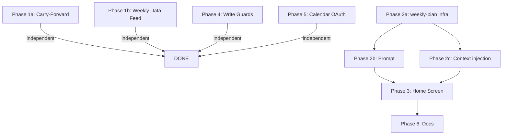

# Data Architecture Layer 2 Fixes

## Overview

Six fixes to close the data flow gaps between MeOS's three artifact layers (Life Map / Life Plan / Daily Plan). The core issues: Layer 2 (weekly planning) doesn't exist as a distinct artifact, daily priority data doesn't carry forward between sessions, and some session types can silently mutate the Life Map.

**Source spec:** `Docs/feedback/20260222_Data_architecture.md`
**Brainstorm:** `Docs/brainstorms/2026-02-22-data-architecture-fixes-brainstorm.md`
**Audit:** `Docs/generated/20260222_data_architecture_audit.md`

## Problem Statement

1. **No weekly planning artifact.** `life-plan/current.md` conflates quarterly commitments (Layer 1) with weekly status (Layer 2). Morning briefs anchor on broad quarterly goals instead of "this week's top 3."
2. **Daily priorities don't carry forward.** When a user skips Close Day, uncompleted priorities from `day_plans.priorities` JSONB are invisible to tomorrow's Open Day.
3. **Weekly check-ins lack operational data.** Sage sees journal narratives but not planned-vs-completed priority data, energy trends, or lingering threads.
4. **Life Map writes are unguarded.** Casual ad hoc conversations and weekly check-ins can silently rewrite deep domain content.
5. **Google Calendar OAuth broken.** Missing `client_id` in OAuth URL (may already be resolved by PR #29).

## Key Design Decisions (from brainstorm)

| Decision | Choice | Rationale |
|---|---|---|
| Weekly plan block format | `[FILE_UPDATE type="weekly-plan"]` | Consistent with existing pipeline — no new parser branches |
| Weekly plan frontmatter | Middle ground: metadata + simple priorities (text, domain) | Home card queryable without parsing markdown; full detail in body |
| Open Day context when weekly.md exists | Weekly primary + quarterly commitment headings only | Sage stays aware of all commitments without full token cost |
| Reflection day | Hardcoded Sunday for MVP | YAGNI — add user preference later |

## Technical Approach

### Architecture

All changes follow established patterns documented in institutional learnings:
- **Timezone threading:** All date computations use `getLocalDateString(timezone)` / `getYesterdayDateString(timezone)` from `lib/dates.ts` — never raw UTC
- **Context injection:** Session-specific blocks in `fetchAndInjectFileContext()` wrapped in try/catch, push to `parts[]` array
- **File type registration:** 6-file checklist (constants → types → frontmatter → user-file-system → file-write-handler → parser auto-discovers)
- **Prompt safety:** User-submitted text sanitized of `[FILE_UPDATE]` block tags before injection
- **Parallelization:** Independent reads via `Promise.allSettled()`

### SpecFlow Gap Resolutions

| Gap | Resolution |
|---|---|
| Stale weekly.md (from 2+ weeks ago) | Only inject if `week_of` frontmatter falls within current Mon-Sun week; else fall back to `current.md` |
| Concurrent weekly_checkin session on Sunday | If active `weekly_checkin` session exists, show "Resume your reflection" instead of "Start" |
| Thread deduplication in Ticket 4 | Deduplicate by `text` field (case-insensitive trim). `OpenThread` type has `text`, `status`, `source_date` |
| Monday nudge dismissal | Session-level state only (disappears on navigation). No persistent "dismissed" flag — YAGNI |
| "View Full Plan" CTA destination | Navigate to `/life-map` tab (existing) with weekly plan section. No new page for MVP |
| Token budget for "Week in Numbers" | Cap at 7 days max. Truncate to summary stats if >500 tokens |
| Prompt guard failure for Ticket 5 | Accept risk for MVP. Infrastructure `SESSION_WRITE_PERMISSIONS` is the real guard. Prompt is defense-in-depth |
| "All priorities completed" vs "no data" | Sage prompt distinguishes: "all done" → acknowledge; "no data" → omit section entirely |

### Implementation Phases

---

#### Phase 1: Daily Priority Carry-Forward + Weekly Data Feed (Tickets 1 & 4)

Both add DB reads to context injection for different session types. Same file (`context.ts`), same DB table (`day_plans`). Low regression risk.

##### Phase 1a: Ticket 1 — Daily Priority Carry-Forward

**Files to change:**

1. **`lib/ai/context.ts`** — Add `day_plans` DB read inside `if (sessionType === 'open_day')` block (after line ~185, the existing `yesterdayDayPlan` markdown read)

```typescript
// After the markdown day plan read, add DB read for structured data
import { getDayPlan } from '@/lib/supabase/day-plan-queries'

// Inside the open_day block:
try {
  const yesterdayDbPlan = await getDayPlan(supabase, userId, yesterdayStr)
  if (yesterdayDbPlan) {
    const uncompleted = yesterdayDbPlan.priorities?.filter(p => !p.completed) ?? []
    const unresolvedThreads = yesterdayDbPlan.open_threads?.filter(t => t.status !== 'resolved') ?? []

    if (uncompleted.length > 0 || unresolvedThreads.length > 0) {
      parts.push('\n=== CARRY FORWARD FROM YESTERDAY ===')
      if (uncompleted.length > 0) {
        parts.push('\n### Uncompleted Priorities')
        for (const p of uncompleted) {
          parts.push(`- [ ] ${p.text} (set yesterday, not completed)`)
        }
      }
      if (unresolvedThreads.length > 0) {
        parts.push('\n### Unresolved Open Threads')
        for (const t of unresolvedThreads) {
          parts.push(`- ${t.text} (from ${t.provenance_label || 'yesterday'})`)
        }
      }
      parts.push('\nNote: These items were on yesterday\'s plan but weren\'t completed. Surface them naturally — the user should decide whether to carry forward, defer, or drop.')
    } else if (yesterdayDbPlan.priorities && yesterdayDbPlan.priorities.length > 0) {
      // All priorities completed — acknowledge clean slate
      parts.push('\n=== YESTERDAY\'S PRIORITIES: ALL COMPLETED ===')
      parts.push('The user completed everything on yesterday\'s plan. Acknowledge this positively.')
    }
  }
} catch {
  // No day_plans data — fine, omit section
}
```

2. **`lib/ai/prompts.ts`** — Update `getOpenDayBasePrompt()` to acknowledge carry-forward data:
   - Add instruction: "If there are uncompleted priorities or unresolved threads from yesterday, mention them naturally during the briefing. Frame as 'still on your plate' not 'you didn't finish these.' Let the user decide what to carry forward vs. drop."

**Acceptance criteria:**
- [x] 1 of 3 priorities completed Monday, Tuesday brief surfaces the 2 uncompleted
- [x] All priorities completed → morning brief acknowledges clean slate
- [x] No yesterday `day_plans` row → section omitted, no error
- [x] Timezone-aware: uses `getYesterdayDateString(timezone)` for the query date

##### Phase 1b: Ticket 4 — Feed Daily Data into Weekly Check-in

**Files to change:**

1. **`lib/ai/context.ts`** — Add `day_plans` bulk read inside `if (sessionType === 'weekly_checkin')` block (after the daily journals injection, ~line 320)

```typescript
// After daily journal injection, add structured day_plans data
try {
  // Reuse the same date range as daily logs
  const weekDayPlans = await Promise.allSettled(
    journalDates.map(date => getDayPlan(supabase, userId, date))
  )
  const validPlans = weekDayPlans
    .filter((r): r is PromiseFulfilledResult<DayPlan> =>
      r.status === 'fulfilled' && r.value != null)
    .map(r => r.value)

  if (validPlans.length > 0) {
    const totalPriorities = validPlans.reduce((sum, d) => sum + (d.priorities?.length || 0), 0)
    const completedPriorities = validPlans.reduce((sum, d) =>
      sum + (d.priorities?.filter(p => p.completed)?.length || 0), 0)
    const avgEnergy = validPlans
      .map(d => d.energy_level)
      .filter(Boolean)
      // Convert to numeric for averaging

    parts.push(`\n=== WEEK IN NUMBERS ===`)
    parts.push(`Days with morning sessions: ${validPlans.length} / 7`)
    parts.push(`Priorities set: ${totalPriorities} | Completed: ${completedPriorities}`)

    parts.push('\n### Daily Intentions')
    for (const plan of validPlans) {
      const status = plan.priorities?.every(p => p.completed) ? '✅' : '—'
      parts.push(`- **${plan.date}**: "${plan.intention || 'no intention set'}" ${status}`)
    }

    // Deduplicate unresolved threads by text
    const seen = new Set<string>()
    const unresolvedThreads = validPlans
      .flatMap(d => (d.open_threads || []).filter(t => t.status !== 'resolved'))
      .filter(t => {
        const key = t.text.trim().toLowerCase()
        if (seen.has(key)) return false
        seen.add(key)
        return true
      })

    if (unresolvedThreads.length > 0) {
      parts.push('\n### Unresolved Threads (persisted across multiple days)')
      for (const t of unresolvedThreads) {
        parts.push(`- ${t.text} (first appeared: ${t.source_date || 'unknown'})`)
      }
    }

    parts.push('\nUse this operational data alongside daily journals to close the loop on planned vs. actual.')
  }
} catch {
  // No day_plans data — fine
}
```

2. **`lib/ai/prompts.ts`** — Update `getWeeklyCheckinBasePrompt()` to reference the new data:
   - Add instruction: "If operational data is present (Week in Numbers), use it to identify patterns: Are priorities being completed? Is energy trending? Are threads lingering unresolved? Reference specific data points during the reflection."

**Acceptance criteria:**
- [x] Weekly check-in context includes priority completion rates from `day_plans`
- [x] Sage references specific daily intentions and completion data during reflection
- [x] Unresolved threads persisting across multiple days are surfaced (deduplicated by text)
- [x] Zero `day_plans` rows → "Week in Numbers" section omitted entirely
- [x] Cap at 7 days max; truncate to summary stats if needed

---

#### Phase 2: Weekly Planning Artifact (Ticket 2)

The architectural centerpiece. Creates the Layer 2 artifact that makes weekly planning real.

##### Phase 2a: Infrastructure — Register the `weekly-plan` file type

**Files to change (in order):**

1. **`lib/markdown/constants.ts`**
   - Add `WEEKLY_PLAN: 'weekly-plan'` to `FILE_TYPES` object (~line 38)
   - Add `'life-plan/weekly.md'` to `SESSION_WRITE_PERMISSIONS.weekly_checkin` array (~line 68)
   - Also add `'life-plan/weekly.md'` read permission for `open_day` if read permissions are tracked

2. **`types/markdown-files.ts`**
   - Add `WeeklyPlanFrontmatterSchema` Zod schema (after `LifePlanFileFrontmatterSchema`, ~line 53):

```typescript
export const WeeklyPlanFrontmatterSchema = z.object({
  type: z.literal('weekly-plan').default('weekly-plan'),
  week_of: z.string(),               // YYYY-MM-DD of Monday
  created_from_session: z.string().optional(),
  priorities: z.array(z.object({
    text: z.string(),
    domain: z.string().optional(),
  })).default([]),
  status: z.enum(['active', 'archived']).default('active'),
  created_at: z.string(),
  last_updated: z.string(),
  updated_by: z.enum(['sage', 'system', 'user']).default('sage'),
  version: z.number().int().positive().default(1),
  schema_version: z.number().int().positive().default(1),
})
export type WeeklyPlanFrontmatter = z.infer<typeof WeeklyPlanFrontmatterSchema>
```
   - Add `WeeklyPlanFrontmatter` to the `AnyFrontmatter` union (~line 151)

3. **`lib/markdown/frontmatter.ts`**
   - Add `generateWeeklyPlanFrontmatter()` function following the `generateLifePlanFrontmatter` pattern (~line 60):

```typescript
export function generateWeeklyPlanFrontmatter(
  weekOf: string,
  overrides?: Partial<WeeklyPlanFrontmatter>
): WeeklyPlanFrontmatter {
  const now = new Date().toISOString()
  return {
    type: 'weekly-plan',
    week_of: weekOf,
    created_from_session: overrides?.created_from_session,
    priorities: overrides?.priorities ?? [],
    status: overrides?.status ?? 'active',
    created_at: overrides?.created_at ?? now,
    last_updated: now,
    updated_by: overrides?.updated_by ?? 'sage',
    version: overrides?.version ?? 1,
    schema_version: 1,
  }
}
```

4. **`lib/markdown/user-file-system.ts`**
   - Add `readWeeklyPlan()` method (following `readLifePlan()` pattern, ~line 230):
     - Path: `life-plan/weekly.md`
     - Parse frontmatter with `WeeklyPlanFrontmatterSchema`
   - Add `writeWeeklyPlan()` method (following `writeLifePlan()` pattern):
     - Read existing frontmatter if present
     - Merge with overrides
     - Generate frontmatter via `generateWeeklyPlanFrontmatter()`
     - Write to `life-plan/weekly.md`
     - Update `file_index`

5. **`lib/markdown/file-write-handler.ts`**
   - In `resolveFileUpdatePath()` (~line 23), add case:
     ```typescript
     case FILE_TYPES.WEEKLY_PLAN:
       return 'life-plan/weekly.md'
     ```
   - In `handleFileUpdate()` switch (~line 110), add case:
     ```typescript
     case FILE_TYPES.WEEKLY_PLAN: {
       // Extract week_of from attributes or compute from current date
       const weekOf = update.attributes?.week_of || getStartOfWeek(timezone)
       await ufs.writeWeeklyPlan(update.content, {
         week_of: weekOf,
         created_from_session: sessionId,
         priorities: extractPrioritiesFromContent(update.content), // parse from markdown
       })
       break
     }
     ```

6. **`lib/ai/parser.ts`** — No changes needed. `VALID_FILE_TYPES` is built dynamically from `Object.values(FILE_TYPES)`, so `weekly-plan` is automatically valid.

**Helper needed:** Add `getStartOfWeek(timezone: string): string` to `lib/dates.ts` — returns the Monday of the current week as `YYYY-MM-DD` in the user's timezone.

**Helper needed:** Add `extractPrioritiesFromContent(markdown: string): Array<{text: string, domain?: string}>` — parses the `## Priorities` section of weekly.md to extract the simple priorities list for frontmatter. Follows the `extractCommitments()` pattern in the codebase.

##### Phase 2b: Prompt — Instruct Sage to produce weekly plan

**Files to change:**

1. **`lib/ai/prompts.ts`** — In `getWeeklyCheckinBasePrompt()` (~line 364):
   - Add `weekly-plan` to the `FILE_UPDATE_FORMAT` constant description (~line 25)
   - Add end-of-session generation instructions (~line 409):

```
At the end of the weekly check-in, after summarizing the week and updating
commitment statuses, produce a WEEKLY PLAN for the coming week.

Emit a [FILE_UPDATE type="weekly-plan"] block containing:

## This Week's Focus
{{2-3 sentence narrative connecting priorities to the broader life plan}}

## Priorities
1. **{{Priority text}}** — {{Brief context or connection to quarterly commitment}}
2. ...
(Top 3-5 priorities. Draw from quarterly commitments + new items that emerged.)

## Active Projects
- **{{Project name}}** — {{Status}}. Next milestone: {{milestone}}

## Open Threads
- {{Thread text}} ({{source context}})

## Recurring
- {{Recurring commitment}}

Frame priorities as choices — help them focus rather than listing everything.
The weekly plan is FORWARD-LOOKING. It's "what matters next week,"
not a summary of last week (that's what the check-in summary is for).
```

##### Phase 2c: Context injection — Open Day reads weekly.md

**Files to change:**

1. **`lib/ai/context.ts`** — In `fetchAndInjectFileContext()`:
   - In the base context section (where `life-plan/current.md` is read for all session types), add a conditional for `open_day`:

```typescript
// For open_day: prefer weekly.md if current-week, with quarterly headings as supplement
if (sessionType === 'open_day') {
  try {
    const weeklyPlan = await ufs.readWeeklyPlan()
    if (weeklyPlan) {
      const weekOf = weeklyPlan.frontmatter?.week_of
      const currentWeekMonday = getStartOfWeek(timezone)
      if (weekOf === currentWeekMonday) {
        // Weekly plan is current — use as primary
        parts.push('\n=== THIS WEEK\'S PLAN (from weekly check-in) ===')
        parts.push(weeklyPlan.content)

        // Add abbreviated quarterly context (headings only)
        if (lifePlan) {
          const headings = extractCommitmentHeadings(lifePlan.content)
          if (headings.length > 0) {
            parts.push('\n=== QUARTERLY COMMITMENTS (headings only) ===')
            for (const h of headings) {
              parts.push(`- ${h}`)
            }
          }
        }
        // Skip full life-plan/current.md injection for open_day
        skipFullLifePlan = true
      }
    }
  } catch {
    // No weekly plan — fall through to full current.md
  }
}

// Existing life-plan/current.md injection (add skipFullLifePlan guard)
if (!skipFullLifePlan && lifePlan) {
  parts.push('\n=== LIFE PLAN ===')
  parts.push(lifePlan.content)
}
```

2. **`lib/ai/context.ts`** — Also add `life-plan/weekly.md` to the `weekly_checkin` context injection so the next check-in can reference what was planned last week vs. actual:

```typescript
if (sessionType === 'weekly_checkin') {
  try {
    const lastWeeklyPlan = await ufs.readWeeklyPlan()
    if (lastWeeklyPlan) {
      parts.push('\n=== LAST WEEK\'S PLAN (for comparison) ===')
      parts.push(lastWeeklyPlan.content)
    }
  } catch { /* no previous plan — fine */ }
}
```

3. **`lib/ai/prompts.ts`** — Update `getOpenDayBasePrompt()`:
   - Add: "When briefing the user, anchor on their WEEKLY PRIORITIES (from weekly plan) rather than quarterly commitments. Help them pick 1-3 things from the weekly priorities that make sense for TODAY. If no weekly plan exists, fall back to quarterly commitments."

**Helper needed:** Add `extractCommitmentHeadings(content: string): string[]` — extracts `###` headings from `life-plan/current.md`. Can reuse the existing heading extraction pattern.

**Acceptance criteria:**
- [x] After a weekly check-in, `life-plan/weekly.md` exists with valid frontmatter and content
- [x] `weekly-plan` type flows through parser → handler → UserFileSystem → Storage without error
- [x] Frontmatter contains simple priorities list (text + domain) for home card
- [x] Next morning's open_day brief references weekly priorities, not quarterly commitments
- [x] Stale weekly.md (>1 week old) → falls back to full `current.md`
- [x] No weekly.md exists → falls back to full `current.md`
- [x] Weekly check-in reads last week's plan for comparison

---

#### Phase 3: Weekly Reflection Home Screen Trigger (Ticket 3)

Depends on Phase 2 for the post-completion success state.

**Files to change:**

1. **`lib/dates.ts`** — Add helper:
   ```typescript
   export function getStartOfWeek(timezone: string): string
   // Returns Monday YYYY-MM-DD of the current week in user's timezone
   ```

2. **`lib/supabase/home-data.ts`**
   - Add fields to `HomeData` interface (~line 9):
     ```typescript
     showWeeklyReflection: boolean    // true if Sunday + no completed weekly_checkin this week
     showWeeklyNudge: boolean         // true if Monday + no completed weekly_checkin this week
     weeklyPlanPriorities: Array<{ text: string; domain?: string }> | null  // from weekly.md frontmatter
     hasActiveWeeklySession: boolean  // true if in-progress weekly_checkin session exists
     ```
   - In `getHomeData()` (~line 30):
     - Compute day of week: `getLocalDayOfWeek(timezone)` (already exists in `lib/dates.ts`)
     - Query sessions table for completed `weekly_checkin` this week:
       ```sql
       SELECT id FROM sessions
       WHERE user_id = $1
         AND type = 'weekly_checkin'
         AND status = 'completed'
         AND created_at >= $startOfWeek
       LIMIT 1
       ```
     - Query for active (non-completed) `weekly_checkin` session:
       ```sql
       SELECT id FROM sessions
       WHERE user_id = $1
         AND type = 'weekly_checkin'
         AND status IN ('active', 'in_progress')
       LIMIT 1
       ```
     - If completed this week, read `life-plan/weekly.md` frontmatter for priorities
     - Set `showWeeklyReflection = isSunday && !completedThisWeek && !hasActiveSession`
     - Set `showWeeklyNudge = isMonday && !completedThisWeek`
     - Set `hasActiveWeeklySession = !!activeSession`

3. **`app/(main)/home/page.tsx`**
   - Pass new fields through to `HomeScreen` component (~line 37)

4. **`components/home/home-screen.tsx`**
   - Add new fields to `HomeScreenData` interface (~line 22)
   - Add weekly reflection hero card logic:

```tsx
{/* Weekly Reflection — Sunday trigger */}
{data.showWeeklyReflection && (
  <WeeklyReflectionCard />
)}

{/* Active weekly session — Resume trigger */}
{data.hasActiveWeeklySession && (
  <ResumeWeeklyCard sessionId={data.activeWeeklySessionId} />
)}

{/* Weekly plan summary — post-completion */}
{data.weeklyPlanPriorities && (
  <WeeklyPlanSummaryCard priorities={data.weeklyPlanPriorities} />
)}

{/* Monday nudge */}
{data.showWeeklyNudge && (
  <WeeklyNudgeCard />
)}
```

5. **New component: `components/home/weekly-reflection-card.tsx`**
   - Follow existing `HeroCard` pattern
   - CTA: "Start weekly check-in" → navigates to `/chat?type=weekly_checkin`
   - Warm design (amber accent, not cold blue) per MeOS design system

6. **New component: `components/home/weekly-plan-summary-card.tsx`**
   - Shows top 3 priorities from `weeklyPlanPriorities` prop
   - "View Full Plan" CTA → navigates to `/life-map`

**Acceptance criteria:**
- [ ] Sunday morning → hero card prompts weekly reflection
- [ ] Active in-progress weekly session → "Resume" card instead of "Start"
- [ ] Post-completion → priorities summary card
- [ ] Monday, reflection not done → gentle nudge
- [ ] Tuesday+ → nudge gone, silence
- [ ] Sunday detection uses user timezone (not UTC)
- [ ] Cards don't block Open Day / Capture / Close Day rituals

---

#### Phase 4: Life Map Write Guards (Ticket 5)

Prompt-only changes. No code changes outside `prompts.ts`. Can ship independently.

**Files to change:**

1. **`lib/ai/prompts.ts`** — In `getAdHocPrompt()` (~line 443), for the `isExploring` mode (~line 447):
   - Replace current write permission text with confirmation-required version:

```
If during this conversation you identify an insight that would meaningfully
update the user's Life Map (e.g., a shift in how they think about a domain,
a new tension, a resolved goal), DO NOT silently update the Life Map.

Instead:
1. Surface the insight: "This sounds like a real shift in how you think about
   [domain]. Your Life Map currently says [X] — should I update it to reflect [Y]?"
2. Wait for the user to confirm
3. Only then emit the [FILE_UPDATE type="domain"] block

If the user explicitly asks to update their notes ("update my life map",
"save that", "capture this"), that counts as confirmation — proceed with the write.

If the insight is minor or you're not sure it's a real shift, capture it in
sage/context.md instead. It will surface during the next weekly or quarterly review.
```

2. **`lib/ai/prompts.ts`** — In `getWeeklyCheckinBasePrompt()` (~line 364), add scope guard for domain writes:

```
During weekly check-ins, you may update life-map domain files, but ONLY:
- The status field (e.g., thriving → stable → needs_attention)
- The score field (1-5 rating)
- Brief additions to the "what's changed recently" section

Do NOT rewrite the core domain content (current state narrative, core tensions,
long-term desires) during a weekly check-in. Those deeper rewrites belong in a
life_mapping session or quarterly review.

If you notice something that warrants a deeper domain rewrite, note it in
sage/context.md and flag it: "Worth exploring [domain] in depth next time."
```

**Acceptance criteria:**
- [ ] Ad hoc explore: Sage surfaces Life Map change proposals before writing
- [ ] Ad hoc explore: User must confirm before any Life Map `[FILE_UPDATE]` is emitted
- [ ] Weekly check-in: domain updates limited to status/score
- [ ] Observations below write threshold → captured in `sage/context.md`

---

#### Phase 5: Calendar OAuth Verification (Ticket 6)

**Investigation steps:**

1. **Check if PR #29 fully resolved the issue:**
   - PR #29 (`fix: incremental Google Calendar OAuth consent flow`) is already merged
   - Current code in `lib/calendar/google-calendar.ts` correctly creates a new `OAuth2` instance with `redirectUri` in `generateCalendarAuthUrl()` (~line 205)
   - The code path is correct IF `process.env.GOOGLE_CLIENT_ID` is set

2. **Verify env vars in deployment:**
   - Check Vercel dashboard for `GOOGLE_CLIENT_ID`, `GOOGLE_CLIENT_SECRET`, `GOOGLE_REDIRECT_URI`
   - Check Google Cloud Console: OAuth consent screen configured, authorized redirect URIs match deployed domain
   - If app is in "Testing" mode, only test users can authorize

3. **If still broken:** The issue is `new google.auth.OAuth2(undefined, ...)` silently generating an auth URL with blank `client_id`. Add a guard:

```typescript
// In generateCalendarAuthUrl() or /api/calendar/connect/route.ts
if (!process.env.GOOGLE_CLIENT_ID) {
  throw new Error('GOOGLE_CLIENT_ID environment variable is not set')
}
```

**Acceptance criteria:**
- [ ] "Connect" button opens Google OAuth consent screen (not error)
- [ ] After authorization, calendar events display on home screen
- [ ] Missing env var produces clear server error, not cryptic Google 400

---

#### Phase 6: Data Architecture Anchor Document

Create `Docs/data_architecture.md` as the canonical reference for the three-layer data model, file paths, write permissions, and data flow between sessions.

**Content:** Consolidate from the audit (`20260222_data_architecture_audit.md`), the original brainstorm (`2026-02-14-markdown-data-architecture-brainstorm.md`), and CLAUDE.md's architecture section into a single living document. Include:
- Three-layer model diagram
- Complete file path map per user
- Session write permission matrix (updated with `weekly-plan`)
- Context injection matrix (what each session type reads)
- Frontmatter schema summary table
- Data flow diagrams (daily cycle, weekly cycle)

---

## Dependencies & Prerequisites



- Phase 1a + 1b can run in parallel
- Phase 2a must complete before 2b and 2c
- Phase 3 depends on Phase 2 (needs weekly.md to exist for success state)
- Phase 4 and Phase 5 are fully independent — can run anytime
- Phase 6 runs last (documents the final state)

## Risk Analysis & Mitigation

| Risk | Impact | Mitigation |
|---|---|---|
| `fetchAndInjectFileContext()` grows too large | Token budget exceeded, slow morning sessions | Cap each injected section; measure total tokens per session type |
| Sage doesn't emit `[FILE_UPDATE type="weekly-plan"]` reliably | weekly.md never created | Test with real check-in sessions; add logging for missing blocks |
| Stale weekly.md injected for wrong week | Morning brief anchors on outdated priorities | `week_of` freshness check + `getStartOfWeek()` comparison |
| Prompt-level write guard (Ticket 5) ignored by model | Silent Life Map mutation in ad hoc sessions | Infrastructure `SESSION_WRITE_PERMISSIONS` is the real guard; prompt is defense-in-depth |
| Home screen query count increases | Page load latency | Parallelize new queries with `Promise.allSettled()` |

## Quality Gates

- [ ] All existing tests pass after each phase
- [ ] `npm run type-check` passes (no new `any` types)
- [ ] `npm run lint` passes
- [ ] Manual test: full daily cycle (Open Day → Capture → Close Day → next Open Day) with carry-forward
- [ ] Manual test: weekly check-in produces `life-plan/weekly.md` with valid frontmatter
- [ ] Manual test: next morning's Open Day reads weekly priorities instead of quarterly
- [ ] Manual test: Sunday home screen shows weekly reflection card

## References & Research

### Internal References
- Context injection: [context.ts](lib/ai/context.ts) — `fetchAndInjectFileContext()`
- Prompts: [prompts.ts](lib/ai/prompts.ts) — `getOpenDayBasePrompt()`, `getWeeklyCheckinBasePrompt()`, `getAdHocPrompt()`
- File types: [constants.ts](lib/markdown/constants.ts) — `FILE_TYPES`, `SESSION_WRITE_PERMISSIONS`
- Write handler: [file-write-handler.ts](lib/markdown/file-write-handler.ts) — `resolveFileUpdatePath()`, `handleFileUpdate()`
- File system: [user-file-system.ts](lib/markdown/user-file-system.ts) — `readLifePlan()`, `writeLifePlan()` (pattern to follow)
- Frontmatter: [frontmatter.ts](lib/markdown/frontmatter.ts) — `generateLifePlanFrontmatter()` (pattern to follow)
- Types: [markdown-files.ts](types/markdown-files.ts) — `LifePlanFileFrontmatterSchema` (pattern to follow)
- Day plan queries: [day-plan-queries.ts](lib/supabase/day-plan-queries.ts) — `getDayPlan()`
- Day plan types: [day-plan.ts](types/day-plan.ts) — `DayPlan`, `Priority`, `OpenThread`
- Home data: [home-data.ts](lib/supabase/home-data.ts) — `getHomeData()`
- Home screen: [home-screen.tsx](components/home/home-screen.tsx)
- Date utils: [dates.ts](lib/dates.ts) — `getLocalDateString()`, `getYesterdayDateString()`, `getLocalDayOfWeek()`
- Calendar OAuth: [google-calendar.ts](lib/calendar/google-calendar.ts) — `generateCalendarAuthUrl()`

### Institutional Learnings Applied
- Timezone-aware dates: `Docs/solutions/logic-errors/2026-02-21-server-side-utc-date-context-injection-bug.md`
- Markdown storage security: `Docs/solutions/security-issues/markdown-storage-security-review-fixes.md`
- Prompt injection prevention: `Docs/solutions/code-review-fixes/20260218-daily-rhythm-m3-review-findings.md`
- Section extraction patterns: `Docs/solutions/logic-errors/markdown-section-extraction-heading-boundary.md`
